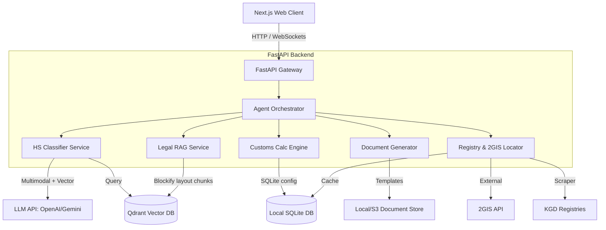

# Domain Model & System Architecture: CustomAI Kazakhstan (Кеден Көмекшісі)

This document establishes the official domain language, architecture, and system specifications for the AI Customs Clearance Assistant in Kazakhstan.

---

## 1. Domain Lexicon & Taxonomy

To ensure consistency across the codebase, database schemas, and AI prompts, the following terminology MUST be used exclusively:

| Term (RU) | Term (KZ) | Code Domain Term | Description |
| :--- | :--- | :--- | :--- |
| **ТН ВЭД Код** | СЭҚ ТН Коды | `hs_code` | 10-digit Harmonized System (HS) code representing a product category in EAEU. |
| **Таможенная пошлина** | Кедендік алым | `customs_duty` | Rate or absolute value of tax levied on imported/exported goods. |
| **НДС на импорт** | Импортқа ҚҚС | `import_vat` | Value Added Tax on imports (standard rate in RK: 12%). |
| **Акциз** | Акциз | `excise_tax` | Special tax on specific goods (alcohol, tobacco, gasoline, vehicles). |
| **Таможенный сбор** | Кедендік рәсімдеу үшін алым | `customs_fee` | Fixed payment for customs clearance declaration processing (20,000 KZT as of current RK regulation). |
| **Утильсбор** | Кәдеге жарату алымы | `recycling_fee` | Recycling fee applied to vehicles, agricultural machinery, and specific packages. |
| **ТРОИС** | ЗТМБР | `trois_registry` | Register of Intellectual Property (Товарные знаки) of the State Revenue Committee (КГД). |
| **Преференция / Льгота** | Преференция / Жеңілдік | `tariff_preference` | Tariff exemptions based on country of origin (e.g., CIS free trade) or investment projects. |
| **СЭЗ (СЭЗ)** | АЭА | `sez_zone` | Special Economic Zones (e.g., "Khorgos - Eastern Gate", "Ontustik") providing tax & tariff relief. |
| **Сертификация / Разрешения** | Сертификаттау / Рұқсаттар | `non_tariff_measures` | Non-tariff technical barriers, including Certificates of Conformity (ТР ТС), licenses, and phytosanitary permits. |
| **КГД РК** | ҚР МКД | `kgd_rk` | State Revenue Committee of the Ministry of Finance of the Republic of Kazakhstan (customs authority). |

---

## 2. System Architecture

---

## 3. Core Subsystems

### A. HS Code Selection Pipeline (`hs_classifier/`)
Processes description texts, technical documentation, or photo attachments:
1. **Multimodal Analysis:** If a photo is provided, LLM extracts visual attributes (make, model, material, function) into a standardized text description.
2. **First-Stage Retrieval:** Vector search in Qdrant using the unified description against the EAEU HS Code Explanatory Notes (Пояснения к ТН ВЭД).
3. **Second-Stage Selection:** Top-5 candidate HS Codes are fed to the LLM alongside the product description to make the final 10-digit selection with exact reasoning and legal notes.

### B. Rule-Based Calculation Engine (`calculation/`)
Calculates payments deterministically. **Never use LLMs for math.**
* **Formula:**
  $$\text{Customs Value (Таможенная стоимость)} = \text{Invoice Price} + \text{Delivery to Border (Транспортные расходы)}$$
  $$\text{Customs Fee (Таможенный сбор)} = 20,000 \text{ KZT (fixed)}$$
  $$\text{Customs Duty (Пошлина)} = \text{Customs Value} \times \text{Duty Rate} \text{ (Ad valorem, Specific, or Combined)}$$
  $$\text{Excise (Акциз)} = \text{Excise Base} \times \text{Excise Rate}$$
  $$\text{VAT Base (База НДС)} = \text{Customs Value} + \text{Customs Fee} + \text{Customs Duty} + \text{Excise}$$
  $$\text{Import VAT (НДС)} = \text{VAT Base} \times 12\%$$
  $$\text{Total Payments} = \text{Customs Fee} + \text{Customs Duty} + \text{Excise} + \text{Import VAT} + \text{Recycling Fee (if applicable)}$$

### C. Legal RAG with Layout-Aware Parsing (`rag/`)
Uses **Blockify**-style chunking to preserve tables, hierarchies, and articles from official legal documents (EAEU Customs Code, RK Tax Code, EEC Decisions).
* **Indexing:** Documents are parsed into layout blocks (articles, subsections, tables) preserving context headers.
* **Vector Store:** Embedded in Qdrant with metadata (article number, document source, enactment date).
* **Retrieval:** Semantic query yields exact article quotes alongside the assistant's advice to ensure zero-hallucination compliance checking.

### D. Document Generator (`documents/`)
Generates formal clearance/trade paperwork:
* **Invoices & Specifications:** Rendered to PDF and Excel (.xlsx) using structured datasets.
* **Supply Agreements (Договоры поставки):** Rendered to Word (.docx) with customized buyer/seller/incoterms parameters.
* **Tech Stack:** `python-docx` for `.docx`, `openpyxl`/`xlsxwriter` for `.xlsx`, and `WeasyPrint` (HTML-to-PDF) for premium PDFs.

---

## 4. Implementation Checklist & Phased Roadmap

### Phase 1: Foundation & Data Prep
- [ ] Initialize Python FastAPI backend and Next.js frontend structure.
- [ ] Create SQLite schema for HS Codes database, TROIS registers, and broker caches.
- [ ] Parse and ingest EAEU HS Code Directory (ТН ВЭД ЕАЭС) into Qdrant using chunking.
- [ ] Ingest RK Customs Code, Tax Code, and EEC Technical Regulations (ТР ТС) into Qdrant.

### Phase 2: Core Calculations & HS Classifier
- [ ] Implement deterministic Python `CustomsCalculator` for duties, VAT, excise, and fees.
- [ ] Implement multimodal HS code classification pipeline (Vision + Description -> Vector -> LLM Selection).
- [ ] Add support for preferences, exemptions, and SEZ calculation rules.

### Phase 3: RAG, Document Generation & Registries
- [ ] Implement layout-aware legal search (RAG) referencing exact laws.
- [ ] Wire up document generation templates (Invoices, Packing Lists, Agreements).
- [ ] Add scraper/loader for KGD registry tables (Brokers, Logisticians) and integrate 2GIS.

### Phase 4: Frontend UI & Verification
- [ ] Build React chatbot and dashboard for customs calculations.
- [ ] Implement document upload (for invoice/photo parsing) and document preview.
- [ ] Perform comprehensive test cases for tariff calculations against actual declarations.
