# System Architecture Map (Cross-Flow Architecture)

This document shows how different business and event flows connect at the system level in **CustomAI Kazakhstan (Кеден Көмекшісі)**.

```mermaid
flowchart LR
    subgraph Orchestrator["Agent Orchestrator (Chat)"]
        OR_Input[User Message]
        OR_Classify[Intent Classifier]
        OR_RAG --> RAG
        OR_HS --> HS
        OR_Calc --> Calc
        OR_Ingest --> Ingest
    end

    subgraph AgenticRAG["Agentic RAG Customs Clearance"]
        AR_Intake[Extract shipment facts]
        AR_Plan[Select guidance modes]
        AR_Tools[Invoke deterministic tools / RAG]
        AR_Critic[Compliance critic]
        AR_Final[Structured guidance payload]
    end
    subgraph RAG["Legal RAG Flow"]
        RAG_Query[Formulate legal question]
        RAG_Retrieve[Qdrant Article Chunk Query]
        RAG_Synth[Gemini Article Citation Synthesis]
    end

    subgraph HS["HS Code Classification Flow"]
        HS_Start[Identify Product]
        HS_Questionnaire[Classification Questionnaire]
        HS_Vision[Attribute / Vision Parse]
        HS_Vector[Qdrant Search hs_code_directory]
        HS_Select[Candidate Selection]
    end

    subgraph Ingest["Document Ingestion Flow"]
        ING_Source[Official Source File]
        ING_Markdown[MarkItDown Markdown Artifact]
        ING_Parse[Markdown / Local Structure Parsing]
        ING_Dedup[Local Dedup via Granite]
        ING_Embed[Granite Embedding]
        ING_Store[Upsert to Qdrant with Provenance]
    end

    subgraph Calc["Customs Calculation Flow"]
        Calc_Fetch[Fetch NBK Exchange Rates]
        Calc_Check[Query TROIS Registry]
        Calc_Math[Deterministic Tax Engine]
        Doc_Gen[Generate Word/Excel documents]
    end

    subgraph Workspace["Automated Calculation Workspace"]
        WS_Input[Product text input]
        WS_Extract[AI Field Extractor]
        WS_Classify --> HS
        WS_Calc --> Calc
        WS_Risk --> Risk
        WS_Report --> Report
        WS_DocParse --> DocParse
    end

    subgraph DocParse["Document Parsing & OCR"]
        DP_PDF[PDF Extractor]
        DP_Excel[Excel Parser]
        DP_OCR[OCR Engine]
        DP_Struct[LLM Structurizer]
    end

    subgraph Risk["Risk Audit"]
        RA_Lookup[Query risk_profiles]
        RA_Match[HS Code Mask Matching]
        RA_Classify[Severity Grouping]
    end

    subgraph Report["Export Report (PDF)"]
        RP_Build[Build HTML from template]
        RP_QR[QR Code Generation]
        RP_Render[WeasyPrint HTML→PDF]
    end

    subgraph SaaS["SaaS Layer (Auth / Billing / Cabinet)"]
        SA_Auth[Auth: JWT + RBAC]
        SA_Billing[Subscriptions & Payments]
        SA_Cabinet[User Cabinet / Usage]
        SA_Admin[Admin Panel]
    end

    subgraph KnowledgeMgmt["Knowledge Management API"]
        KM_Auth[Admin API Key Auth]
        KM_CRUD[CRUD Laws & HS Codes]
        KM_Embed[Generate Embeddings]
        KM_Reindex[Bulk Reindex Operations]
        KM_Audit[Audit Logging]
    end

    subgraph ConfigService["Configuration Service"]
        CS_Rates[Rate Versioning & Lookup]
        CS_Admin[Admin Rate API]
        CS_Audit[Rate Change Audit]
    end

    subgraph RulesEngine["Classification Rules Engine"]
        RE_Rules[Dynamic Rules Database]
        RE_Apply[Rules Application Engine]
        RE_Attributes[Structured Attribute Extraction]
        RE_Admin[Admin Rules API]
    end

    subgraph VectorDB["Qdrant Vector DB"]
        Q_Legal[(legal_regulations_kz)]
        Q_HS[(hs_code_directory)]
        Q_Risk[(risk_profiles)]
    end

    subgraph Postgres["PostgreSQL (SaaS)"]
        PG_Users[(users, refresh_tokens)]
        PG_Subs[(plans, subscriptions, payments)]
        PG_Usage[(usage_logs)]
        PG_History[(calculation_history)]
    end

    %% Orchestrator routes
    OR_Classify -- "question_about_law" --> OR_RAG
    OR_Classify -- "product_description" --> OR_HS
    OR_HS --> HS_Questionnaire
    HS_Questionnaire -- "classification:questionnaire_complete" --> HS_Vision
    HS_Vision --> HS_Vector
    HS_Vector --> HS_Select
    OR_Classify -- "calculation_request" --> OR_Calc
    OR_Classify -- "document_upload" --> OR_Ingest
    OR_Classify -- "customs_guidance" --> AR_Intake
    AR_Intake -- "agentic_rag:plan_created" --> AR_Plan
    AR_Plan --> AR_Tools
    AR_Tools --> AR_Critic
    AR_Critic --> AR_Final

    %% Cross-Flow Boundaries (existing)
    HS_Select -- "selected_hs_code" --> Calc_Math
    RAG -- "article_duty_rate" --> Calc_Math
    HS_Select -- "hs_code_legal_requirements" --> RAG
    Calc_Math -- "calculation_results" --> Doc_Gen

    %% Vector Index Connections (existing)
    ING_Source -- "rag_ingestion:markdown_ready" --> ING_Markdown
    ING_Markdown -- "rag_ingestion:chunks_extracted" --> ING_Parse
    ING_Parse --> ING_Dedup
    ING_Dedup --> ING_Embed
    ING_Embed -- "rag_ingestion:points_synced" --> ING_Store
    ING_Store --> Q_Legal
    RAG_Retrieve --> Q_Legal
    HS_Vector --> Q_HS
    
    %% Knowledge Management API Connections
    KM_Embed --> Q_Legal
    KM_Embed --> Q_HS
    KM_Reindex --> Q_Legal
    KM_Reindex --> Q_HS

    %% Configuration Service Connections
    CS_Rates -- "get_rate(vat, date)" --> Calc_Math
    CS_Rates -- "get_rate(mci, year)" --> Calc_Math
    CS_Rates -- "get_rate(vat)" --> RAG_Synth

    %% Classification Rules Engine Connections
    RE_Attributes -- "extracted_attributes" --> RE_Apply
    RE_Rules -- "active_rules" --> RE_Apply
    RE_Apply -- "refined_candidates" --> HS_Select
    HS_Vision -- "vision_data" --> RE_Attributes
    AR_Tools -- "agentic_rag:classification_requested" --> HS_Questionnaire
    AR_Tools -- "agentic_rag:rag_query_requested" --> RAG_Query
    AR_Tools -- "agentic_rag:calculation_requested" --> Calc_Math
    CS_Rates -- "agentic_rag:config_rate_requested" --> AR_Tools
    AR_Critic -- "agentic_rag:audit_recorded" --> KM_Audit

    %% Workspace Integration
    WS_Input --> WS_Extract
    WS_Extract --> WS_Classify
    WS_Classify --> HS_Select
    HS_Select --> WS_Calc
    WS_Calc --> Calc_Math
    Calc_Math --> WS_Risk
    WS_Risk --> RA_Lookup
    RA_Match --> WS_Report
    WS_Report --> RP_Build
    WS_DocParse --> DP_PDF
    WS_DocParse --> DP_Excel
    WS_DocParse --> DP_OCR

    %% Risk Audit Vector
    RA_Lookup --> Q_Risk

    %% Report connections
    RP_Render --> WS_Input

    %% SaaS boundaries
    SA_Auth -.->|auth check| Workspace
    SA_Auth -.->|auth check| Orchestrator
    SA_Auth -.->|auth check| RAG
    SA_Auth -.->|auth check| HS
    SA_Auth -.->|auth check| Calc
    SA_Auth -.->|auth check| DocParse
    SA_Cabinet -.->|usage_log| PG_Usage
    SA_Cabinet -.->|history| PG_History
    SA_Billing -.->|user_plan_changed| SA_Auth
    SA_Admin -.->|override| SA_Billing
    SA_Admin -.->|manage| SA_Auth
```

---

## Declared Cross-Flow Boundaries

### 1. HS Code Classification Flow → Customs Calculation Flow
* **Trigger Event:** User confirms a 10-digit EAEU HS Code selected by the classifier.
* **Payload:** `{ hs_code: "8543709000", duty_rate_percent: 10.0, is_subject_to_recycling_fee: false }`
* **Consumer:** Calculations Engine (`Calc_Math`) automatically populates the duty rate and recycling parameters for the tariff computation.

### 2. Legal RAG Flow → Customs Calculation Flow
* **Trigger Event:** Retrieval of legal technical regulations or anti-dumping duties from official EAEU / RK texts.
* **Payload:** `{ special_duty_rate_percent: 25.5, regulation_id: "EEC-Decision-78" }`
* **Consumer:** Calculation Engine overlays ad-valorem calculations with special or anti-dumping duties where applicable.

### 3. HS Code Classification Flow → Legal RAG Flow
* **Trigger Event:** Selected HS Code has active non-tariff regulation alerts (e.g., Phytosanitary certification required).
* **Payload:** `{ hs_code: "1209911000", regulation_category: "phytosanitary" }`
* **Consumer:** Legal RAG service formulates a query to fetch the exact certificate requirement text from RK Technical Regulations.

### 4. Agent Orchestrator → Legal RAG Flow
* **Trigger Event:** User message classified as `question_about_law` by Intent Classifier.
* **Payload:** `{ query: "...", top_k: 5 }`
* **Consumer:** `LegalRAGService.query_legal_base()` returns LegalRAGResponse with citations.

### 5. Agent Orchestrator → HS Classification Flow
* **Trigger Event:** User message classified as `product_description`.
* **Payload:** `{ description: "...", image_bytes?: File }`
* **Consumer:** `HSCodeClassifier.classify()` returns HSClassificationResponse.

### 6. Agent Orchestrator → Customs Calculation Flow
* **Trigger Event:** User message classified as `calculation_request`, or chained from HS classification.
* **Payload:** `{ invoice_price, currency, hs_code, ... }`
* **Consumer:** `CustomsCalculator.calculate()` returns CalculationResponse.

### 7. Agentic RAG Customs Clearance → HS Classification + Legal RAG + Customs Calculation
* **Trigger Event:** User message requires customs-clearance decision workflow rather than plain legal retrieval (e.g., import case, documents, restrictions, payments, classification uncertainty).
* **Payload:** `{ user_query, extracted_facts, guidance_modes, missing_fields }`
* **Consumers:** HS Classification receives `agentic_rag:classification_requested`; Legal RAG receives `agentic_rag:rag_query_requested`; Customs Calculation receives `agentic_rag:calculation_requested`; Configuration Service may receive `agentic_rag:config_rate_requested`.
* **Critic Gate:** `agentic_rag:critic_review_requested` must run before final response. Unsupported HS, payment, restriction, or legal certainty claims are downgraded or blocked.
* **Audit:** `agentic_rag:audit_recorded` stores extracted facts, tool trajectory, sources, calculations, final answer, confidence, and human-review flag.

### 8. Document Ingestion Flow → Qdrant
* **Trigger Event:** Document uploaded for indexing.
* **Payload:** `{ collection: "legal_regulations_kz", points: [...] }`
* **Consumer:** Qdrant upsert with local in-process dedup.

### 9. Authentication Middleware → All Pipeline Flows
* **Trigger Event:** Every authenticated HTTP request to any pipeline endpoint.
* **Payload:** `Authorization: Bearer <jwt>` → resolved to `{ user_id, role, plan }`
* **Consumer:** JWT middleware (`get_current_user`) validates token before handler executes. `require_plan` / `require_role` decorators gate specific routes.

### 10. User Cabinet → Usage Logs (PostgreSQL)
* **Trigger Event:** Pipeline completes a request (calculation, classification, RAG query, document generation).
* **Payload:** `{ user_id, action_type: "calculation", metadata: {...} }`
* **Consumer:** `usage_logs` table — row inserted fire-and-forget after successful pipeline response.

### 11. Billing Flow → Auth Flow
* **Trigger Event:** Payment confirmed via webhook (Kaspi/Stripe), `user_plan_changed` event emitted.
* **Payload:** `{ user_id, old_role: "basic", new_role: "premium", plan_expires_at: "..." }`
* **Consumer:** Auth layer updates `users.role` and `plan_expires_at`. Next JWT refresh picks up new role.

### 12. Admin Panel → Billing + Auth
* **Trigger Event:** Admin manually overrides user plan via admin API.
* **Payload:** `{ user_id, plan_id, duration_days }`
* **Consumer:** Billing service updates subscription, auth service syncs role. Same `user_plan_changed` event path.

### 13. Automated Calculation Workspace → HS Classifier + Calculator
* **Trigger Event:** User submits product text in workspace input (or after document parsing).
* **Payload:** `{ product_text, overrides? }` → internally calls classifier then calculator.
* **Consumer:** WorkspaceService orchestrates: classifier returns code + rates → calculator returns full payment breakdown. Results combined into single WorkspaceResponse.

### 14. Document Parsing → Workspace Input
* **Trigger Event:** User uploads invoice file (PDF/XLSX/image), extraction completes and is confirmed.
* **Payload:** `{ InvoiceData }` — structured fields from invoice.
* **Consumer:** Workspace input is auto-populated with extracted data for classification + calculation.

### 15. Risk Audit → Workspace Result
* **Trigger Event:** HS code confirmed during workspace calculation.
* **Payload:** `{ hs_code }` → query Qdrant `risk_profiles` collection.
* **Consumer:** Risk audit result (blocking/warning/info flags) appended to workspace response.

### 16. Export Report → Calculation History
* **Trigger Event:** User clicks "Экспорт PDF" on calculation result.
* **Payload:** `{ calculation_id }`
* **Consumer:** ReportService fetches full calculation data from history, builds HTML, renders PDF via WeasyPrint.

### 17. Knowledge Management API → Qdrant (Data Dependency)
* **Trigger Event:** Admin creates/updates/deletes legal document or HS code via admin API.
* **Payload:** `{ collection: "legal_regulations_kz" | "hs_code_directory", operation: "upsert" | "delete", document: {...} }`
* **Consumer:** Qdrant vector database updated with new embeddings. Existing RAG and HS classification flows automatically use updated data on next query.
* **Note:** This is a data dependency, not an event boundary. No direct flow-to-flow communication occurs.

### 18. Configuration Service → Customs Calculation Flow (Data Dependency)
* **Trigger Event:** Calculation Engine requests rate for specific date via `config_service.get_rate("import_vat", declaration_date)`.
* **Payload:** `{ rate_type: "import_vat", effective_date: "2026-05-30" }`
* **Consumer:** Configuration Service returns versioned rate value (e.g., `0.16` for 2026). Calculation Engine uses this rate instead of hardcoded defaults.
* **Fallback:** If Config Service unavailable, Calculation Engine falls back to `business_rules.py` defaults.
* **Note:** This is a synchronous data dependency, not an event boundary.

### 19. Configuration Service → Legal RAG Flow (Data Dependency)
* **Trigger Event:** RAG Service queries current rates for citation in legal responses.
* **Payload:** `{ rate_type: "import_vat" }`
* **Consumer:** RAG Service includes accurate rate in synthesized legal advice (e.g., "Согласно НК РК, ставка НДС на импорт составляет 16%").
* **Note:** This is a synchronous data dependency, not an event boundary.

### 20. Classification Rules Engine → HS Code Classification Flow (Data Dependency)
* **Trigger Event:** HS Classifier extracts product attributes and applies classification rules.
* **Payload:** `{ product_description, image_bytes, extracted_attributes }`
* **Consumer:** Rules Engine returns refined HS code candidates based on dynamic rules (e.g., "материал: натуральный мех >50% → группа 4303 вместо 9503").
* **Clarifying Questions:** If required attributes missing, Rules Engine returns questions for user (e.g., "Из какого материала сделана игрушка?").
* **Note:** This is a synchronous data dependency integrated into HS Classifier workflow.

---

## Implementation Trace & Flow Map
* **Orchestrator (Chat):** `backend/app/core/orchestrator/` → Flow Document: `flows/features/agent_orchestrator_flow.md` (ADK 2.0 migration designed in `flows/features/google_adk_orchestration_flow.md`)
* **Agentic RAG Customs Clearance:** `backend/app/core/orchestrator/` + `backend/app/core/rag/` + deterministic tool seams → Flow Document: `flows/features/agentic_rag_customs_clearance_flow.md`
* **Legal RAG Flow:** `backend/app/core/rag/` → Flow Document: `flows/features/semantic_embedding_flow.md`
* **Document Ingestion:** `backend/app/core/rag/indexer.py` → Flow Document: `flows/integrations/markdown_rag_ingestion_flow.md`
* **HS Code Classifier:** `backend/app/core/hs_classifier/` and `backend/app/core/classification/questionnaire.py` → Flow Documents: `flows/features/hs_classification_flow.md`, `flows/features/classification_questionnaire_flow.md`
* **Customs Calculation:** `backend/app/core/calculation/` → Flow Document: `flows/features/customs_calculation_flow.md`
* **Dynamic Profile Extraction:** `backend/app/core/orchestrator/profile_extractor.py` → Flow Document: `flows/features/customs_profile_flow.md`
* **Document Generation:** `backend/app/core/documents/` → Flow Document: `flows/features/document_generation_flow.md`
* **KGD Registry & Trademark:** `backend/app/services/kgd_registry.py` → Flow Document: `flows/features/kgd_registry_flow.md`
* **Vertex AI / Gemini Client:** `backend/app/core/vertex_client.py` → Flow Document: `flows/features/langfuse_monitoring_flow.md`
* **Authentication & Authorization (DEFERRED):** `backend/app/services/auth/` (not implemented) → Flow Document: `flows/auth/auth_flow.md`
* **Billing & Subscriptions (DEFERRED):** `backend/app/services/billing/` (not implemented) → Flow Document: `flows/integrations/billing_flow.md`
* **User Cabinet & Admin Panel (DEFERRED):** `backend/app/services/cabinet/` (not implemented) → Flow Document: `flows/features/user_cabinet_flow.md`
* **Automated Calculation Workspace (DEFERRED backend service):** `backend/app/services/workspace/` (not implemented; current UI uses orchestrator endpoints) → Flow Document: `flows/features/automated_calculation_workspace_flow.md`
* **Document Parsing & OCR:** `backend/app/services/parser/` → Flow Document: `flows/integrations/document_parsing_flow.md`
* **Risk Audit (DEFERRED):** `backend/app/services/risk_audit/` (not implemented) → Flow Document: `flows/features/risk_audit_flow.md`
* **Report Export (PDF) (DEFERRED):** `backend/app/services/report/` (not implemented) → Flow Document: `flows/features/report_export_flow.md`
* **Knowledge Management API:** `backend/app/api/admin.py` + `backend/app/core/admin/` → Flow Document: `flows/features/knowledge-management-api.md`
* **Configuration Service:** `backend/app/core/config_service.py` + `backend/app/api/admin_config.py` → Flow Document: `flows/features/configuration-service-flow.md`
* **Classification Rules Engine:** `backend/app/core/classification/rules_engine.py` + `backend/app/api/admin_rules.py` → Flow Document: `flows/features/classification-rules-engine-flow.md`
* **Behavior Tests:** `backend/tests/` → Covered globally in target traces.
