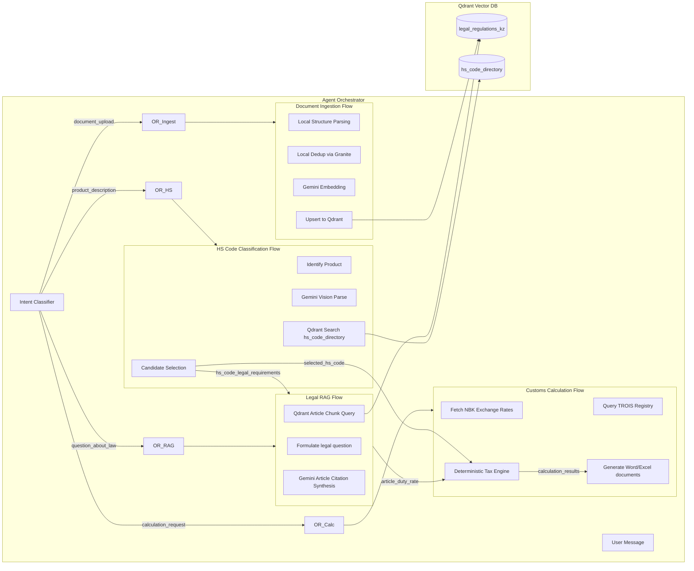

# System Architecture Map (Cross-Flow Architecture)

This document shows how different business and event flows connect at the system level in **CustomAI Kazakhstan (Кеден Көмекшісі)**.

---

## Declared Cross-Flow Boundaries

### 1. HS Code Classification Flow $\rightarrow$ Customs Calculation Flow
* **Trigger Event:** User confirms a 10-digit EAEU HS Code selected by the classifier.
* **Payload:** `{ hs_code: "8543709000", duty_rate_percent: 10.0, is_subject_to_recycling_fee: false }`
* **Consumer:** Calculations Engine (`Calc_Math`) automatically populates the duty rate and recycling parameters for the tariff computation.

### 2. Legal RAG Flow $\rightarrow$ Customs Calculation Flow
* **Trigger Event:** Retrieval of legal technical regulations or anti-dumping duties from official EAEU / RK texts.
* **Payload:** `{ special_duty_rate_percent: 25.5, regulation_id: "EEC-Decision-78" }`
* **Consumer:** Calculation Engine overlays ad-valorem calculations with special or anti-dumping duties where applicable.

### 3. HS Code Classification Flow $\rightarrow$ Legal RAG Flow
* **Trigger Event:** Selected HS Code has active non-tariff regulation alerts (e.g., Phytosanitary certification required).
* **Payload:** `{ hs_code: "1209911000", regulation_category: "phytosanitary" }`
* **Consumer:** Legal RAG service formulates a query to fetch the exact certificate requirement text from RK Technical Regulations.

### 4. Agent Orchestrator $\rightarrow$ Legal RAG Flow
* **Trigger Event:** User message classified as `question_about_law` by Intent Classifier.
* **Payload:** `{ query: "...", top_k: 5 }`
* **Consumer:** `LegalRAGService.query_legal_base()` returns LegalRAGResponse with citations.

### 5. Agent Orchestrator $\rightarrow$ HS Classification Flow
* **Trigger Event:** User message classified as `product_description`.
* **Payload:** `{ description: "...", image_bytes?: File }`
* **Consumer:** `HSCodeClassifier.classify()` returns HSClassificationResponse.

### 6. Agent Orchestrator $\rightarrow$ Customs Calculation Flow
* **Trigger Event:** User message classified as `calculation_request`, or chained from HS classification.
* **Payload:** `{ invoice_price, currency, hs_code, ... }`
* **Consumer:** `CustomsCalculator.calculate()` returns CalculationResponse.

### 7. Document Ingestion Flow $\rightarrow$ Qdrant
* **Trigger Event:** Document uploaded for indexing.
* **Payload:** `{ collection: "legal_regulations_kz", points: [...] }`
* **Consumer:** Qdrant upsert with local in-process dedup.

---

## Implementation Trace & Flow Map

* **Orchestrator:** `backend/app/core/orchestrator/` $\rightarrow$ Flow Document: `flows/features/agent_orchestrator_flow.md`
* **Legal RAG Flow:** `backend/app/core/rag/` $\rightarrow$ Flow Document: `flows/features/semantic_embedding_flow.md`
* **Document Ingestion:** `backend/app/core/rag/indexer.py` $\rightarrow$ Flow Document: `flows/features/blockify_ingestion_flow.md` (Migrated to Local parsing & dedup)
* **HS Code Directory & Classifier:** `backend/app/core/hs_classifier/` $\rightarrow$ Flow Document: `flows/features/hs_classification_flow.md`
* **Customs Calculation:** `backend/app/core/calculation/` $\rightarrow$ Flow Document: `flows/features/customs_calculation_flow.md`
* **Dynamic Profile Extraction (Stateful Accumulator):** `backend/app/core/orchestrator/profile_extractor.py` $\rightarrow$ Flow Document: `flows/features/customs_profile_flow.md`
* **Document Generation:** `backend/app/core/documents/` $\rightarrow$ Flow Document: `flows/features/document_generation_flow.md`
* **KGD Registry & Trademark (TROIS):** `backend/app/services/kgd_registry.py` $\rightarrow$ Flow Document: `flows/features/kgd_registry_flow.md`
* **Vertex AI / Gemini Client:** `backend/app/core/vertex_client.py` $\rightarrow$ Flow Document: `flows/features/langfuse_monitoring_flow.md`
* **Behavior Tests:** `backend/tests/` $\rightarrow$ Covered globally in target traces.
