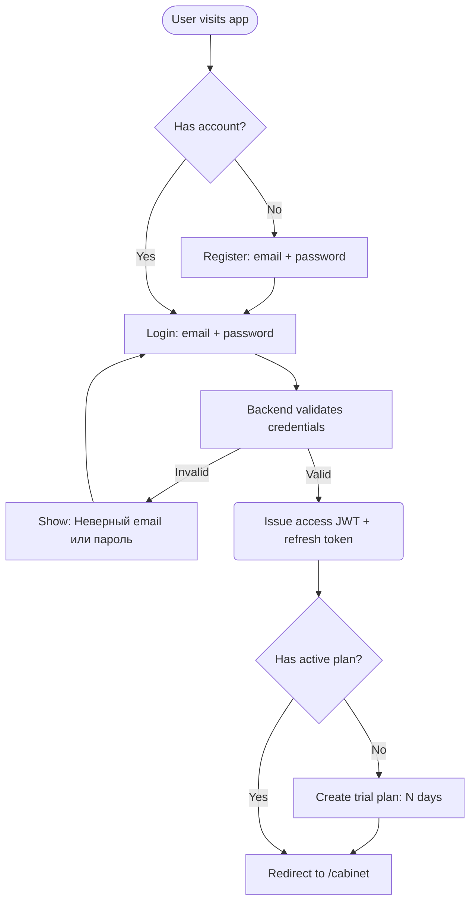
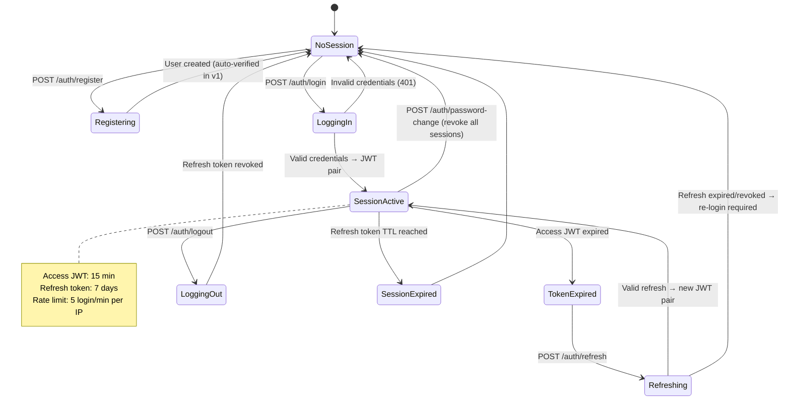
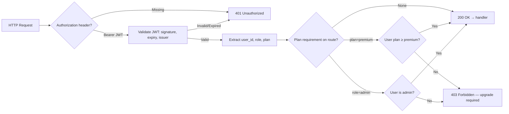

# Flow Design: Authentication & Authorization (SaaS)

This document defines the authentication, authorization, session management, and role-based access control (RBAC) lifecycle for the CustomAI Kazakhstan SaaS platform.

---

## 1. Intent
* **User Goal:** Users register, log in, manage their sessions, and access features based on their subscription role/plan. The system issues JWTs, refreshes them transparently, and enforces permissions on every protected endpoint.
* **Success Criteria:**
  - Users register with email + password (and optionally OAuth via Google / EГОВ).
  - Users log in and receive a short-lived access JWT + long-lived refresh token (httpOnly cookie).
  - Refresh tokens rotate silently; expired refresh forces re-login.
  - Every API endpoint checks `Authorization: Bearer <jwt>`; missing/invalid → 401.
  - Roles (`admin`, `premium`, `basic`, `trial`) gate features via middleware.
  - Session invalidation on logout or password change.
  - Rate limiting by user/plan on sensitive endpoints.
* **Non-negotiables:**
  - Passwords NEVER stored in plain text — hashed with bcrypt/argon2.
  - JWTs MUST be signed (RS256 recommended; HS256 acceptable for single-server v1) and validated on every request.
  - Refresh tokens are single-use (rotation prevents replay).
  - Auth middleware MUST accept an optional `plan_required` parameter to enforce subscription tier.

---

## 2. Scope
* **In Scope:**
  - `POST /api/auth/register` — email + password registration.
  - `POST /api/auth/login` — credential validation → JWT pair.
  - `POST /api/auth/refresh` — rotate refresh token → new JWT pair.
  - `POST /api/auth/logout` — invalidate refresh token.
  - `GET /api/auth/me` — current user profile + plan.
  - JWT middleware (`requires_auth`, `requires_plan(plan_name)`, `requires_role(role_name)`).
  - PostgreSQL schema: `users`, `refresh_tokens`.
  - Rate limiting by IP / user_id on auth endpoints (5 attempts / min on login).
* **Out of Scope / Deferred:**
  - OAuth Google / EГОВ integration (deferred to v2).
  - MFA / TOTP (deferred).
  - Team / multi-tenant accounts (deferred).
  - API key management for external integrations (deferred).

---

## 3. Actors and Permissions

| Actor | Role | Can Do | Cannot Do |
| :--- | :--- | :--- | :--- |
| **Guest** | — | Access login, register, pricing pages | Access /cabinet, use any protected API endpoint |
| **Basic User** | `basic` | Free-tier features (X calc/month, basic RAG queries) | Access premium/advanced endpoints, admin panel |
| **Premium User** | `premium` | Unlimited calculations, advanced RAG, document generation, priority support | Access admin panel |
| **Trial User** | `trial` | Full premium access for N days | Access admin panel |
| **Admin** | `admin` | User management, billing admin, content moderation, full API access | — |

---

## 4. Diagrams

### User Flow — Registration & Login

### System State Machine — Session Lifecycle

### Auth Middleware — Request Flow

---

## 5. State and Projections

### Database Tables

**`users`:**
| Column | Type | Description |
| :--- | :--- | :--- |
| `id` | UUID PK | Primary identifier |
| `email` | VARCHAR(255) UNIQUE | Login credential |
| `password_hash` | VARCHAR(255) | bcrypt/argon2 hash |
| `role` | ENUM(`basic`, `premium`, `trial`, `admin`) | Current role |
| `trial_ends_at` | TIMESTAMPTZ | If role=trial, when trial expires |
| `plan_expires_at` | TIMESTAMPTZ | If role=premium, when plan ends |
| `is_verified` | BOOLEAN | Email verified? |
| `preferred_lang` | VARCHAR(2) | `ru` or `kz`, default `ru` |
| `created_at` | TIMESTAMPTZ | |
| `updated_at` | TIMESTAMPTZ | |

**`refresh_tokens`:**
| Column | Type | Description |
| :--- | :--- | :--- |
| `id` | UUID PK | |
| `user_id` | UUID FK→users | Owner |
| `token_hash` | VARCHAR(255) | SHA-256 of token (never store raw) |
| `expires_at` | TIMESTAMPTZ | |
| `revoked` | BOOLEAN | Manual invalidation |
| `created_at` | TIMESTAMPTZ | |

---

## 6. Events/Actions

| Direction | Name | Source/Target | Payload | Allowed When | Reject/Failure Reason |
| :--- | :--- | :--- | :--- | :--- | :--- |
| Incoming | `register` | Client → Backend | `{email, password}` | Guest only | Email taken, weak password |
| Incoming | `login` | Client → Backend | `{email, password}` | Guest only | Wrong credentials, account locked |
| Incoming | `refresh` | Client → Backend | `{refresh_token}` | Any | Token expired/revoked |
| Incoming | `logout` | Client → Backend | `{refresh_token}` | Authenticated | Token not found |
| Outgoing | `user_created` | Backend → Event Bus | `{user_id, email, role, plan}` | User registered | — |
| Outgoing | `user_plan_changed` | Backend → Event Bus | `{user_id, old_role, new_role}` | Plan upgraded/downgraded | — |
| Incoming | `password_change` | Client → Backend | `{old_password, new_password}` | Authenticated | Wrong old password |

---

## 7. Edge Cases

* **Concurrent logins:** Multiple devices are allowed; each gets its own refresh token. Revoke all on password change.
* **Refresh token replay:** If a revoked/used refresh token is presented, ALL sessions for that user are invalidated (token theft detection).
* **JWT clock skew:** Accept ±30 seconds skew in `iat`/`exp` validation.
* **Trial expiry:** A daily cron or on-request check: if `role = trial AND trial_ends_at < now()`, downgrade to `basic` and return `403 PlanExpired` on premium endpoints.
* **Rate limit exceeded:** Return `429 Too Many Requests` with `Retry-After` header.
* **Email not verified:** Login succeeds but returns `"email_verified": false`. Unverified users can't access premium features (configurable).
* **Password reset:** Not in scope v1 — user contacts support to recover.

---

## 8. Side Effects

* On `register`: create user row, optionally send verification email.
* On `login`: issue JWT pair, store refresh token hash in DB.
* On `refresh`: verify old refresh, revoke it, issue new pair.
* On `logout`: revoke presented refresh token.
* On `password_change`: revoke ALL refresh tokens for user.

---

## 9. Schemas Touched

* `backend/app/services/auth/schemas.py` — Pydantic models for request/response
* `backend/app/services/auth/service.py` — AuthService (register, login, refresh, logout)
* `backend/app/services/auth/dependencies.py` — FastAPI Depends (`get_current_user`, `require_plan`, `require_role`)
* `backend/app/services/auth/router.py` — FastAPI router for `/api/auth/*`
* `backend/app/database/postgres.py` — PostgreSQL connection pool
* `backend/app/core/config.py` — JWT secret, token TTLs, rate limit config

---

## 10. Targeted Tests

| Layer | Behavior | File | Status |
| :--- | :--- | :--- | :--- |
| Unit | Register with valid email/password → 201 + user returned | `backend/tests/test_auth.py` | **TODO** |
| Unit | Register with existing email → 409 Conflict | `backend/tests/test_auth.py` | **TODO** |
| Unit | Register with weak password → 422 Validation | `backend/tests/test_auth.py` | **TODO** |
| Unit | Login with valid credentials → 200 + JWT pair | `backend/tests/test_auth.py` | **TODO** |
| Unit | Login with wrong password → 401 | `backend/tests/test_auth.py` | **TODO** |
| Unit | Refresh with valid token → 200 + new pair | `backend/tests/test_auth.py` | **TODO** |
| Unit | Refresh with revoked token → 401 + all sessions invalidated | `backend/tests/test_auth.py` | **TODO** |
| Unit | Access protected route without JWT → 401 | `backend/tests/test_auth.py` | **TODO** |
| Unit | Access premium route with basic plan → 403 | `backend/tests/test_auth.py` | **TODO** |
| Unit | Admin route non-admin user → 403 | `backend/tests/test_auth.py` | **TODO** |
| Unit | Login rate limit exceeded → 429 | `backend/tests/test_auth.py` | **TODO** |
| Integration | Register → login → call protected endpoint → succeeds | `backend/tests/test_auth.py` | **TODO** |
| Integration | Trial expiry → premium endpoint → 403 | `backend/tests/test_auth.py` | **TODO** |

---

## 11. Implementation Plan

1. Install dependencies: `python-jose[cryptography]`, `passlib[bcrypt]`, `httpx`.
2. Create PostgreSQL connection pool in `backend/app/database/`.
3. Create `users` and `refresh_tokens` tables (Alembic migration).
4. Implement `AuthService` — register, login, refresh, logout, password change.
5. Implement JWT middleware (`get_current_user`, `require_plan`, `require_role`).
6. Create `/api/auth/*` router.
7. Wire middleware into existing endpoints (historical queries, HS classifier, calc).
8. Add rate limiting middleware for `/api/auth/login`.
9. Write tests.

---

## 12. Implementation Trace

*To be filled during implementation.*

### Files Created
* `backend/app/database/postgres.py`
* `backend/app/services/auth/service.py`
* `backend/app/services/auth/schemas.py`
* `backend/app/services/auth/dependencies.py`
* `backend/app/services/auth/router.py`

### Files Modified
* `backend/app/main.py` — mount auth router
* `backend/app/core/config.py` — add JWT settings
* `backend/requirements.txt` — add new deps
* Existing pipeline endpoints — add `require_plan` decorator

### Status
* **Not implemented** — awaiting flow-review approval

---

## 13. Open Questions

* *OAuth providers priority?* → Deferred to v2.
* *Session limit per user?* → No limit for v1; up to user control.
* *Email verification flow?* → Deferred to v2; for v1, email verified by default.
* *JWT signing algorithm: RS256 (asymmetric) vs HS256 (symmetric)?* → RS256 recommended for multi-service deployments. HS256 acceptable for single-server v1 (simpler key management). Decision deferred to implementation.

---

## 14. Review Checklist

- [x] Is every auth state transition documented in the state machine?
- [x] Are all failure transitions (401, 403, 429) shown?
- [x] Is token rotation and replay protection defined?
- [x] Are password hashing requirements specified?
- [x] Is the middleware chain (JWT → plan → role) documented?
- [x] Is trial expiry edge case handled?
- [x] Are rate limits documented?
- [x] Is there a test for each failure mode?
