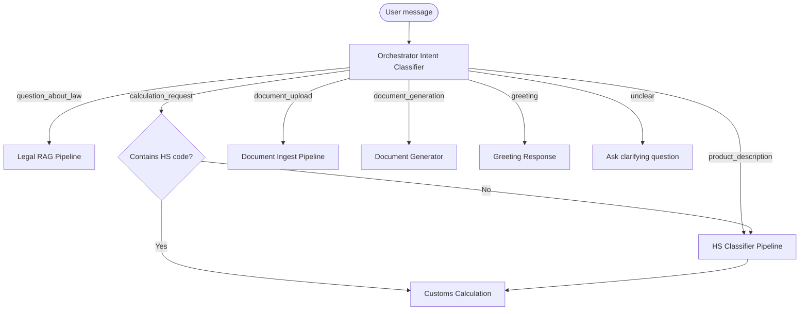
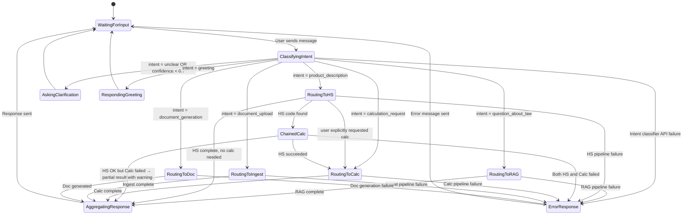
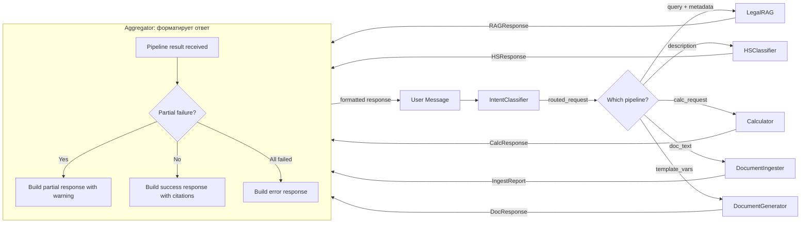

# Flow Design: Agent Orchestrator & Intent Routing

This document defines the behavioral flow, state transitions, API contract, and validation rules for the orchestrator that classifies incoming user messages and dispatches them to the correct pipeline (RAG / HS Classifier / Customs Calculation / Document Ingest / Document Generation).

---

## 1. Intent
* **User Goal:** The user types a single message (e.g. "посчитай пошлину на iPhone из США") and the system automatically routes it to the right pipeline — no need to click separate tabs.
* **Success Criteria:**
  - Orchestrator classifies intent with >90% accuracy.
  - Each intent maps to exactly one pipeline.
  - If intent is ambiguous, orchestrator asks a clarifying question.
  - Pipelines can return structured results that feed into each other (e.g. HS classification → calculation).
* **Non-negotiables:** Orchestrator MUST NOT perform business logic — only route. Business logic stays in dedicated pipelines.

---

## 2. Scope
* **In Scope:**
  - Intent classification into one of: `question_about_law`, `product_description`, `calculation_request`, `document_upload`, `document_generation`, `greeting`, `unclear`.
  - Routing to LegalRAGService, HSCodeClassifier, CustomsCalculator, DocumentIngester, DocumentGenerator.
  - Chained flows: HS Classifier result auto-populates Customs Calculator, returns combined response.
* **Out of Scope / Deferred:**
  - Multi-turn conversation state machine (deferred to v2).
  - User authentication / session management (deferred to v2).

---

## 3. Actors and Permissions
* **Guest User:** Sends messages, gets routed responses.
* **Orchestrator (System):** Classifies intent, dispatches to pipelines, aggregates results.

---

## 4. Diagrams

### User Flow

### System State Machine

### Data & Event Flow

---

## 5. State and Projections
* **Orchestrator State:** Stateless per request. No conversation history stored (deferred to v2).
* **Pipeline Results:** Cached in request-scoped dict. If HS classifier runs before calc, its candidates are available for the calc step.

---

## 6. Events/Actions
| Direction | Name | Source/Target Flow | Payload | Allowed When | Reject/Failure Reason |
| :--- | :--- | :--- | :--- | :--- | :--- |
| Incoming | `user_message` | Frontend | `{text, image?, file?}` | Always | Empty text and no attachment |
| Outgoing | `routed_to_pipeline` | Orchestrator | `{intent, payload}` | Intent classified | Intent classifier failure |
| Outgoing | `chained_calc` | Orchestrator → Calc | `{hs_code, description}` | HS Classifier succeeded | No HS candidates returned |
| Outgoing | `clarifying_question` | Orchestrator | `{question, options}` | Intent = unclear | — |

---

## 7. Edge Cases
* **Empty message:** Return error "Пожалуйста, напишите ваш вопрос или загрузите файл".
* **Ambiguous intent:** If classifier confidence < 0.7, ask "Вы хотите классифицировать товар или рассчитать пошлину?" with buttons.

* **Chained flow partial failure:** HS classification succeeds (returns candidates) but Calc fails (exchange rate missing). Return partial response: HS candidates + warning "Расчёт не выполнен: курс валюты не получен". User can retry calc with explicit data.
* **Image + text ambiguity:** If user sends photo + "сколько стоит?", treat as intent=product_description (HS first) then auto-prompt for calc.
* **Intent classifier failure:** If Gemini API call for intent classification fails (timeout, API error), return generic error "Не удалось обработать запрос. Попробуйте ещё раз или выберите действие вручную."

---

## 8. Side Effects
* **API Usage:** Each classified intent consumes one LLM call to Gemini for intent classification.

---

## 9. Schemas Touched
* `backend/app/main.py` (new `/api/orchestrate` endpoint)
* `backend/app/core/rag/service.py` (LegalRAGService)
* `backend/app/core/hs_classifier/classifier.py` (HSCodeClassifier)
* `backend/app/core/calculation/engine.py` (CustomsCalculator)

---

## 10. Targeted Tests
| Layer | Behavior | File | Status |
| :--- | :--- | :--- | :--- |
| Core / Unit | Intent `question_about_law` routes to LegalRAG | `backend/tests/test_orchestrator.py` | **PASSED** |
| Core / Unit | Intent `product_description` routes to HS Classifier | `backend/tests/test_orchestrator.py` | **PASSED** |
| Core / Unit | Intent `calculation_request` routes to Calc | `backend/tests/test_orchestrator.py` | **PASSED** |
| Core / Unit | Intent `document_upload` routes to Ingest | `backend/tests/test_orchestrator.py` | **PASSED** |
| Core / Unit | Intent `document_generation` routes to DocGen | `backend/tests/test_orchestrator.py` | **PASSED** |
| Core / Unit | Intent `greeting` returns greeting | `backend/tests/test_orchestrator.py` | **PASSED** |
| Core / Unit | Intent `unclear` asks clarifying question | `backend/tests/test_orchestrator.py` | **PASSED** |
| Core / Unit | Low confidence (<0.7) falls to unclear | `backend/tests/test_orchestrator.py` | **PASSED** |
| Integration | HS → Calc chained flow succeeds | `backend/tests/test_orchestrator.py` | **PASSED** |
| Integration | HS OK → Calc fail → partial response | `backend/tests/test_orchestrator.py` | **PASSED** |
| Integration | Pipeline failure → error response | `backend/tests/test_orchestrator.py` | **PASSED** |

---

## 11. Implementation Plan
1. Create `IntentClassifier` in `backend/app/core/orchestrator/`.
2. Implement intent classification via Gemini structured output (few-shot with 6 intents).
3. Create `/api/orchestrate` endpoint in `main.py`.
4. Implement dispatch logic: route to pipeline, aggregate response.
5. Implement chained HS→Calc flow.
6. Write tests for each intent and chain.

---

## 12. Implementation Trace

### Files Created
* **Orchestrator Logic:** `backend/app/core/orchestrator/` (new)
* **Route Handlers:** `backend/app/main.py`
* **Intent Schema:** `backend/app/core/orchestrator/models.py` (new)

### Files Modified
* `backend/app/main.py` — mounted orchestrator_router
* `frontend/app/page.tsx` — chat now sends to `/api/orchestrate`

### Status
* All 12 tests in `backend/tests/test_orchestrator.py` pass
* E2E integration test in `backend/tests/test_e2e_integration.py` passes
* Full suite: 48 tests pass
* Validation: `PYTHONPATH=backend .venv/Scripts/pytest backend/tests/ --import-mode=importlib` → 48 passed
* Chained HS→Calc flow: **FULLY IMPLEMENTED & TESTED** (passes context parameters backwards dynamically from conversational history)
---

## 13. Open Questions
* *Should the orchestrator maintain conversation history?* → Yes, implemented stateless history chaining which backward-parses history payload in the request body for zero-session-store multi-turn calculation context.
* *What if user wants to override the auto-routing?* → Add explicit buttons in frontend for each pipeline.

---

## 14. Review Checklist
- [x] Is the intent classifier documented with examples for each intent?
- [x] Are chained flows (HS→Calc) explicitly handled with error states?
- [x] Is there a clear separation: orchestrator routes only, pipelines do work?
- [x] Are all edge cases (ambiguous, empty, chain failure) covered?
- [x] Are ALL failure transitions shown in the state machine?
- [x] Is there a test for each intent + each failure mode?