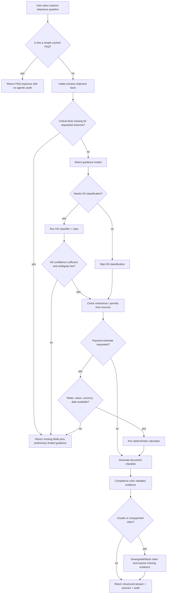
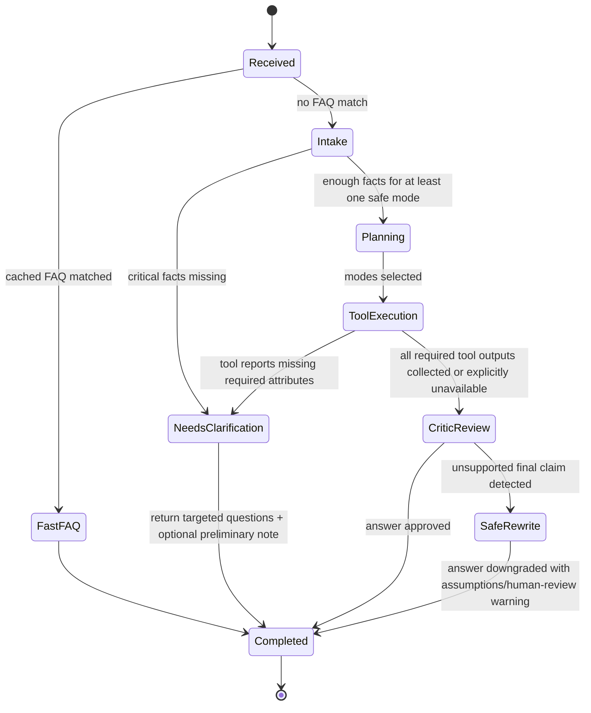
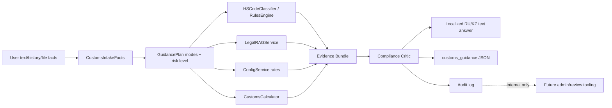

# Flow Design: Agentic RAG Customs Clearance Workflow

This document defines the first Agentic RAG cutover for SmartKeden: the chat endpoint remains `/api/orchestrate`, but customs guidance is produced by an explicit decision workflow instead of a single retrieve-and-synthesize RAG pass.

---

## 1. Intent

* **User Goal:** A user can ask a customs-clearance question in free text and receive a structured, source-grounded preliminary answer that identifies missing facts, safe assumptions, tool-derived results, risks, and next actions.
* **Success Criteria:**
  - Route customs guidance requests through an explicit intake → mode selection → deterministic tools/RAG → compliance critic → final answer path.
  - Never let the LLM invent HS codes, rates, payment totals, restriction clearance, or legal certainty when required facts or sources are missing.
  - Preserve existing `/api/orchestrate` request/response compatibility for the frontend while adding a stable machine-readable guidance payload in `pipeline_results`.
  - Continue using existing deterministic core services for HS classification, classification rules, calculations, configuration rates, and RAG retrieval.
  - Audit the decision path: extracted facts, missing fields, selected modes, tool calls, sources, calculations, risk level, critic result, and final answer.
* **Non-negotiables:**
  - Deterministic customs calculations MUST run only through `backend/app/core/calculation/`.
  - HS classification MUST remain preliminary unless the classification tool has enough required attributes and no high-risk ambiguity remains.
  - Payment estimates MUST NOT be produced without customs value, currency, exchange-rate date or explicit assumption, HS/rate source, and VAT/rate source.
  - “No restriction / permit required” MUST NOT be stated unless restrictions were checked against a source for the candidate HS code/procedure.
  - Case memory or conversation history MAY prefill known user context, but MUST NOT be cited as legal authority.

---

## 2. Scope

* **In Scope for v1:**
  - Add an agentic customs guidance path on top of the existing ADK workflow graph for questions that require more than a plain legal FAQ answer.
  - Extract a normalized `CustomsIntakeFacts` structure from user text and conversation history.
  - Select one or more guidance modes: `answer_from_law`, `ask_clarifying_questions`, `classify_goods`, `calculate_payments`, `generate_document_checklist`, `check_restrictions`, `astana1_guidance`.
  - Invoke existing tools/services where available: `LegalRAGService`, `HSCodeClassifier`, `apply_classification_rules`, `ProfileExtractor`, `CustomsCalculator`, `ConfigService`.
  - Add a compliance critic pass that blocks overconfident or unsupported final responses.
  - Return a stable `customs_guidance` JSON payload for the UI in `OrchestrateResponse.pipeline_results`.
  - Persist or append an audit record using the existing audit facilities used by backend services.
* **Out of Scope / Deferred:**
  - Full specialist ADK Agent subclasses for classification/procedure/restrictions/documents/ASTANA-1. v1 uses workflow nodes and typed helper services.
  - Live synchronization from KGD XML/Excel tariff sources. v1 consumes already configured/rag-indexed data and marks missing structured sources as assumptions.
  - User account-level long-term case memory. v1 may use request history only.
  - Binding legal advice. All outputs are preliminary guidance for human review.

---

## 3. Actors and Permissions

| Actor | Can Do | Cannot Do | Authority Source |
|---|---|---|---|
| User | Submit free-text customs questions, product descriptions, values, countries, and documents. | Force a final HS code, payment total, or restriction clearance when required facts/sources are missing. | `/api/orchestrate` request payload. |
| Root Customs Orchestrator | Decide whether the request is a plain FAQ/legal query or agentic customs workflow; coordinate nodes/tools. | Perform calculations or legal conclusions directly in prose. | ADK workflow state and typed service outputs. |
| Intake Extractor | Normalize known facts and identify missing critical facts. | Treat absent facts as known; use memory as a legal source. | User text, session history, uploaded document extraction output. |
| Specialist Tools / Core Services | Produce HS candidates, RAG citations, calculations, config rates, and rule refinements. | Override their typed input contracts or return unsupported prose-only conclusions. | Existing `app/core/` deterministic or retrieval services. |
| Compliance Critic | Approve, downgrade, or block final answer sections based on evidence and guardrails. | Invent missing evidence; call external tools not in the plan. | Tool outputs, source metadata, risk rules. |
| Frontend UI | Render text response and optional structured guidance card. | Interpret absent `estimated_payments` as zero or “not payable”. | `OrchestrateResponse.pipeline_results.customs_guidance`. |

---

## 4. Diagrams

### User Flow



### State Machine



### Data and Evidence Flow



---

## 5. State and Projections

### Authoritative request state

`ctx.state` stores request-scoped values only:

```text
user_text
history
uploaded_file metadata/bytes when present
intake_facts: CustomsIntakeFacts
guidance_plan: GuidancePlan
tool_results: CustomsToolResults
critic_result: ComplianceCriticResult
customs_guidance: CustomsGuidancePayload
```

### Public projection

The frontend receives:

```json
{
  "text": "localized answer",
  "intent": "customs_guidance",
  "confidence": 0.0,
  "pipeline_results": {
    "customs_guidance": {
      "answer_type": "customs_import_guidance",
      "confidence": "low|medium|high",
      "risk_level": "LOW|MEDIUM|HIGH|CRITICAL",
      "needs_human_review": true,
      "missing_fields": [],
      "candidate_hs_codes": [],
      "estimated_payments": null,
      "required_documents": [],
      "possible_restrictions": [],
      "assumptions": [],
      "sources": [],
      "critic_warnings": []
    }
  }
}
```

### Hidden/internal projection

Audit records include full tool trajectory and raw tool outputs. They are not returned wholesale to the user because they may contain irrelevant retrieval chunks, operational traces, or future account/session identifiers.

---

## 6. Events / Actions

| Direction | Name / Method | Source → Target | Payload | Allowed When | Reject / Downgrade Reason |
|---|---|---|---|---|---|
| Incoming | `POST /api/orchestrate` | Frontend → FastAPI router | Multipart form: `text`, optional `session_id`, `history`, `file` | Any chat request | Empty text and no file returns existing unclear/upload handling. |
| Internal | `agentic_rag:intake_requested` | `coordinator_node` → intake helper/node | `{ user_text, history, parsed_file? }` | FAQ/interception did not fully answer and request is customs guidance | If extraction fails, return missing-fields response. |
| Internal | `agentic_rag:plan_created` | intake → guidance planner | `{ facts, requested_outcome, missing_fields }` | Intake produced a schema | If requested outcome requires missing critical facts, plan mode is `ask_clarifying_questions`. |
| Outgoing | `agentic_rag:classification_requested` | Agentic RAG → HS Classification Flow | `{ description, attributes, image_bytes? }` | Goods classification is needed and minimum description exists | If material/function/composition are missing, return candidate caveat + required attributes. |
| Incoming | `classification:candidates_returned` | HS Classification Flow → Agentic RAG | `{ candidate_codes, ambiguous_points, needs_human_review }` | Classifier returns typed result | Low confidence forces preliminary-only answer. |
| Outgoing | `agentic_rag:rag_query_requested` | Agentic RAG → Legal RAG Flow | `{ query, filters?, top_k }` | Legal/procedure/restriction/document source needed | If no sources found, answer section is marked unverified. |
| Outgoing | `agentic_rag:calculation_requested` | Agentic RAG → Customs Calculation Flow | `{ hs_code, customs_value, currency, exchange_rate_date, rates, quantity?, weight? }` | Payment estimate requested and required fields exist | Missing value/currency/date/rate blocks calculation. |
| Incoming | `calculation:result_returned` | Customs Calculation Flow → Agentic RAG | `{ customs_value_kzt, duty, vat_base, vat, total, formula, assumptions }` | Calculator succeeds | Calculator errors are surfaced as no estimate, never hand-calculated by LLM. |
| Outgoing | `agentic_rag:config_rate_requested` | Agentic RAG → Configuration Service | `{ rate_type, effective_date }` | Rate required for calculation/explanation | Missing rate becomes assumption/warning. |
| Internal | `agentic_rag:critic_review_requested` | tool aggregation → critic | `{ facts, plan, tool_results, draft_answer }` | Before final response for agentic path | Unsupported claims downgraded/blocked. |
| Outgoing | `agentic_rag:audit_recorded` | Agentic RAG → Audit log | `{ user_query, extracted_facts, plan, tools_called, sources, calculations, final_answer, confidence, needs_human_review }` | Agentic path completes or safely fails | Audit failure must not corrupt user response, but must be logged/server-warninged. |

Cross-flow boundaries: Legal RAG, HS Classification, Customs Calculation, Classification Rules Engine, Configuration Service. No direct boundary to deferred Risk Audit, Auth, Billing, or Report Export in v1.

---

## 7. Edge Cases

| Scenario | Expected Behavior | Test Derivation |
|---|---|---|
| User asks for exact HS code with only a generic product name. | Return candidate(s) only if classifier can support them; set `needs_human_review=true`; list required attributes; do not state final code. | `test_agentic_guidance_requires_hs_attributes_for_final_code` |
| User asks for payment total but omits currency or customs value. | Do not calculate; list missing fields; explain preliminary nature. | `test_agentic_guidance_blocks_calculation_without_value_currency` |
| User supplies value/currency but no exchange-rate date. | Ask for declaration/exchange-rate date or use clearly labeled current-rate assumption only if ConfigService has a current rate and the response is preliminary. | `test_agentic_guidance_marks_exchange_date_assumption` |
| RAG returns no cited sources for a restriction claim. | Do not say restriction is absent; mark restrictions as unverified and ask user to check official source/specialist. | `test_critic_blocks_no_restriction_without_source` |
| HS candidate is high-risk category (children goods, food, medicine, chemicals, dual-use, plants/animals, precious metals). | Set risk `CRITICAL`; append explicit human-review warning even if other fields are complete. | `test_agentic_guidance_escalates_critical_goods` |
| Classifier returns multiple close candidates. | Provide alternatives with distinguishing attributes; do not calculate a single definitive total unless user supplied/confirmed a code. | `test_agentic_guidance_handles_multiple_hs_candidates` |
| Calculator raises validation error. | Return no hand-computed total; include calculator error as warning; preserve other sections. | `test_agentic_guidance_never_llm_calculates_on_calc_error` |
| Cached FAQ matches broad keyword but user also asks for case-specific import guidance. | Agentic path wins over FAQ-only answer; FAQ may be cited as supporting info. | `test_agentic_guidance_overrides_broad_faq_for_case_specific_query` |
| Session history contains prior country/incoterms but current message contradicts it. | Current message wins; history values only prefill fields not present in current message. | `test_intake_current_message_overrides_history` |
| User requests ASTANA-1 procedural help without shipment facts. | Return ASTANA-1 navigation checklist and ask only fields needed for the stated next action; no HS/payment assertions. | `test_astana1_guidance_does_not_require_payment_facts` |
| Audit write fails. | User gets safe answer; server logs audit failure; response includes no internal stack trace. | `test_agentic_guidance_audit_failure_is_nonfatal` |

---

## 8. Side Effects

* **Model calls:** Intake extraction, optional planning, RAG synthesis, and critic review may use Gemini. Each model call must receive typed input and produce a schema or bounded text.
* **Vector search:** Legal/source retrieval uses Qdrant via `LegalRAGService`; retrieved source metadata is propagated into `customs_guidance.sources`.
* **Database/config access:** Classification rules and config rates may read from PostgreSQL/JSON config through existing service seams.
* **Audit logging:** Each agentic path writes a structured audit record. Audit failures are nonfatal but observable in logs/tests.
* **Frontend projection:** Existing chat text remains primary; UI can render `pipeline_results.customs_guidance` when present.

---

## 9. Schemas Touched

Expected implementation files/contracts:

* `backend/app/core/orchestrator/models.py`
  - Extend `IntentType` with `customs_guidance` if existing intent set cannot represent the agentic path cleanly.
  - Add Pydantic models: `CustomsIntakeFacts`, `GuidanceMode`, `GuidancePlan`, `GuidanceRiskLevel`, `GuidanceSource`, `GuidanceDocumentItem`, `GuidanceRestrictionItem`, `GuidancePaymentEstimate`, `ComplianceCriticResult`, `CustomsGuidancePayload`.
* `backend/app/core/orchestrator/workflow_nodes.py`
  - Add or update node/helper path for agentic customs guidance.
  - Ensure `legal_rag_node` remains available for plain legal questions.
* `backend/app/core/orchestrator/workflow_graph.py`
  - Add route edge for `customs_guidance` if implemented as a separate node.
* `backend/app/core/orchestrator/intent_classifier.py` and `backend/app/core/orchestrator/config/intents.yaml`
  - Add examples distinguishing plain legal FAQ from case-specific customs clearance workflow.
* `backend/app/core/orchestrator/profile_extractor.py`
  - Reuse or extend extraction for richer shipment facts without weakening calculator validation.
* `backend/app/core/orchestrator/adk_tools.py`
  - Reuse existing classification rules tool; add narrow wrapper functions only if needed.
* `backend/app/core/rag/service.py`
  - Preserve `LegalRAGResponse.supporting_laws` propagation into guidance sources; no broad RAG rewrite required.
* `backend/tests/test_orchestrator.py`
  - Add integration tests for routing, missing fields, critic guardrails, and structured payload.
* `backend/tests/test_rag.py` or a new focused orchestrator test module under `backend/tests/`
  - Add source/critic tests where RAG source behavior is easiest to isolate.

---

## 10. Targeted Tests

| Layer | Test Scenario | Expected Behavior | Target File |
|---|---|---|---|
| Unit | Intake extracts current-message facts over history | Current message values override history; absent values may be backfilled | `backend/tests/test_orchestrator.py` |
| Unit | Missing critical fields | `missing_fields` populated; blocked sections omitted; no fabricated calculation | `backend/tests/test_orchestrator.py` |
| Unit | Compliance critic blocks unsupported restriction clearance | No “restriction not required” claim without source | `backend/tests/test_orchestrator.py` |
| Unit | Critical goods risk escalation | `risk_level=CRITICAL`, `needs_human_review=true` | `backend/tests/test_orchestrator.py` |
| Integration | Case-specific import question routes to agentic guidance | `intent=customs_guidance`, `pipeline_results.customs_guidance` present | `backend/tests/test_orchestrator.py` |
| Integration | Calculation request uses deterministic calculator only | Payment estimate appears only after required fields/rates are present; formula returned | `backend/tests/test_orchestrator.py` |
| Integration | Plain legal question still uses legal RAG path | Existing legal RAG behavior remains compatible | `backend/tests/test_orchestrator.py` |
| Regression | Broad FAQ does not swallow case-specific workflow | Agentic path chosen for shipment-specific question even if FAQ keyword appears | `backend/tests/test_orchestrator.py` |

---

## 11. Implementation Plan

1. Add typed Pydantic contracts for intake facts, guidance plan, source evidence, critic result, and final guidance payload.
2. Add deterministic helper functions for:
   - critical missing-field detection by requested mode;
   - risk-level classification from goods/category keywords and tool outputs;
   - final payload assembly without allocating duplicate large RAG chunks.
3. Extend routing so case-specific customs clearance requests enter `customs_guidance_node`, while plain legal questions continue to `legal_rag_node`.
4. Implement `customs_guidance_node` as a thin orchestrator around existing services: intake/profile extraction, HS classifier/rules, LegalRAGService, ConfigService, CustomsCalculator.
5. Implement compliance critic as typed validation logic plus optional LLM review for prose claims; deterministic blockers must run even if model is unavailable.
6. Add targeted tests for all edge cases in Section 7.
7. Fill Section 12 Implementation Trace with exact code/test files and validation command output.
8. Run `sync-flows` for this flow and update architecture if implementation changes event boundaries.

---

## 12. Implementation Trace

* **Status:** Implemented and verified.
* **Files Created:** `flows/features/agentic_rag_customs_clearance_flow.md`
* **Files Modified:** `flows/ARCHITECTURE.md`, `backend/app/core/orchestrator/models.py`, `backend/app/core/orchestrator/intent_classifier.py`, `backend/app/core/orchestrator/config/intents.yaml`, `backend/app/core/orchestrator/workflow_graph.py`, `backend/app/core/orchestrator/workflow_nodes.py`, `backend/tests/test_orchestrator.py`
* **Validation Command:** `cmd /c \"set PYTHONPATH=backend&& .venv\\Scripts\\pytest backend\\tests\\test_orchestrator.py\"`
* **Validation Result:** 62 passed, 2 warnings on 2026-05-30.
* **Flow Review:** APPROVED on 2026-05-30. Review found no blockers: diagrams include decision/rejection paths, edge cases are concrete, schemas/files are named, and cross-flow boundaries are declared in `flows/ARCHITECTURE.md`.
* **Sync Note:** Implementation follows the v1 thin-workflow-node design. The calculation branch now requires a sourced duty rate from classification output; otherwise it records `duty_rate` as missing and returns no payment estimate, preserving the no-LLM/no-default-rate guardrail.

---

## 13. Open Questions

* **Restriction source of truth:** v1 can only claim checked restrictions for data available in current RAG/structured stores. Live KGD non-tariff XML/Excel sync is deferred and must be named as a limitation in responses.
* **Bilingual response policy:** Existing UI/user-facing text is RU/KZ. v1 may return Russian primary text with Kazakh labels only if current frontend does not support full bilingual rendering; final implementation should match existing localization conventions.
* **Audit storage target:** Current repo has file-based and database audit surfaces. Implementation must reuse the existing project-standard audit path discovered in code, not invent a second audit store.
* **ADK Agent subclasses:** v1 intentionally avoids splitting into full specialist Agent subclasses. Multi-agent decomposition is deferred until router/tools/critic/evals are stable.

---

## 14. Review Checklist

- [x] Intended behavior is specified, not merely current implementation.
- [x] User flow includes decision nodes, rejection/downgrade branches, and terminal states.
- [x] State machine includes clarification, safe rewrite, and completed states.
- [x] Data flow shows public JSON projection and hidden audit boundary.
- [x] Actors and forbidden actions are explicit.
- [x] Edge cases are concrete and testable.
- [x] Schemas and expected files are named.
- [x] Cross-flow boundaries are declared.
- [x] Open product/implementation questions are surfaced or deferred explicitly.
