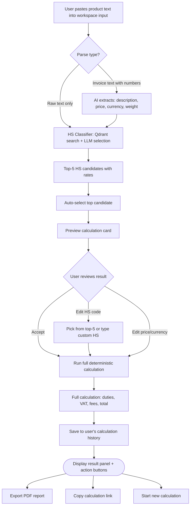
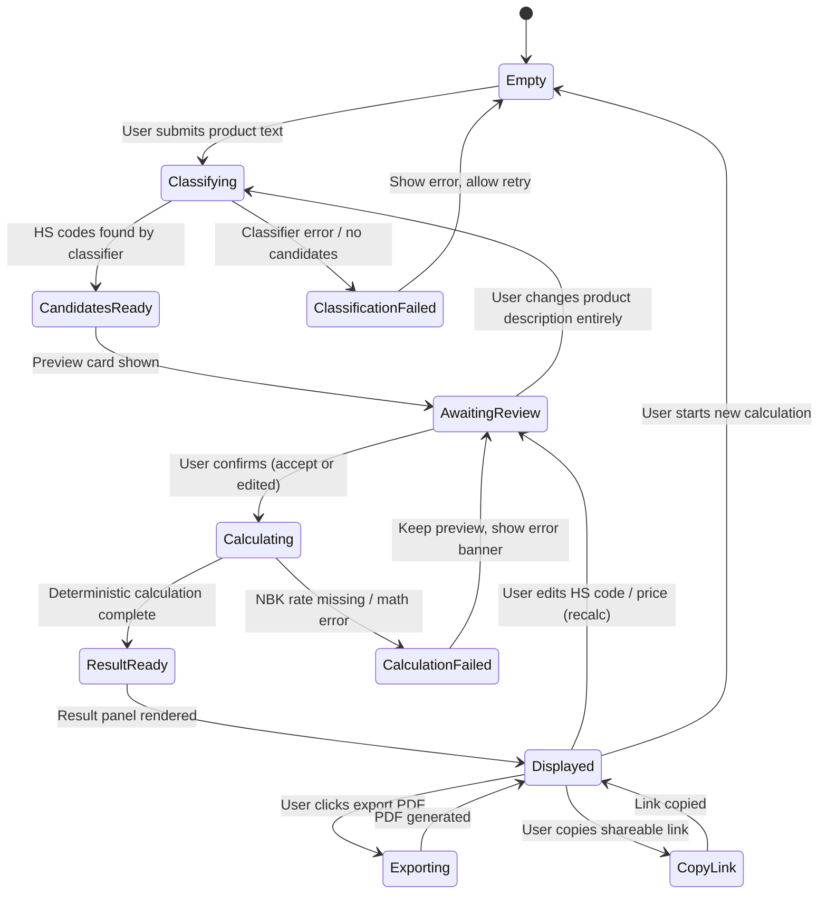
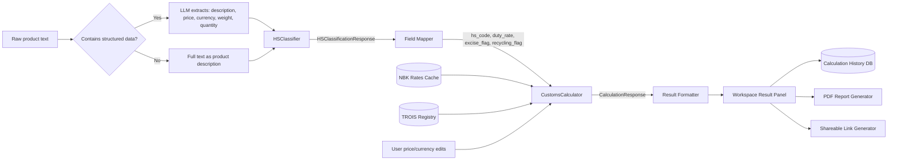

# Flow Design: Automated Calculation Workspace (RAG → Calculator)

This document defines the seamless integration of the HS classifier (RAG module) with the deterministic customs calculator, transforming the system from a question-answer chat into a declarant's single-page workspace.

---

## 1. Intent
* **User Goal:** A declarant pastes raw product text (slang, invoice line, or technical description) and immediately receives a complete financial calculation — HS code, duties, VAT, fees — without manually copying data between tools.
* **Success Criteria:**
  - Single input field accepts free-form text, no structured forms required.
  - System auto-classifies the product (HS code) and auto-calculates all payments in one click.
  - Result is displayed as a structured financial summary card, not a chat message.
  - Each result links to its sources: HS code explanatory notes, duty rate legal basis, NBK exchange rate timestamp.
  - User can correct the HS code and recalculate instantly without re-entering the product description.
  - All calculations are logged to history for later retrieval.
* **Non-negotiables:**
  - HS classification MUST use vector search in Qdrant (never pure LLM guess) per existing hs_classification_flow.md.
  - Calculations MUST be deterministic (Python math, never LLM) per existing customs_calculation_flow.md.
  - The workspace page MUST render a calculation result panel separate from any chat interface.

---

## 2. Scope
* **In Scope:**
  - Single-page workspace UI: input field + result panel side by side.
  - Unified pipeline: raw text → HS classifier → calculator → result display.
  - Auto-populate calculator fields from HS classifier output (hs_code, duty_rate, excise_flag, recycling_fee_flag).
  - User can override HS code, duty rate, invoice price, currency, transport cost before recalculating.
  - History sidebar with past calculations (read-only).
  - "Copy calculation link" for sharing with clients.
* **Out of Scope / Deferred:**
  - Batch calculation (multi-product invoice) — deferred to v2.
  - Real-time collaboration — deferred.
  - Saving calculation as a template — deferred.

---

## 3. Actors and Permissions

| Actor | Can Do | Cannot Do |
| :--- | :--- | :--- |
| **Guest** | Perform single calculation, view result | Save to history, access previous calculations |
| **Authenticated User (basic/premium)** | Full workspace: auto-classify, calculate, save history, correct HS code, export reports | Access admin features, override system rates |
| **Admin** | Full workspace + audit all users' calculations, override system configuration | — |

---

## 4. Diagrams

### Workspace — Single Calculation Flow



### System State Machine — Workspace Session



### Data Flow — Unified Pipeline



---

## 5. State and Projections

### Workspace Session State (frontend, React state)

| Field | Type | Description |
| :--- | :--- | :--- |
| `product_input` | string | Raw user input |
| `parsed_fields` | `{description, price?, currency?, weight?}` | LLM-extracted fields |
| `hs_candidates` | `List[HSCodeCandidate]` | Top-5 from classifier |
| `selected_hs_code` | string | User-chosen or auto-selected HS |
| `calculation_input` | `CalculationRequest` | Current calc parameters |
| `calculation_result` | `CalculationResponse` | Latest calc output |
| `history` | `List[HistoryEntry]` | Past calculations for this session |

### API Contract — Unified Endpoint

`POST /api/workspace/calculate`
```
Request:
{
  "product_text": "iPhone 15 Pro Max 256GB, цена 1200 USD, вес 0.3 кг",
  "override_hs_code": null,         // optional, if user already knows
  "override_price": null,            // optional, in invoice currency
  "override_currency": null,         // optional
  "override_transport_cost": null    // optional, delivery to border KZT
}

Response:
{
  "hs_classification": {
    "selected_code": "8517130000",
    "confidence": 0.92,
    "candidates": [...],
    "reasoning": "Товар относится к ..."
  },
  "calculation": {
    "customs_value_kzt": 567000,
    "duty_kzt": 56700,
    "vat_kzt": 74844,
    "excise_kzt": 0,
    "recycling_fee_kzt": 0,
    "customs_fee_kzt": 20000,
    "total_kzt": 718544,
    "exchange_rate": 472.5,
    "exchange_rate_date": "2026-05-28"
  },
  "warnings": ["Ставка пошлины 10% применена по коду ТН ВЭД 8517130000"],
  "calculation_id": "uuid",
  "share_url": "/calc/uuid"
}
```

---

## 6. Events/Actions

| Direction | Name | Source/Target | Payload | Allowed When | Reject/Failure Reason |
| :--- | :--- | :--- | :--- | :--- | :--- |
| Incoming | `workspace_calculate` | Client → Backend | `{product_text, overrides}` | Authenticated (or guest with session_id) | Empty text, invalid price |
| Outgoing | `classification_complete` | Backend → Client | `{candidates, selected_code}` | Classifier OK | Classifier error |
| Outgoing | `calculation_complete` | Backend → Client | `{full_calculation}` | Calculator OK | NBK rate missing, math error |
| Incoming | `recalculate` | Client → Backend | `{calculation_id, overrides}` | User edited fields | Calculation not found |
| Outgoing | `history_saved` | Backend → DB | `{user_id, calculation_id, result}` | Authenticated | — |
| Incoming | `get_history` | Client → Backend | `{page, limit}` | Authenticated | — |
| Incoming | `share_calculation` | Guest (via link) → Backend | `{calculation_id}` | Link valid (no auth req) | Calculation not found / expired |

---

## 7. Edge Cases

* **Ambiguous product text:** If classifier confidence < 0.7, show all top-5 candidates in the result panel and let the user pick before calculating.
* **HS code + calculation in one request:** Workspace endpoint runs both. If classifier succeeds but calculator fails (e.g. NBK down), return partial result: HS candidates + error banner "Курс валют временно недоступен. Укажите курс вручную."
* **User edits HS code after calculation:** Recalculate from scratch with new code. Warning: "Изменение кода ТН ВЭД может повлиять на ставки пошлины и акциза."
* **Guest user calculation:** Allowed, but saved with session cookie (not user_id). History lost on cookie clear. Guest prompted to register to save.
* **Very long product text (>2000 chars):** Truncate to 2000 chars before classification; show warning "Текст сокращён до 2000 символов."
* **Non-standard currency in invoice:** If currency not in NBK rates (e.g. CNY, GBP), fall back to USD via cross-rate or reject with list of supported currencies.
* **Calculation link shared to non-existent calculation:** Return 404 with message "Расчёт не найден или был удалён."
* **Concurrent editing:** Workspace state is client-side only — no multi-device sync for v1.

---

## 8. Side Effects

* Each `workspace_calculate` call consumes: 1 LLM extraction call (if needed), 1 classifier pipeline, 1 calculator pipeline.
* Results are saved to `calculation_history` table in PostgreSQL (authenticated users) or session storage (guests).
* NBK rates are fetched daily and cached; no per-request side effect.

---

## 9. Schemas Touched

* `backend/app/services/workspace/schemas.py` — WorkspaceRequest, WorkspaceResponse
* `backend/app/services/workspace/router.py` — `/api/workspace/*`
* `backend/app/services/workspace/service.py` — WorkspaceService (orchestrates classifier + calculator)
* `backend/app/services/workspace/extractor.py` — Invoice text field extractor (LLM)
* `backend/app/core/hs_classifier/classifier.py` — existing, called by workspace
* `backend/app/core/calculation/engine.py` — existing, called by workspace
* `backend/app/core/database.py` — calculation_history table via existing database boundary
* `frontend/app/workspace/page.tsx` — new workspace page

---

## 10. Targeted Tests

| Layer | Behavior | File | Status |
| :--- | :--- | :--- | :--- |
| Unit | Workspace with valid text → full response (HS + calc) | `backend/tests/test_workspace.py` | **DEFERRED** |
| Unit | Workspace with structured text → fields extracted | `backend/tests/test_workspace.py` | **DEFERRED** |
| Unit | Workspace with empty text → 422 | `backend/tests/test_workspace.py` | **DEFERRED** |
| Unit | Workspace with classifier fail → partial result + error | `backend/tests/test_workspace.py` | **DEFERRED** |
| Unit | Workspace with calculator fail → partial result + error | `backend/tests/test_workspace.py` | **DEFERRED** |
| Unit | User overrides HS code → recalculates with new rate | `backend/tests/test_workspace.py` | **DEFERRED** |
| Unit | Recalculate with edited price → new result, same HS | `backend/tests/test_workspace.py` | **DEFERRED** |
| Unit | History pagination returns correct entries | `backend/tests/test_workspace.py` | **DEFERRED** |
| Integration | Full flow: text → classify → calc → save history → recall | `backend/tests/test_workspace.py` | **DEFERRED** |
| Frontend | Workspace renders input + result panel | `frontend/__tests__/workspace.test.tsx` | **DEFERRED** |
| Frontend | HS candidate selector allows manual pick | `frontend/__tests__/workspace.test.tsx` | **DEFERRED** |

---

## 11. Implementation Plan

1. Create `backend/app/services/workspace/` package.
2. Implement `extractor.py` — LLM call to extract structured fields from raw text.
3. Implement `WorkspaceService` — orchestrates classifier → calculator, handles partial failures.
4. Create `POST /api/workspace/calculate` unified endpoint.
5. Create `GET /api/workspace/calculation/{id}` for shared links.
6. Create `GET /api/workspace/history` for authenticated users.
7. Add `calculation_history` table to PostgreSQL.
8. Build frontend workspace page (input + result panel + history sidebar).
9. Wire copy-link and share functionality.
10. Write tests.

---

## 12. Implementation Trace

*Deferred/superseded design-only backend flow. The expected `backend/app/services/workspace/` package does not exist; current workspace-like frontend uses orchestrator/calculation endpoints directly.*

### Files Created
* `backend/app/services/workspace/` (new package)
* `backend/app/services/workspace/schemas.py`
* `backend/app/services/workspace/service.py`
* `backend/app/services/workspace/router.py`
* `backend/app/services/workspace/extractor.py`
* `frontend/app/workspace/page.tsx`
* `frontend/app/workspace/layout.tsx`
* `frontend/__tests__/workspace.test.tsx`

### Files Modified
* `backend/app/main.py` — mount workspace router
* `backend/app/core/database.py` — add calculation_history table via existing database boundary
* `backend/app/core/config.py` — workspace settings
* `frontend/app/layout.tsx` — add workspace nav link

### Status
* **DEFERRED / NOT IMPLEMENTED AS DESIGNED** — no `backend/app/services/workspace/` package or `backend/tests/test_workspace.py` exists.

---

## 13. Open Questions

* *Should workspace replace the chat entirely or coexist?* → Coexist for now. Chat remains for legal RAG ("спроси про НДС"), workspace for calculations.
* *Guest history: session-based or IP-based?* → Session cookie. User prompted to register on second calculation.
* *Max input length?* → 2000 chars for v1. Longer texts should use document upload flow.

---

## 14. Review Checklist

- [ ] Is the single-page workspace clearly distinguished from the chat interface?
- [ ] Does the flow show both happy path and partial failure paths?
- [ ] Is the auto-selection logic documented with confidence threshold?
- [ ] Are all user override points (HS code, price, currency) shown?
- [ ] Is history persistence defined for both auth and guest users?
- [ ] Is there a test for each pipeline (classifier fail, calc fail, both fail)?
- [ ] Is the share link flow defined?
