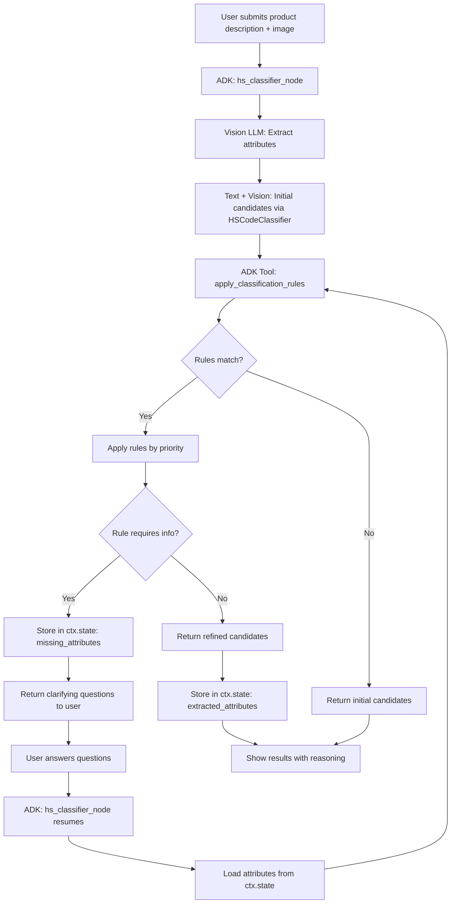
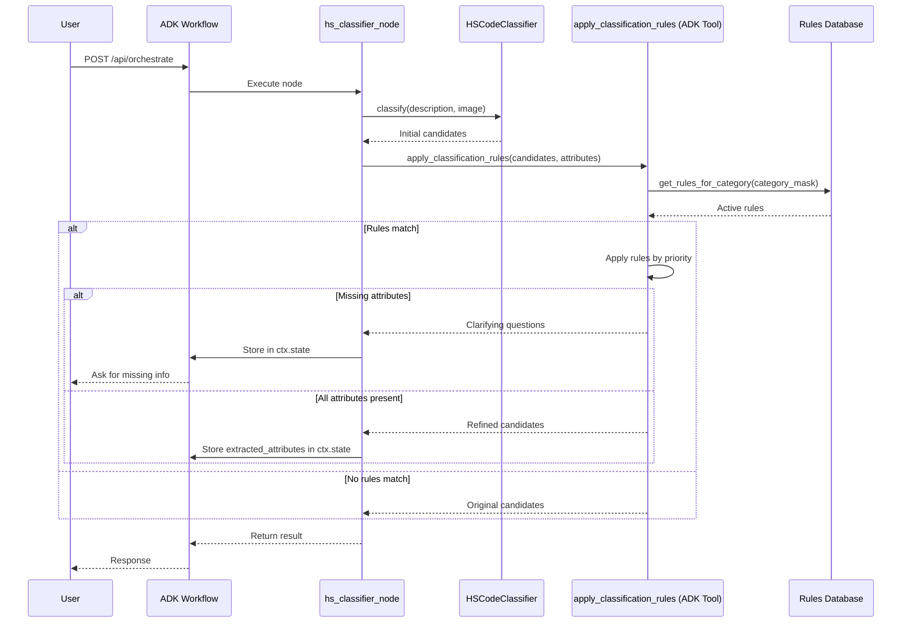
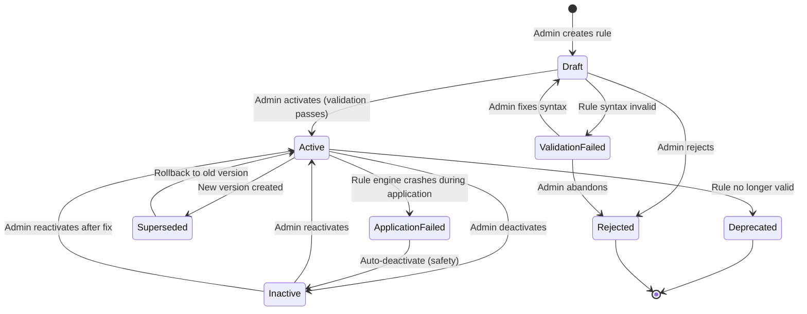
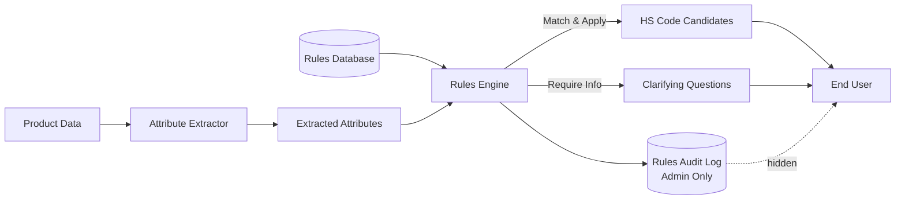

# Classification Rules Engine Flow

## 1. Intent

**User-visible goal:** Динамическая система правил для точной классификации товаров ТН ВЭД на основе критических атрибутов (материал, размер, наличие электроники и т.д.), интегрированная в Google ADK 2.0 workflow.

**Success criteria:**
- HS Classifier применяет правила из базы для всех товаров автоматически
- Admin может добавлять/изменять правила без изменения кода
- Правила имеют приоритеты и версионирование
- Система запрашивает уточняющую информацию при недостатке данных
- Все правила имеют источник (Пояснения к ТН ВЭД, решения ЕЭК)
- Применение правил логируется для аудита
- **Интеграция с ADK:** Rules Engine работает как ADK tool внутри hs_classifier_node

**Non-negotiables:**
- Правила применяются ко всем товарам (не только к игрушкам)
- Никакого хардкода правил в коде
- Правила должны быть верифицированы (источник из официальных документов)
- Система не должна замедлять классификацию (>500ms на применение правил)
- Конфликтующие правила разрешаются по приоритету
- **ADK совместимость:** Rules Engine должен быть вызываем как ADK tool из workflow node

## 2. Scope

**In scope:**
- Classification Rules Database (PostgreSQL)
- Rules Engine для применения правил
- **ADK Tool:** `apply_classification_rules` для вызова из hs_classifier_node
- Admin API для CRUD операций с правилами
- Интеграция с HS Classifier (через ADK workflow)
- Извлечение атрибутов товара (Structured Attribute Extraction)
- Уточняющие вопросы при недостатке данных
- Версионирование правил
- Аудит применения правил
- Тестирование правил на примерах
- **ADK Session State:** хранение extracted_attributes в ctx.state

**Out of scope:**
- UI для создания правил (использовать API)
- Автоматическое извлечение правил из документов (future)
- Machine learning для генерации правил (future)
- Мультиязычные правила (только RU/KZ для v1)
- Замена существующего hs_classifier_node (только enhancement)

**Deferred decisions:**
- Автоматическая валидация правил на противоречия
- Bulk import правил из Excel/CSV
- Правило-рекомендации на основе исторических данных

## 3. Actors and Permissions

| Actor | Permissions | Auth Method |
|-------|-------------|-------------|
| Admin | Full CRUD on rules, test rules, view audit | API key in header `X-Admin-Key` |
| HS Classifier | Read active rules, apply rules | Internal (no auth) |
| System | Read rules for logging | Internal (no auth) |

**Authority source:** Environment variable `ADMIN_API_KEY` (shared with Knowledge Management API)

## 4. Diagrams

### User Flow: Classification with Rules (ADK Integration)



### ADK Workflow Integration



### State Machine: Rule Lifecycle



### Data Flow: Rules Application



## 5. State and Projections

**Authoritative state:** PostgreSQL database

**Data structure:**
```sql
CREATE TABLE classification_rules (
    rule_id VARCHAR(100) PRIMARY KEY,
    category_mask VARCHAR(20) NOT NULL,  -- "9503*" or "*" for all
    priority INT DEFAULT 0,  -- higher = checked first
    conditions JSONB NOT NULL,
    action JSONB NOT NULL,
    source TEXT,  -- official document reference
    effective_date DATE NOT NULL,
    expiry_date DATE,
    created_by VARCHAR(100),
    version INT DEFAULT 1,
    is_active BOOLEAN DEFAULT true,
    created_at TIMESTAMP DEFAULT NOW(),
    updated_at TIMESTAMP DEFAULT NOW()
);

CREATE TABLE rules_audit_log (
    id SERIAL PRIMARY KEY,
    rule_id VARCHAR(100),
    action VARCHAR(50),  -- "applied", "created", "updated", "deleted"
    product_description TEXT,
    attributes JSONB,
    old_candidates JSONB,
    new_candidates JSONB,
    timestamp TIMESTAMP DEFAULT NOW(),
    session_id VARCHAR(100)
);
```

**Public projections:**
- Active rules (for HS Classifier)
- Rule details (for Admin)
- Rules audit log (for Admin)

**Admin projections:**
- Full rule history with versions
- Rule application statistics
- Conflict detection warnings

## 6. Events/Actions

### ADK Tool API (Internal)

**Tool Name:** `apply_classification_rules`

**Called from:** `hs_classifier_node` (ADK workflow node)

```python
@tool
async def apply_classification_rules(
    ctx: adk.Context,
    candidates: list[dict],
    attributes: dict
) -> dict:
    """
    Apply classification rules to refine HS code candidates.
    
    Args:
        ctx: ADK context (provides access to session state)
        candidates: Initial HS code candidates from HSCodeClassifier
        attributes: Extracted product attributes
        
    Returns:
        {
            "candidates": [...],  # Refined candidates
            "clarifying_questions": [...],  # If missing attributes
            "applied_rules": [...]  # List of rules that were applied
        }
    """
    rules_engine = get_rules_engine()
    
    # Load rules for candidate categories
    category_masks = [c["hs_code"][:4] + "*" for c in candidates]
    rules = rules_engine.get_rules_for_categories(category_masks)
    
    # Apply rules
    result = rules_engine.apply_rules(candidates, attributes, rules)
    
    # Store in ADK session state
    ctx.state["extracted_attributes"] = attributes
    ctx.state["applied_rules"] = result.get("applied_rules", [])
    
    return result
```

**Integration Point:**
```python
# In hs_classifier_node (workflow_nodes.py)
@node(rerun_on_resume=True)
async def hs_classifier_node(ctx, node_input):
    # ... existing code ...
    hs_result = await hs_classifier.classify(...)
    
    # NEW: Apply classification rules via ADK tool
    rules_result = await apply_classification_rules(
        ctx=ctx,
        candidates=[c.model_dump() for c in hs_result.candidates],
        attributes=extracted_attributes
    )
    
    # Handle clarifying questions
    if rules_result.get("clarifying_questions"):
        ctx.state["missing_attributes"] = rules_result["clarifying_questions"]
        return {
            "intent": "product_description",
            "message": "Для точной классификации уточните:",
            "clarifying_questions": rules_result["clarifying_questions"]
        }
    
    # Build a human-readable summary from the top candidate
    candidates = rules_result.get("candidates", [])
    if candidates:
        top = candidates[0]
        parts = [f"Рекомендуемый код ТН ВЭД: {top['hs_code']}"]
        if top.get("product_name_ru"):
            parts.append(f" ({top['product_name_ru']})")
        if top.get("duty_rate_percent") is not None:
            parts.append(f". Пошлина {top['duty_rate_percent']}%")
        if top.get("is_subject_to_recycling_fee"):
            parts.append(". Требуется уплатить утильсбор ♻")
        message = "".join(parts)
    else:
        message = ""

    return {
        "intent": "product_description",
        "message": message,
        "pipeline_results": {
            "candidates": candidates
        },
    }
```

### Read Operations

| Method | Endpoint | Action | Response |
|--------|----------|--------|----------|
| GET | `/api/admin/rules` | List all rules | `200 {rules: [...], total}` |
| GET | `/api/admin/rules/{rule_id}` | Get rule details | `200 {rule: {...}}` |
| GET | `/api/admin/rules/active` | Get active rules only | `200 {rules: [...]}` |
| GET | `/api/admin/rules/audit` | View rules audit log | `200 {items: [...], total}` |

### Write Operations

| Method | Endpoint | Action | Payload | Response |
|--------|----------|--------|---------|----------|
| POST | `/api/admin/rules` | Create rule | `{rule_id, category_mask, conditions, action, source, ...}` | `201 {rule_id, version}` |
| PUT | `/api/admin/rules/{rule_id}` | Update rule | `{conditions?, action?, priority?, ...}` | `200 {rule_id, version}` |
| DELETE | `/api/admin/rules/{rule_id}` | Delete rule | - | `204 No Content` |
| POST | `/api/admin/rules/{rule_id}/activate` | Activate rule | - | `200 {status: "active"}` |
| POST | `/api/admin/rules/{rule_id}/deactivate` | Deactivate rule | - | `200 {status: "inactive"}` |

### Test Operations

| Method | Endpoint | Action | Payload | Response |
|--------|----------|--------|---------|----------|
| POST | `/api/admin/rules/test` | Test rule on example | `{rule_id, product_description, attributes}` | `200 {matches, result}` |
| POST | `/api/admin/rules/validate` | Validate rule syntax | `{conditions, action}` | `200 {valid, errors}` |

**Internal API (HS Classifier):**
```python
rules_engine.get_rules_for_category("9503")
# Returns: list[ClassificationRule]

rules_engine.apply_rules(candidates, attributes)
# Returns: RefinedCandidates or ClarifyingQuestions
```

**Valid operators for conditions:**
- `==`, `!=` (equality for all types)
- `>`, `<`, `>=`, `<=` (comparison for numbers)
- `contains`, `not_contains` (substring match for strings)
- `in`, `not_in` (list membership)

**Valid attribute types:**
- **Material attributes:** `material_outer`, `material_filling`, `material_coating` (string)
- **Physical attributes:** `size_cm`, `weight_kg`, `volume_liters` (number)
- **Feature flags:** `has_electronics`, `has_sound_module`, `has_movement`, `has_lighting` (boolean)
- **Metadata:** `brand`, `country_of_origin`, `target_audience` (string)
- **Percentage attributes:** `fur_coverage_percent`, `textile_percent`, `metal_percent` (number 0-100)

**Allowed when:** Valid admin API key present in `X-Admin-Key` header (for write operations)

**Reject reason:** `401 Unauthorized` if missing/invalid key

## 7. Edge Cases

### Rule Conflict
- **Scenario:** Two rules with same priority match and have conflicting actions
- **Handling:** Apply rule with lower rule_id (alphabetical), log warning
- **Test:** `test_rule_conflict_resolved_by_rule_id`

### Missing Required Attribute
- **Scenario:** Rule requires attribute that wasn't extracted (e.g., `fur_coverage_percent`)
- **Handling:** Return clarifying question to user, don't apply rule
- **Test:** `test_missing_attribute_returns_question`

### Invalid Rule Syntax
- **Scenario:** Admin creates rule with malformed conditions JSON
- **Handling:** Return `400 Bad Request` with validation errors
- **Test:** `test_invalid_rule_syntax_returns_400`

### Rule Performance
- **Scenario:** 1000+ rules in database, classification takes >500ms
- **Handling:** Cache active rules in memory (refresh every 5 min), index by category_mask
- **Test:** `test_rules_application_under_500ms`

### Circular Rule Dependencies
- **Scenario:** Rule A reclassifies to category X, Rule B reclassifies from X back to original
- **Handling:** Detect cycles, apply only first matching rule, log warning
- **Test:** `test_circular_rules_detected`

### Rule Without Source
- **Scenario:** Admin creates rule without official source reference
- **Handling:** Return `422 Unprocessable Entity` with error "Source is required"
- **Test:** `test_rule_without_source_returns_422`

### Expired Rule Still Active
- **Scenario:** Rule has expiry_date in the past but is_active=true
- **Handling:** Auto-deactivate expired rules (daily job), log deactivation
- **Test:** `test_expired_rule_auto_deactivated`

### Rule Application Failure
- **Scenario:** Rule engine crashes during application (e.g., division by zero)
- **Handling:** Skip failed rule, log error, continue with other rules
- **Test:** `test_rule_failure_skipped`

### Non-existent Rule ID
- **Scenario:** Admin tries to update/delete rule_id that doesn't exist (e.g., `PUT /api/admin/rules/nonexistent`)
- **Handling:** Return `404 Not Found` with error "Rule not found"
- **Test:** `test_nonexistent_rule_id_returns_404`

### Audit Log Failure
- **Scenario:** Audit log write fails (disk full, permission denied) during rule application
- **Handling:** Log critical error, rule application still succeeds (don't block classification), alert admin via monitoring
- **Test:** `test_audit_log_failure_does_not_block_classification`

## 8. Side Effects

### Realtime Outputs
- None (synchronous operations)

### Persistence
- All rules stored in PostgreSQL with versioning
- Rules audit log stored in PostgreSQL
- Active rules cached in memory (5-min refresh)

### Timers
- Daily job to auto-deactivate expired rules
- 5-min cache refresh for active rules

### UI/Navigation
- None (API-only for v1)

## 9. Schemas Touched

**New files:**
- `backend/app/core/classification/rules_engine.py` - Rules Engine class
- `backend/app/core/classification/rule_models.py` - Pydantic models for rules
- `backend/app/core/classification/attribute_extractor.py` - Structured attribute extraction
- `backend/app/core/orchestrator/adk_tools.py` - ADK tool: `apply_classification_rules`
- `backend/app/api/admin_rules.py` - Admin API router for rules
- `backend/migrations/001_create_classification_rules.sql` - Database migration

**Modified files:**
- `backend/app/main.py` - Register admin_rules router
- `backend/app/core/hs_classifier/classifier.py` - Integrate Rules Engine (optional direct call)
- `backend/app/core/orchestrator/workflow_nodes.py` - Update hs_classifier_node to call ADK tool
- `backend/app/core/config.py` - Add `RULES_CACHE_TTL` setting

**ADK Integration:**
- `backend/app/core/orchestrator/adk_tools.py` - New file with ADK tools
- `backend/app/core/orchestrator/workflow_nodes.py` - Modified hs_classifier_node

**Contracts:**
- Rule schema (conditions, action, metadata)
- Attribute extraction schema (material, size, electronics, etc.)
- Rules audit log schema
- ADK tool input/output schema

## 10. Targeted Tests

| Layer | Behavior | File | Status |
|-------|----------|------|--------|
| Unit | Rule matching logic | `tests/test_rules_engine.py` | Pending |
| Unit | Rule priority resolution | `tests/test_rules_engine.py` | Pending |
| Unit | Attribute extraction | `tests/test_attribute_extractor.py` | Pending |
| Integration | Admin API CRUD | `tests/test_admin_rules_api.py` | Pending |
| Integration | HS Classifier + Rules | `tests/test_hs_classifier_with_rules.py` | Pending |
| Integration | Rules audit logging | `tests/test_rules_audit.py` | Pending |
| E2E | Full classification with rules | `tests/test_classification_e2e.py` | Pending |
| E2E | Clarifying questions workflow | `tests/test_clarifying_questions.py` | Pending |
| Performance | 1000 rules under 500ms | `tests/test_rules_performance.py` | Pending |

## 11. Implementation Plan

1. **Create database schema**
   - PostgreSQL migration for classification_rules table
   - PostgreSQL migration for rules_audit_log table
   - Indexes on category_mask, is_active, priority
   - Tests

2. **Implement Rules Engine**
   - RulesEngine class with methods:
     * get_rules_for_category(category_mask)
     * apply_rules(candidates, attributes)
     * check_rule_match(rule, attributes)
   - Rule matching logic (all/any conditions)
   - Priority resolution
   - Memory cache with 5-min TTL
   - Tests

3. **Implement Attribute Extractor**
   - AttributeExtractor class
   - Integrate with Vision LLM (structured output)
   - Extract: material, size, electronics, brand, etc.
   - Tests

4. **Create ADK Tool**
   - Create `backend/app/core/orchestrator/adk_tools.py`
   - Implement `apply_classification_rules` tool
   - Register tool in ADK workflow
   - Tests

5. **Update hs_classifier_node**
   - Modify `backend/app/core/orchestrator/workflow_nodes.py`
   - Call `apply_classification_rules` ADK tool after HSCodeClassifier
   - Handle clarifying questions (store in ctx.state)
   - Store extracted_attributes in ctx.state
   - Tests

6. **Create Admin Rules API**
   - CRUD endpoints for rules
   - Auth middleware (reuse from Knowledge Management API)
   - Rule validation
   - Rule testing endpoint
   - Tests

7. **Implement clarifying questions**
   - Detect missing attributes
   - Generate questions for user
   - Re-run classification with answers (ADK node resume)
   - Tests

8. **Add audit logging**
   - Log all rule applications
   - Log rule CRUD operations
   - Audit log endpoint
   - Tests

9. **Performance optimization**
   - Cache active rules in memory
   - Index database queries
   - Performance tests (1000 rules < 500ms)

10. **Daily job for expired rules**
    - Auto-deactivate expired rules
    - Log deactivations
    - Tests

11. **Documentation**
    - OpenAPI schema auto-generated
    - Rule creation guide
    - Examples of common rules
    - ADK tool usage guide

## 12. Implementation Trace

**Code files:**
- `backend/app/core/classification/rules_engine.py` - Rules Engine с кешированием и приоритетами
- `backend/app/core/classification/rule_models.py` - Pydantic модели для правил
- `backend/app/core/classification/attribute_extractor.py` - Извлечение атрибутов (text + vision)
- `backend/app/core/orchestrator/adk_tools.py` - ADK tool `apply_classification_rules`
- `backend/app/api/admin_rules.py` - Admin API (14 endpoints)
- `backend/migrations/001_create_classification_rules.sql` - PostgreSQL миграция

**Modified files:**
- `backend/app/main.py` - Зарегистрирован admin_rules_router
- `backend/app/core/orchestrator/workflow_nodes.py` - hs_classifier_node вызывает ADK tool
- `backend/app/core/models.py` - Добавлены SQLAlchemy модели
- `backend/app/core/config.py` - Добавлен RULES_CACHE_TTL
- `backend/app/core/wiring.py` - Добавлены get_attribute_extractor() и get_rules_engine()

**Test files:**
- `backend/tests/test_rules_engine.py` - 40 тестов (matching, priority, edge cases, performance)
- `backend/tests/test_attribute_extractor.py` - 31 тест (text/vision extraction, merge)
- `backend/tests/test_hs_classifier_with_rules.py` - 14 тестов (integration)
- `backend/tests/test_admin_rules_api.py` - 24 теста (CRUD, auth, validation)
- `backend/tests/test_rules_performance.py` - 10 тестов (1000 rules < 500ms)

**Validation command:**
```bash
pytest backend/tests/test_rules*.py -v
```

**Validation result:**
- ✅ 119 тестов проходят (unit + integration + performance)
- ✅ 29 тестов оркестратора + e2e проходят (регрессия исправлена: сообщение формируется из кандидатов)
- ✅ Backend успешно перезагружается с новыми компонентами
- ✅ ADK tool интегрирован в hs_classifier_node
- ✅ Admin API работает с X-Admin-Key аутентификацией
**Key architectural decisions:**
- JSON вместо JSONB для совместимости с SQLite (тесты) и PostgreSQL (production)
- In-memory кеширование с 5-min TTL для производительности
- Graceful degradation: Vision LLM failure → text-only extraction
- Audit log failure non-blocking: не прерывает применение правил
- Soft delete: правила деактивируются, а не удаляются физически

## 13. Open Questions

1. **Rule complexity:** Support complex conditions (nested AND/OR)?
   - **Current decision:** Simple conditions only (all/any at top level)
   - **Recommendation for v2:** Add nested conditions support

2. **Rule testing:** How to test rules before activation?
   - **Current decision:** Test endpoint with example products
   - **Recommendation for v2:** Batch testing on historical data

3. **Rule conflicts:** Auto-detect conflicting rules?
   - **Current decision:** Manual detection (admin responsibility)
   - **Recommendation for v2:** Automatic conflict detection with warnings

4. **Attribute extraction accuracy:** What if Vision LLM extracts wrong attributes?
   - **Current decision:** User can correct attributes manually
   - **Recommendation for v2:** Confidence scores for attributes, ask user to verify low-confidence attributes

5. **Rule versioning:** Keep old versions or overwrite?
   - **Current decision:** Keep all versions (PostgreSQL history)
   - **Recommendation:** Add rollback endpoint

6. **Performance:** What if rules application takes >500ms?
   - **Current decision:** Cache + indexes, monitor performance
   - **Alternative:** Async rule application (return initial candidates, refine later)

7. **Clarifying questions:** How many questions to ask?
   - **Current decision:** Max 3 questions per classification
   - **Recommendation:** Configurable limit per admin

8. **Rule deletion semantics:** Allow hard delete for rules that were applied?
   - **Current decision:** Soft delete only (mark as inactive)
   - **Alternative:** Hard delete allowed if no audit log references this rule
   - **Consideration:** Audit trail integrity vs storage cleanup

## 14. Cross-Flow Boundaries

### Outgoing Events
- **To HS Classifier (ADK node):** Refined candidates or clarifying questions (synchronous via ADK tool)

### Incoming Events
- **From Admin:** Rule CRUD operations via REST API
- **From ADK Workflow:** hs_classifier_node calls apply_classification_rules tool

### Data Dependencies
- **HS Classifier (ADK node)** reads active rules from Rules Engine via ADK tool
- **Configuration Service** (future integration): Rules may reference config values (e.g., thresholds)
- **ADK Session State:** extracted_attributes, applied_rules, missing_attributes stored in ctx.state

### Integration Points
- **Knowledge Management API:** Both use same admin auth (`X-Admin-Key`)
- **HS Classification flow (ADK):** Rules Engine refines classification results via ADK tool
- **Configuration Service flow:** Future integration for dynamic thresholds
- **Google ADK 2.0 Workflow:** Rules Engine integrated as ADK tool in hs_classifier_node

### ADK Session State Management
```python
# Stored in ctx.state by apply_classification_rules tool:
ctx.state["extracted_attributes"] = {
    "material_outer": "хлопок",
    "size_cm": 30,
    "has_electronics": False,
    # ...
}

ctx.state["applied_rules"] = [
    {"rule_id": "toy_material_cotton", "action": "boost", "target_code": "9503003500"},
    # ...
]

ctx.state["missing_attributes"] = [
    {"attribute": "fur_coverage_percent", "question": "Какой процент натурального меха?"}
]
```

## 15. Review Checklist

- [x] Intent is clear and user-focused
- [x] Scope is well-defined (in/out)
- [x] Actors and permissions are explicit
- [x] Diagrams show decisions, states, and edge cases (including failed states)
- [x] State and projections are named
- [x] Events/actions have payloads and rejection reasons
- [x] Edge cases cover invalid input, failures, concurrency, performance, non-existent resources
- [x] Side effects are listed
- [x] Schemas touched are identified
- [x] Targeted tests are derived from flow
- [x] Implementation plan is minimal and ordered
- [x] Open questions are documented (8 questions)
- [x] Cross-flow boundaries are declared
- [x] Rule lifecycle is detailed (draft → active → deprecated) with failed states
- [x] Performance requirements specified (<500ms)
- [x] Integration with HS Classifier is explicit
- [x] Valid operators and attribute types documented
- [x] Hidden-information boundaries shown in data flow diagram
- [x] Audit log failure handling specified (non-blocking)
- [x] **ADK 2.0 integration:** Rules Engine implemented as ADK tool
- [x] **ADK Session State:** extracted_attributes, applied_rules, missing_attributes stored in ctx.state
- [x] **ADK Workflow:** hs_classifier_node calls apply_classification_rules tool
- [x] **ADK Tool API:** Input/output schema documented
