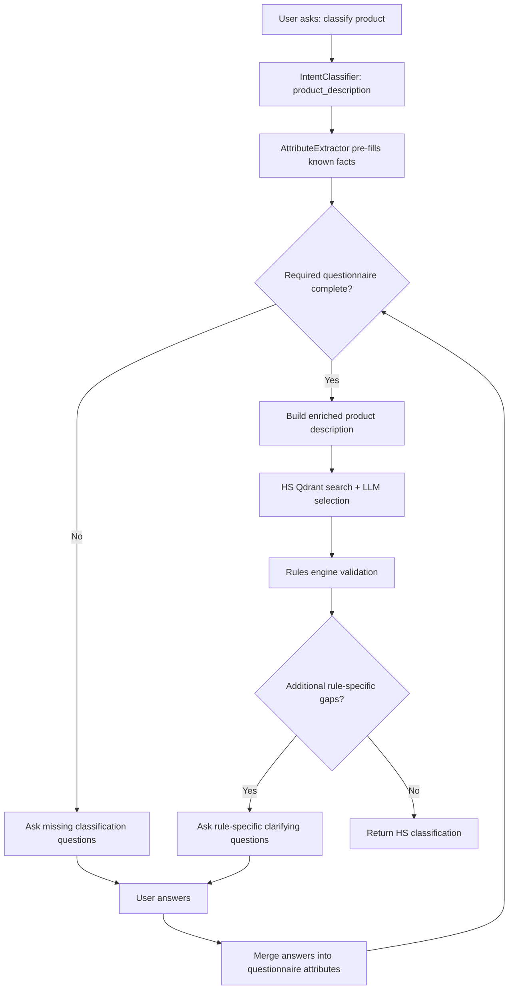
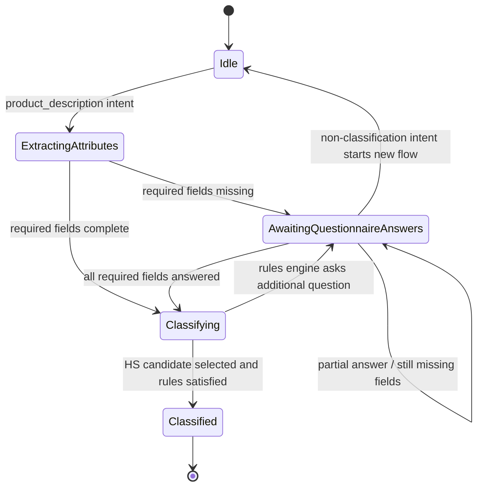
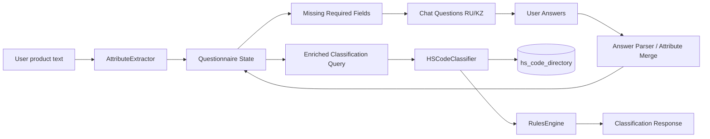

# Flow Design: HS Classification Questionnaire

This document defines a mandatory pre-classification questionnaire for HS/TN VED classification. The questionnaire gathers customs-critical attributes before vector search and LLM code selection so classification is based on function, material, completeness, jurisdiction, and customs regime rather than product name alone.

---

## 1. Intent

* **User Goal:** When a user asks to classify a product, the assistant asks the minimum required customs questions before searching HS codes, then uses the collected answers to classify with better precision.
* **Success Criteria:**
  - Product-description intent enters a questionnaire before HS vector search when required attributes are missing.
  - The first questionnaire asks for the core classification facts: separate/kit, purpose, material/composition, technical characteristics, origin country, customs regime, jurisdiction.
  - User answers are merged into structured attributes and reused on the follow-up classification turn.
  - HS Qdrant search is not called until the questionnaire is complete or explicitly skippable by policy.
  - Existing automatic attribute extraction still pre-fills facts already present in the user's original message.
* **Non-negotiables:**
  - Do not classify underspecified goods when required questionnaire fields are absent.
  - Do not ask already-known questions if the extractor already found the answer.
  - Do not route legal questions through the classification questionnaire.
  - Questions must be user-facing RU/KZ capable; implementation may start with existing RU chat copy and leave KZ copy as an explicit UI/i18n follow-up if current frontend has no i18n layer.

---

## 2. Scope

* **In Scope:**
  - Backend questionnaire state for `product_description` intent in ADK orchestrator state.
  - Required questionnaire fields:
    1. `is_kit` — товар отдельно или в составе комплекта
    2. `product_purpose` — основное назначение товара
    3. `material_composition` — материал / состав
    4. `technical_specs` — технические характеристики
    5. `country_of_origin` — страна происхождения
    6. `customs_regime` — импорт / экспорт / транзит
    7. `jurisdiction` — ЕАЭС / ЕС / США / другая
  - Mapping free-form user answers back into attributes.
  - Tests proving HS search is blocked before required answers and allowed after answers are merged.
* **Out of Scope / Deferred:**
  - Dedicated frontend wizard UI; chat-based questions are acceptable for this slice.
  - Full bilingual i18n framework.
  - WCO Explanatory Notes ingestion. This flow prepares better attributes; WCO source expansion is separate.
  - Jurisdiction-specific tariff schedules outside EAEU.

---

## 3. Actors and Permissions

| Actor | Can Do | Cannot Do |
| :--- | :--- | :--- |
| **Guest / User** | Ask for product classification, answer questionnaire, receive classification after completion | Force a final HS classification without required questionnaire data |
| **Backend Orchestrator** | Detect missing fields, store questionnaire state, merge answers, call HS classifier after completion | Call HS classifier while required fields are missing |
| **HS Classifier** | Search Qdrant and select candidate codes from complete enriched query | Ask questionnaire questions directly or own multi-turn state |

---

## 4. Diagrams

### User Flow

### State Machine

### Data Flow

---

## 5. State and Projections

### Authoritative State

| State | Owner | Description |
| :--- | :--- | :--- |
| `classification_questionnaire` | Orchestrator ADK state | Current answers, missing fields, original product text |
| `extracted_attributes` | Orchestrator ADK state | Attributes from extractor plus user questionnaire answers |
| `missing_questionnaire_fields` | Orchestrator ADK state | Required fields still absent |
| `pending_classification` | Orchestrator ADK state | True while waiting for questionnaire answers |

### Required Field Contract

| Field | Type | Example | Required for Initial HS Search |
| :--- | :--- | :--- | :--- |
| `is_kit` | boolean/string enum | `separate`, `kit` | yes |
| `product_purpose` | string | `для промышленной фильтрации воды` | yes |
| `material_composition` | string | `нержавеющая сталь, полипропилен` | yes |
| `technical_specs` | string | `220В, 1.5кВт, производительность 200 л/ч` | yes |
| `country_of_origin` | string | `Китай` | yes |
| `customs_regime` | enum/string | `import`, `export`, `transit` | yes |
| `jurisdiction` | enum/string | `EAEU`, `EU`, `US`, `other` | yes |

### Public Projection

The user sees a concise numbered questionnaire for only missing fields. The response intent remains `product_description` so the frontend can treat it as a classification continuation without a new response type.

---

## 6. Events/Actions

| Direction | Name | Source/Target | Payload | Allowed When | Reject/Failure Reason |
| :--- | :--- | :--- | :--- | :--- | :--- |
| Incoming | `classification:requested` | User → Orchestrator | `{text, optional_file, history}` | Intent is `product_description` | Other intents route elsewhere |
| Internal | `classification:attributes_extracted` | AttributeExtractor → Orchestrator | `{attributes}` | Product text present | Extractor failure falls back to empty attributes |
| Outgoing | `classification:questionnaire_requested` | Orchestrator → User | `{missing_fields, questions}` | Any required field missing | — |
| Incoming | `classification:questionnaire_answered` | User → Orchestrator | `{answers_text}` | Pending questionnaire exists | No pending questionnaire; route through normal intent classification |
| Internal | `classification:questionnaire_complete` | Orchestrator → HS Classifier | `{enriched_text, attributes}` | All required fields present | Missing required fields |
| Outgoing | `classification:completed` | Orchestrator → User | `{candidates, selected_code, reasoning}` | HS classifier + rules complete | Classifier failure |

---

## 7. Edge Cases

* **User gives rich description initially:** extractor fills some/all fields; questionnaire asks only missing fields or skips entirely if complete.
* **User answers only some questions:** state remains pending and assistant asks only remaining missing fields.
* **User changes topic while questionnaire pending:** new non-product intent exits pending questionnaire and routes normally.
* **User says unknown / not sure:** field remains missing unless policy later allows explicit skip; no HS search in this slice.
* **Country of origin not relevant for pure nomenclature:** still collected because downstream duty/risk/regime logic needs it; field can be marked `unknown` only by future policy.
* **Jurisdiction not EAEU:** collect value but classification still warns that current HS directory is EAEU-focused.
* **Uploaded image plus text:** extractor may pre-fill technical/material fields; questionnaire asks remaining fields.
* **Rules engine later asks additional attributes:** rule-specific clarifying questions continue after the baseline questionnaire, using existing resume path.
* **Duplicate questionnaire answer submission:** merge is idempotent by field name; latest non-empty answer wins.

---

## 8. Side Effects

* ADK session state stores pending questionnaire attributes for the current classification interaction.
* HS Qdrant search calls decrease for underspecified products because classification waits for required facts.
* The response message may be a questionnaire instead of immediate classification.
* Existing `/api/classify` direct endpoint is out of scope and may still classify directly; orchestrated chat flow is the controlled path in this slice.

---

## 9. Schemas Touched

* `backend/app/core/classification/rule_models.py` — extend `AttributeSchema` with required questionnaire fields if absent.
* `backend/app/core/classification/attribute_extractor.py` — extract or preserve questionnaire attributes where possible.
* `backend/app/core/orchestrator/workflow_nodes.py` — gate `hs_classifier_node` before HS search and resume after answers.
* `backend/app/core/classification/questionnaire.py` — required field list, question rendering, missing-field detection, and answer parsing/merge.
* `backend/tests/test_orchestrator.py` — add multi-turn questionnaire tests and negative HS-search-before-complete test.
* `flows/ARCHITECTURE.md` — map questionnaire before HS search.

---

## 10. Targeted Tests

| Layer | Behavior | File | Status |
| :--- | :--- | :--- | :--- |
| Unit | Missing baseline fields returns questionnaire and does not call HS classifier | `backend/tests/test_orchestrator.py::test_questionnaire_blocks_hs_classifier_on_missing_fields` | Passed |
| Unit | Rich product text with all fields calls HS classifier without questionnaire | `backend/tests/test_orchestrator.py::test_questionnaire_skips_when_fields_rich` | Passed |
| Unit | Partial questionnaire answer asks only remaining fields | `backend/tests/test_orchestrator.py::test_questionnaire_partial_answer_asks_remaining` | Passed |
| Unit | Complete questionnaire answer merges attributes and calls HS classifier | `backend/tests/test_orchestrator.py::test_questionnaire_complete_answer_calls_hs_classifier` | Passed |
| Unit | Non-product intent while pending exits questionnaire | `backend/tests/test_orchestrator.py::test_questionnaire_exits_on_non_product_intent` | Passed |
| Regression | Existing rules-engine clarifying questions still work after baseline questionnaire | `backend/tests/test_orchestrator.py`, `backend/tests/test_hs_classifier_with_rules.py`, `backend/tests/test_rules_engine.py` | Passed |

---

## 11. Implementation Plan

1. Inspect current AttributeSchema, AttributeExtractor, and hs_classifier_node resume state.
2. Add the missing questionnaire fields to the classification attribute model.
3. Add a small questionnaire helper in the orchestrator or classification module: required field list, missing-field detection, question rendering, answer parsing/merge.
4. In `hs_classifier_node`, run extractor first, then questionnaire gate before calling `HSCodeClassifier.classify`.
5. Reuse pending state on the next turn to merge answers and continue classification only when complete.
6. Add targeted tests using monkeypatched HS classifier to prove it is not called before completion.
7. Fill implementation trace and run sync-flow verification.

---

## 12. Implementation Trace

* **Flow Review:** Approved before implementation. The flow defines a mandatory questionnaire gate, history-based continuation, concrete rejection paths, and targeted tests.
* **Code Files:**
  - `backend/app/core/classification/rule_models.py` — added optional questionnaire fields to `AttributeSchema`.
  - `backend/app/core/classification/questionnaire.py` — added pure questionnaire helpers and conservative answer parser.
  - `backend/app/core/classification/attribute_extractor.py` — added obvious text/Vision extraction for questionnaire fields.
  - `backend/app/core/orchestrator/workflow_nodes.py` — added questionnaire detection, gate before HS search, history-based continuation, and enriched HS description.
* **Test Files:**
  - `backend/tests/test_orchestrator.py` — added questionnaire gate and continuation tests.
* **Architecture Map:**
  - `flows/ARCHITECTURE.md` — mapped classification questionnaire before HS vector search.
* **Validation:**
  - `.venv/Scripts/ruff check backend/app/core/classification/rule_models.py backend/app/core/classification/questionnaire.py backend/app/core/classification/attribute_extractor.py backend/app/core/orchestrator/workflow_nodes.py` → `OK`.
  - `.venv/Scripts/pytest backend/tests/test_orchestrator.py` with `PYTHONPATH=backend` → `32 passed, 2 warnings`.
  - `.venv/Scripts/pytest backend/tests/test_orchestrator.py backend/tests/test_hs_classifier.py backend/tests/test_hs_classifier_with_rules.py backend/tests/test_rules_engine.py` with `PYTHONPATH=backend` → `87 passed, 2 warnings`.

---

## 13. Open Questions

* **Deferred:** Should users be allowed to explicitly skip unknown fields? This slice treats missing required fields as blockers to classification.
* **Deferred:** Should the frontend render a structured form instead of chat questions? Backend chat behavior is implemented first.
* **Deferred:** Should non-EAEU jurisdictions trigger a separate classifier/source set? This slice records jurisdiction and warns if needed; it does not add EU/US schedules.

---

## 14. Review Checklist

| Item | Status |
| :--- | :--- |
| Intent describes intended behavior, not current implementation | Ready |
| Diagrams include decisions and rejection paths | Ready |
| Forbidden paths and permissions are explicit | Ready |
| Edge cases are concrete and testable | Ready |
| Schemas/files expected to change are named | Ready |
| Tests map to behavior paths | Ready |
| Cross-flow boundaries declared | Ready |
| Open questions are explicit/deferred | Ready |
