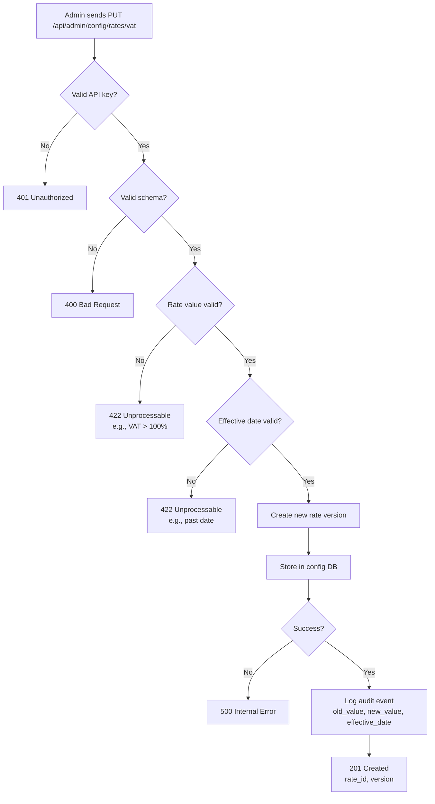
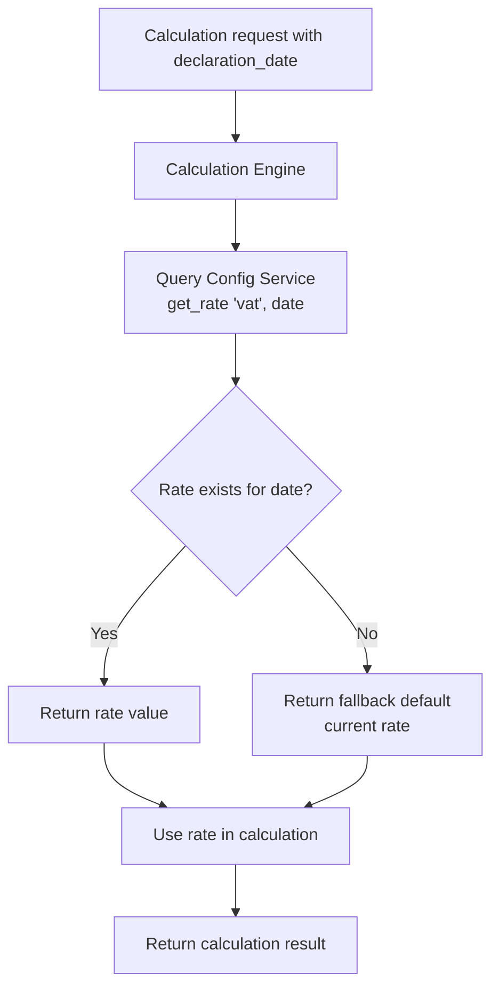
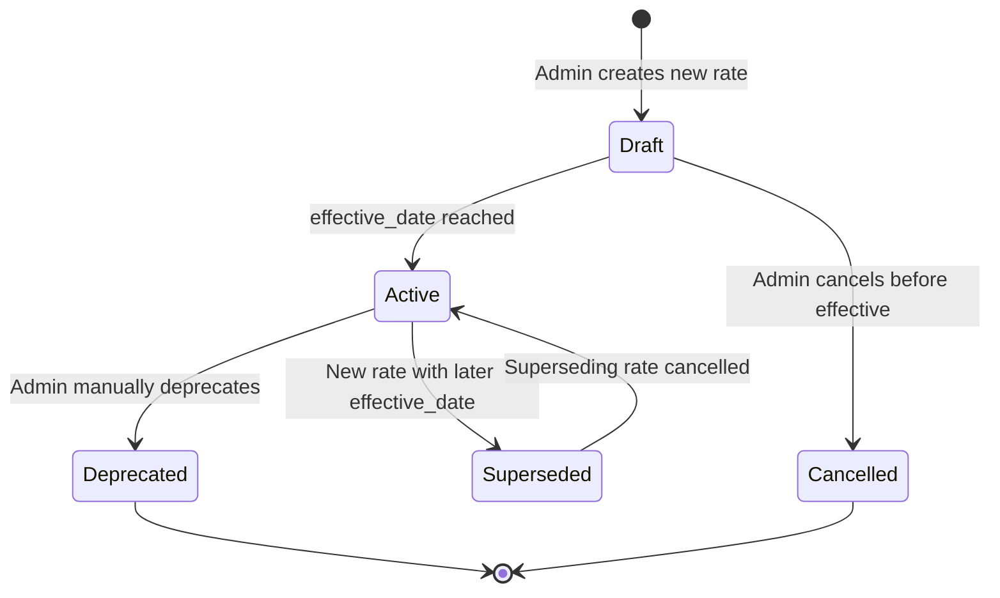
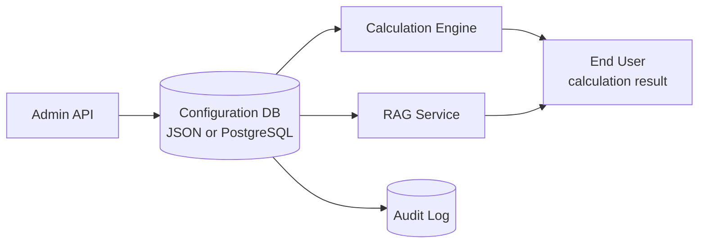

# Configuration Service Flow

## 1. Intent

**User-visible goal:** Centralize all customs calculation rates and constants (VAT, MCI, duty rates, excise rates, recycling fees) in a single source of truth with versioning and audit trail.

**Success criteria:**
- All calculation components read rates from Configuration Service (not hardcoded)
- RAG service references config instead of duplicating rates
- Admin can update rates via API with effective dates
- All rate changes are logged with timestamp, actor, old/new values
- System uses correct rate based on declaration date (historical rates supported)

**Non-negotiables:**
- Calculation Engine must never use hardcoded rates (except fallback defaults)
- Rate updates must not break in-flight calculations
- All changes require admin authentication
- Historical rates preserved for audit and retroactive calculations

## 2. Scope

**In scope:**
- Configuration Service with versioned rates:
  - Import VAT rate (currently 16%)
  - MCI rates by year (2022-2026+)
  - Customs processing fee
  - Recycling fee rates by vehicle category/age
  - Excise rates by product type
- REST API for reading and updating rates
- Integration with Calculation Engine (read rates dynamically)
- Integration with RAG service (reference config instead of duplicating)
- Audit logging of all rate changes
- Historical rate lookup by effective date

**Out of scope:**
- Exchange rates (already handled by NBKExchangeRateProvider)
- HS code duty rates (stored in Qdrant, managed via Knowledge Management API)
- Admin UI (separate feature)
- Bulk rate updates (v2)
- Rate change notifications/webhooks (v2)

**Deferred decisions:**
- Rate approval workflow (draft → review → active)
- Scheduled rate changes (future effective dates)
- Rate change impact analysis (preview before apply)

## 3. Actors and Permissions

| Actor | Permissions | Auth Method |
|-------|-------------|-------------|
| Admin | Read all rates, update rates, view audit log | API key in header `X-Admin-Key` |
| Calculation Engine | Read active rates for given date | Internal (no auth) |
| RAG Service | Read rates for citation in responses | Internal (no auth) |
| System | Read current rates | Internal (no auth) |

**Authority source:** Environment variable `ADMIN_API_KEY` (shared with Knowledge Management API)

## 4. Diagrams

### User Flow: Update Rate



### User Flow: Calculate with Historical Rate



### State Machine: Rate Versioning



### Data Flow



## 5. State and Projections

**Authoritative state:** Configuration database (JSON file for v1, PostgreSQL for v2)

**Data structure:**
```json
{
  "rates": {
    "import_vat": [
      {
        "value": 0.12,
        "effective_date": "2020-01-01",
        "expiry_date": "2025-12-31",
        "version": 1,
        "created_by": "system",
        "created_at": "2020-01-01T00:00:00Z"
      },
      {
        "value": 0.16,
        "effective_date": "2026-01-01",
        "expiry_date": null,
        "version": 2,
        "created_by": "admin",
        "created_at": "2025-12-15T10:30:00Z"
      }
    ],
    "mci": [
      {
        "year": 2026,
        "value": 4325.0,
        "version": 1,
        "created_by": "admin",
        "created_at": "2025-12-01T09:00:00Z"
      }
    ],
    "customs_processing_fee": [...],
    "recycling_rates": [...],
    "excise_rates": [...]
  }
}
```

**Public projections:**
- Current rates (for Calculation Engine)
- Historical rates (for retroactive calculations)
- Rate metadata (version, effective_date, created_by)

**Admin projections:**
- Full rate history with audit trail
- Pending scheduled changes (v2)

## 6. Events/Actions

### Read Operations

| Method | Endpoint | Action | Response |
|--------|----------|--------|----------|
| GET | `/api/admin/config/rates` | Get all current rates | `200 {rates: {...}}` |
| GET | `/api/admin/config/rates/{rate_type}` | Get specific rate history | `200 {rate_type, versions: [...]}` |
| GET | `/api/admin/config/rates/{rate_type}/current` | Get current active rate | `200 {value, effective_date, version}` |
| GET | `/api/admin/config/rates/{rate_type}/at/{date}` | Get rate for specific date | `200 {value, effective_date, version}` |

### Write Operations

| Method | Endpoint | Action | Payload | Response |
|--------|----------|--------|---------|----------|
| PUT | `/api/admin/config/rates/{rate_type}` | Update rate | `{value, effective_date, reason?}` | `201 {rate_id, version, old_value, new_value}` |
| POST | `/api/admin/config/rates/{rate_type}/cancel/{version}` | Cancel scheduled rate | - | `200 {status: "cancelled"}` |
| DELETE | `/api/admin/config/rates/{rate_type}/{version}` | Delete rate version (admin only) | - | `204 No Content` |

### Audit Operations

| Method | Endpoint | Action | Response |
|--------|----------|--------|----------|
| GET | `/api/admin/config/audit` | View rate change audit log | `200 {items: [...], total}` |

**Internal API (Calculation Engine):**
```python
config_service.get_rate("import_vat", declaration_date="2026-05-30")
# Returns: 0.16

config_service.get_mci(year=2026)
# Returns: 4325.0
```

**Allowed when:** Valid admin API key present in `X-Admin-Key` header (for write operations)

**Reject reason:** `401 Unauthorized` if missing/invalid key

## 7. Edge Cases

### Rate Update During Calculation
- **Scenario:** Admin updates VAT rate while calculation is in progress
- **Handling:** Calculation uses rate snapshot at request start (no mid-calculation changes)
- **Test:** `test_rate_update_during_calculation_uses_snapshot`

### Past Effective Date
- **Scenario:** Admin tries to set rate with effective_date in the past
- **Handling:** Return `422 Unprocessable Entity` with error "Effective date cannot be in the past"
- **Test:** `test_past_effective_date_returns_422`

### Conflicting Effective Dates
- **Scenario:** Admin creates rate with effective_date that overlaps existing active rate
- **Handling:** Auto-set expiry_date on previous rate to day before new effective_date
- **Test:** `test_overlapping_effective_dates_auto_adjust_expiry`

### Missing Historical Rate
- **Scenario:** Calculation requests rate for date before any configured rate
- **Handling:** Return earliest available rate (fallback), log warning
- **Test:** `test_missing_historical_rate_returns_earliest`

### Invalid Rate Value
- **Scenario:** Admin tries to set VAT rate to 150% (value: 1.5)
- **Handling:** Return `422 Unprocessable Entity` with validation error "Rate must be between 0 and 1"
- **Test:** `test_invalid_rate_value_returns_422`

### Concurrent Rate Updates
- **Scenario:** Two admins update same rate simultaneously
- **Handling:** Last write wins (optimistic concurrency), both logged in audit
- **Test:** `test_concurrent_rate_updates_last_wins`

### Rate Deletion with Dependencies
- **Scenario:** Admin deletes rate version that is referenced by historical calculations
- **Handling:** Soft delete (mark as deprecated), keep in DB for audit, return `200 OK` with warning
- **Test:** `test_rate_deletion_soft_delete_with_dependencies`

### Config Service Unavailable
- **Scenario:** Config DB connection fails during calculation
- **Handling:** Fall back to hardcoded defaults in `business_rules.py`, log error, return calculation with warning
- **Test:** `test_config_service_unavailable_uses_fallback`

## 8. Side Effects

### Realtime Outputs
- None (synchronous operations)

### Persistence
- All rate versions stored in config DB (JSON file for v1, PostgreSQL for v2)
- Audit log stored in same DB (or separate file)
- Fallback defaults remain in `business_rules.py` (for disaster recovery)

### Timers
- None for v1 (v2 may add scheduled rate activation)

### UI/Navigation
- None (API-only for v1)

## 9. Schemas Touched

**New files:**
- `backend/app/core/config_service.py` - Configuration Service class
- `backend/app/api/admin_config.py` - Admin API router for config
- `backend/app/core/admin/config_schemas.py` - Pydantic models for config API
- `backend/data/config.json` - Configuration database (v1)

**Modified files:**
- `backend/app/main.py` - Register admin config router
- `backend/app/core/calculation/engine.py` - Use Config Service instead of hardcoded rates
- `backend/app/core/business_rules.py` - Keep as fallback defaults only
- `backend/app/core/rag/service.py` - Reference Config Service for rate citations
- `backend/app/core/config.py` - Add `CONFIG_DB_PATH` setting

**Contracts:**
- Config API request/response schemas (Pydantic models)
- Rate version schema (value, effective_date, expiry_date, version, metadata)
- Audit log schema (timestamp, actor, rate_type, old_value, new_value, reason)

## 10. Targeted Tests

| Layer | Behavior | File | Status |
|-------|----------|------|--------|
| Unit | Rate versioning logic | `backend/tests/test_config_service.py` | **PASSED** |
| Unit | Historical rate lookup | `backend/tests/test_config_service.py` | **PASSED** |
| Unit | Rate validation | `backend/tests/test_config_schemas.py` | **PASSED** |
| Integration | Admin API update rate | `backend/tests/test_admin_config_api.py` | **PASSED** |
| Integration | Calculation uses config service | `backend/tests/test_calculation_with_config.py` | **PASSED** |
| Integration | RAG references config service | `backend/tests/test_rag_with_config.py` | **PASSED** |
| Integration | Audit logging | `backend/tests/test_config_audit.py` | **PASSED** |
| E2E | Full rate update workflow | `backend/tests/test_config_e2e.py` | **PASSED** |
| E2E | Historical calculation | `backend/tests/test_config_service.py` | **PASSED** |

## 11. Implementation Plan

1. **Create Configuration Service**
   - Implement `ConfigService` class with rate versioning
   - JSON file storage for v1
   - Methods: `get_rate()`, `update_rate()`, `get_history()`
   - Tests

2. **Define config schemas**
   - Pydantic models for rate versions
   - Validation rules (rate ranges, date formats)
   - Tests

3. **Create admin config API**
   - GET/PUT/DELETE endpoints
   - Auth middleware (reuse from Knowledge Management API)
   - Audit logging
   - Tests

4. **Integrate with Calculation Engine**
   - Replace hardcoded rates with `config_service.get_rate()`
   - Add `declaration_date` parameter support
   - Fallback to `business_rules.py` on config service failure
   - Tests

5. **Integrate with RAG Service**
   - Update RAG to reference Config Service for rate citations
   - Remove hardcoded rates from RAG data files
   - Tests

6. **Migrate existing rates**
   - Extract current rates from `business_rules.py`, `engine.py`, `reference_data.py`
   - Load into config DB with effective dates
   - Tests

7. **Error handling and edge cases**
   - Config service unavailable fallback
   - Concurrent update handling
   - Historical rate missing handling
   - Tests

8. **Documentation**
   - OpenAPI schema auto-generated
   - Update README with config service usage
   - Migration guide for existing hardcoded rates

## 12. Implementation Trace

**Code files:**
- `backend/app/core/config_service.py`
- `backend/app/api/admin_config.py`
- `backend/app/core/config_schemas.py`
- `backend/data/config.json`
- `backend/app/core/calculation/engine.py`
- `backend/app/core/business_rules.py`
- `backend/app/core/rag/service.py`
- `backend/app/core/config.py`

**Test files:**
- `backend/tests/test_config_service.py`
- `backend/tests/test_config_schemas.py`
- `backend/tests/test_admin_config_api.py`
- `backend/tests/test_calculation_with_config.py`
- `backend/tests/test_rag_with_config.py`
- `backend/tests/test_config_audit.py`
- `backend/tests/test_config_e2e.py`

**Validation command:**
```bash
PYTHONPATH=backend .venv/Scripts/pytest backend/tests/test_config_service.py backend/tests/test_config_schemas.py backend/tests/test_admin_config_api.py backend/tests/test_calculation_with_config.py backend/tests/test_rag_with_config.py backend/tests/test_config_audit.py backend/tests/test_config_e2e.py
```

**Validation result:**
- `148 passed, 2 warnings` for the targeted backend sync set, including all listed configuration-service tests.

## 13. Open Questions

1. **Config DB storage:** JSON file vs PostgreSQL?
   - **Current decision:** JSON file for v1 (simpler, no DB dependency)
   - **Recommendation for v2:** Migrate to PostgreSQL for better querying and concurrent access

2. **Rate approval workflow:** Should rate changes require approval?
   - **Current decision:** No for v1 (single admin)
   - **Recommendation for v2:** Add draft → review → active workflow for multi-admin scenarios

3. **Scheduled rate changes:** Support future effective dates?
   - **Current decision:** No for v1 (manual activation)
   - **Recommendation for v2:** Add scheduled activation with background job

4. **Rate change impact analysis:** Preview impact before applying?
   - **Recommendation:** Defer to v2 (requires calculation simulation)

5. **Rate change notifications:** Notify other systems on rate changes?
   - **Recommendation:** Defer to v2 (webhooks or event bus)

6. **Fallback strategy:** What if Config Service is unavailable?
   - **Current decision:** Fall back to hardcoded defaults in `business_rules.py`
   - **Alternative:** Return error and fail calculation (safer but less available)

7. **Rate granularity:** Support different rates by product category?
   - **Current decision:** No for v1 (global rates only)
   - **Recommendation for v2:** Add category-specific rates (e.g., reduced VAT for medical supplies)

## 14. Cross-Flow Boundaries

### Outgoing Events
- **None for v1.** Configuration Service is read-only for other flows.

### Incoming Events
- **From Knowledge Management API:** None (separate concerns)
- **From Admin:** Rate update requests via REST API

### Data Dependencies
- **Calculation Engine** reads rates from Configuration Service
- **RAG Service** reads rates for citation in responses
- **Knowledge Management API** may reference config for HS code duty rates (future integration)

### Integration Points
- **Knowledge Management API flow:** Both use same admin auth (`X-Admin-Key`), but manage different data (config vs knowledge base)
- **Customs Calculation flow:** Calculation Engine queries Config Service for rates
- **Legal RAG flow:** RAG Service queries Config Service for rate citations

## 15. Review Checklist

- [x] Intent is clear and user-focused
- [x] Scope is well-defined (in/out)
- [x] Actors and permissions are explicit
- [x] Diagrams show decisions, states, and edge cases
- [x] State and projections are named
- [x] Events/actions have payloads and rejection reasons
- [x] Edge cases cover invalid input, failures, concurrency, historical data
- [x] Side effects are listed
- [x] Schemas touched are identified
- [x] Targeted tests are derived from flow
- [x] Implementation plan is minimal and ordered
- [x] Open questions are documented
- [x] Cross-flow boundaries are declared
- [x] Rate versioning strategy is detailed
- [x] Fallback strategy specified (hardcoded defaults)
- [x] Integration with Calculation Engine and RAG is explicit
