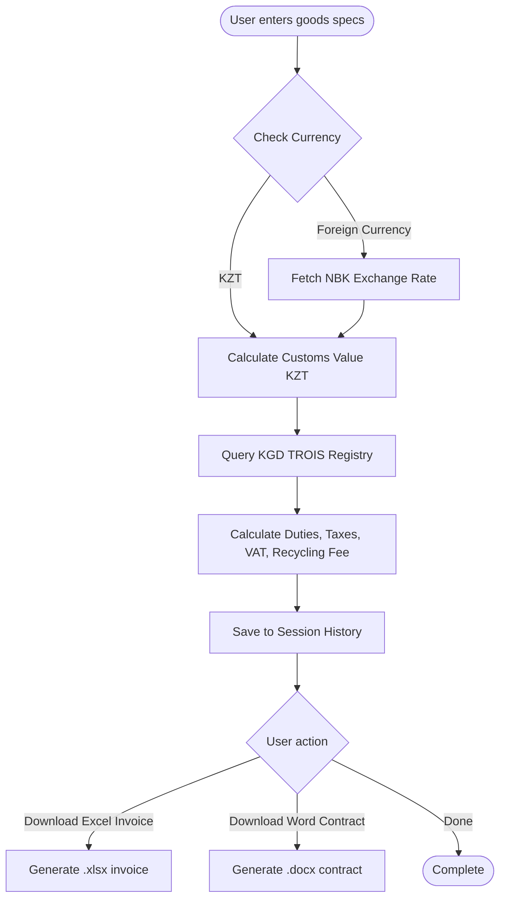
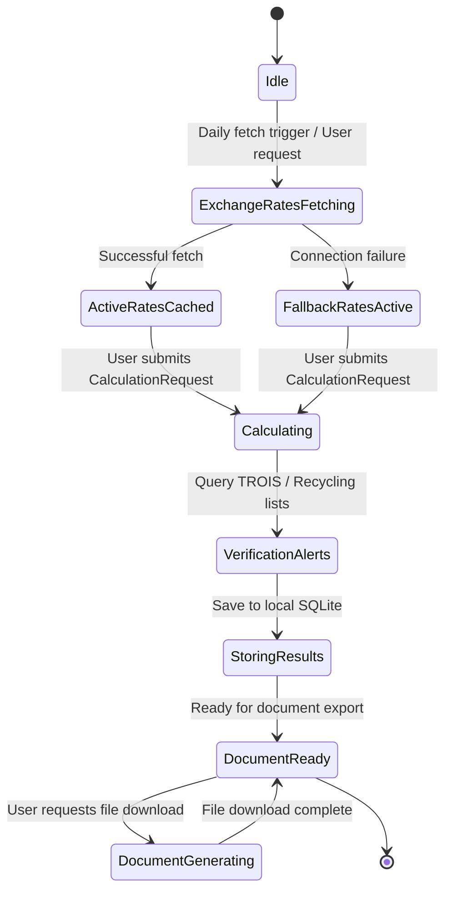
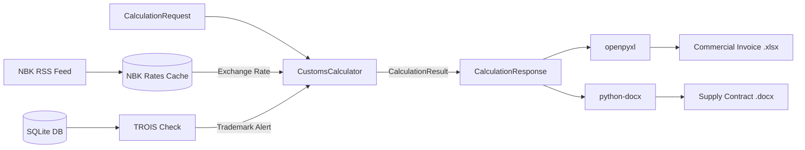

# Flow Design: Customs Calculation & Document Generation

This document defines the behavioral flow, state transitions, API contract, and validation rules for the deterministic customs calculation, trademark verification, and document generation pipeline.

---

## 1. Intent
* **User Goal:** Importers or declarants in Kazakhstan submit commercial details of a shipment (invoice price, currency, transport cost, HS Code) to get an exact calculation of customs duties, taxes, VAT, and recycling fees, verify TROIS trademarks, and generate trade/clearance paperwork.
* **Success Criteria:**
  - Calculations are mathematically deterministic, precise, and comply with RK/EAEU customs law.
  - Active National Bank of Kazakhstan exchange rates are resolved on the day of calculation.
  - Potential TROIS trademark alerts and recycling fee obligations are flagged.
  - Downloadable Excel invoices and Word supply contracts are generated successfully.
* **Non-negotiables:** No LLMs for calculations. High reliability and audited math formulas.

---

## 2. Scope
* **In Scope:**
  - Automated currency exchange rate conversion using live NBK XML feeds.
  - Calculation of customs value, customs fee, customs duties, excise tax, import VAT (12%), and recycling fees.
  - Trademark query against KGD TROIS registry.
  - Excel Commercial Invoice generation (`.xlsx`).
  - Word Supply Agreement generation (`.docx`).
* **Out of Scope / Deferred:**
  - Online payment gateway integration (deferred to v2).
  - Real-time customs declarations submission to ASTANA-1 state portal (deferred to v3).

---

## 3. Actors and Permissions
* **Guest User (Importer):** Can perform calculations, check rates, and generate documents anonymously.
* **Registered Importer / Declarant:** Can save historical calculation sessions to their profile.
* **System/Scheduler:** Automates daily fetching and caching of NBK exchange rates.

---

## 4. Diagrams

### User Flow

### System State Machine

### Data & Event Flow

---

## 5. State and Projections
* **Exchange Rates Cache:**
  - State: Dictionary of currency-to-KZT rates.
  - Freshness: Reset daily at 00:00.
* **Local Database:**
  - Tables: `hs_code_directory`, `trois_registry`, `broker_registry`, `calculation_history`.
* **User Session:**
  - Client stores active calculation inputs/outputs in React state.

---

## 6. Events/Actions
| Direction | Name | Source/Target Flow | Payload | Allowed When | Reject/Failure Reason |
| :--- | :--- | :--- | :--- | :--- | :--- |
| Incoming | `calculate` | Importer | `CalculationRequest` | Always | Missing required fields, negative values |
| Outgoing | `calculated` | System | `CalculationResponse` | Upon calculation completion | Math overflow, exchange rate missing |
| Incoming | `generate_excel`| Importer | Document template variables | calculation complete | Template corrupted |
| Incoming | `generate_word` | Importer | Document template variables | calculation complete | Template corrupted |

---

## 7. Edge Cases
* **NBK Server Downtime:** Fallback to cached rates from the day before; if empty, use hardcoded base estimates and flag calculation with `exchange_rates_approximate: true`.
* **Zero Exchange Rate / Zero Price:** Validate input and reject requests with non-positive price/rates.
* **TROIS Hit:** If product brand matches a protected trademark in the registry, calculation results include a warning payload: `trois_warning: "Required right holder consent for import of [Trademark]"`.

---

## 8. Side Effects
* **File Creation:** Creates dynamic `.xlsx` and `.docx` files in `/tmp` directory for user downloads.
* **Local Cache Write:** Creates or updates `customs_ai.db` SQLite storage.

---

## 9. Schemas Touched
* `backend/app/core/calculation/engine.py` (Calculation inputs & outputs schemas)
* `backend/app/core/models.py` (Database entity schemas)
* `backend/app/services/exchange_rates.py` (NBK rates format schema)

---

## 10. Targeted Tests
| Layer | Behavior | File | Status |
| :--- | :--- | :--- | :--- |
| Core / Unit | Strict formulas (Ad-valorem poшлина, excise, 12% VAT, fee) | `backend/tests/test_calculation.py` | **PASSED** |
| Service / Net | Live National Bank RK RSS parser and caching | `backend/tests/test_exchange_rates.py` | **PASSED** |
| DB / Integration | Auto-seeding of brokers database and querying | `backend/tests/test_database.py` | **PASSED** |
| API / Route | FastAPI JSON payload validations and routes | `backend/tests/test_api.py` | **PASSED** |

---

## 11. Implementation Plan
1. **Initialize Frameworks:** FastAPI, Pydantic, SQLAlchemy configurations. (Done)
2. **Build Exchange Rate Service:** NBK RSS XML parser with caching and fallbacks. (Done)
3. **Build Core Calculation Engine:** Rule-based Pydantic input/output schemas. (Done)
4. **Deploy Database Models:** Schemas for registers and calculation histories. (Done)
5. **Implement Document Generators:** Excel invoice and Word supply contract renderers. (Done)
6. **Deploy API Routes:** Mount routes in main API app. (Done)
7. **Write and Execute Tests:** Verify 100% of pathways are correct. (Done)

---

## 12. Implementation Trace

### Files
* **FastAPI Gateways:** `backend/app/main.py`
* **Configuration:** `backend/app/core/config.py`
* **Customs Math:** `backend/app/core/calculation/engine.py`
* **NBK Rates Fetcher:** `backend/app/services/exchange_rates.py`
* **Database Models:** `backend/app/core/database.py`, `backend/app/core/models.py`
* **Broker & TROIS Registry:** `backend/app/services/kgd_registry.py`
* **Document Engine:** `backend/app/core/documents/generator.py`

### Added API Routes
* `POST /api/generate-excel` — commercial invoice download
* `POST /api/generate-word` — supply contract download

### Status
* All 3 tests in `backend/tests/test_calculation.py` pass
* All 1 test in `backend/tests/test_exchange_rates.py` passes
* All 1 test in `backend/tests/test_database.py` passes
* Document generation tested via API and unit tests in `backend/tests/test_generator.py`
* Full suite: 48 tests pass
* Validation: `PYTHONPATH=backend .venv/Scripts/pytest backend/tests/ --import-mode=importlib` → 48 passed
---

## 13. Open Questions
* *What is the exact official API URL of the National Bank of Kazakhstan for history requests?* -> We utilize `rates_all.xml` which lists today's current official rates. Historic lookups are deferred.

---

## 14. Review Checklist
- [x] Does the diagram accurately capture decisions, states, and exceptions?
- [x] Are the math formulas auditable and deterministic?
- [x] Are third-party integrations (NBK) backed by safe caching and fallbacks?
- [x] Are all tests green?
- [x] Is there an implementation trace?
