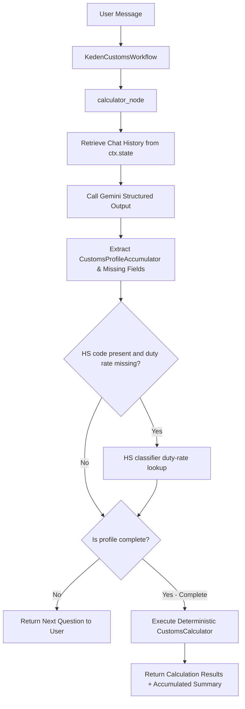
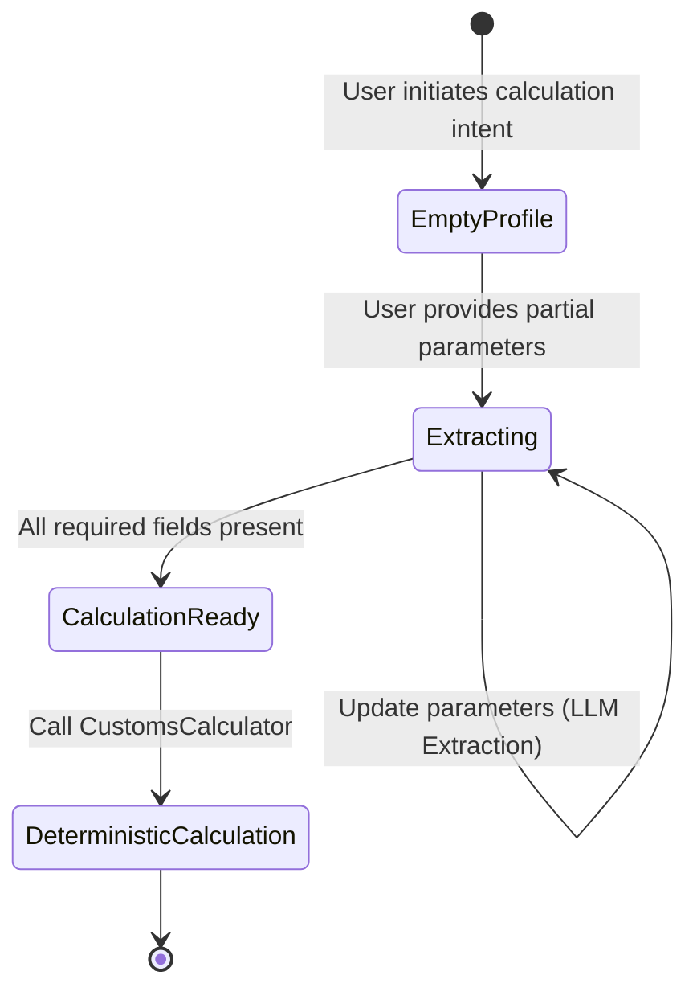

# Flow Design: Dynamic Profile Extraction and Parameter Accumulator

This document defines the behavioral flow, state representation, API integration, and validation rules for the multi-turn stateful customs parameter accumulator (Dynamic Profile Extraction) in **CustomAI Kazakhstan (Кеден Көмекшісі)**.

---

## 1. Intent
* **System Goal:** Enable a seamless, natural-language, multi-turn conversation where the assistant progressively collects customs calculation parameters (e.g., invoice price, currency, weight, HS code, transport costs) from the user. Instead of forcing the user to provide all parameters upfront or relying on brittle regex, the system uses Vertex AI Structured Outputs (Pydantic) to extract and accumulate parameters across the chat history.
* **Success Criteria:**
  - Reliably extract key parameters: `invoice_price`, `currency`, `weight_kg`, `hs_code`, `transport_to_border`, and `is_subject_to_recycling_fee` from conversation history.
  - Maintain a stateful accumulator that gets updated on every user turn.
  - Determine which parameters are still missing and prompt the user for them in a conversational manner.
  - Seamless transition: once all mandatory parameters are accumulated, automatically trigger the deterministic customs calculation engine and return the final calculation.
  - Clean error recovery and fallbacks if LLM structured output fails.
* **Non-negotiables:**
  - Calculations themselves must remain 100% deterministic (handled by `CustomsCalculator`).
  - No database changes required for transient anonymous sessions — state must be passed or inferred via the `history` field in the request.

---

## 2. Scope
* **In Scope:**
  - `CustomsProfileAccumulator` and `ProfileExtractionResult` Pydantic models.
  - `ProfileExtractor` service class in `backend/app/core/orchestrator/profile_extractor.py` to handle LLM structure parsing.
  - Update `calculator_node` in `backend/app/core/orchestrator/workflow_nodes.py` to use `ProfileExtractor` for multi-turn extraction.
  - Seamless calculation execution once enough inputs are collected (at least `invoice_price`, `currency`, `duty_rate_percent`). When an HS code is present and duty rate is missing, `calculator_node` attempts to auto-populate the duty rate through the HS classifier.
* **Out of Scope / Deferred:**
  - Complex database-backed user profile persistence (deferred to v2).
  - Multi-vehicle fleet logistics parameters (deferred to v2).

---

## 3. Actors and Permissions
* **Agent Orchestrator (System):** Coordinates conversation history, calls Gemini to extract parameters, manages the accumulated state, and delegates to the `CustomsCalculator`.
* **User (Importer/Declarant):** Interacts with the assistant, providing customs parameters organically in conversation.

---

## 4. Diagrams

### Multi-Turn Extraction & Accumulation Flow

### Profile State Machine

---

## 5. State and Projections
* **Transient Session State:**
  - The accumulated profile is projected entirely from the chat `history` passed in the API request. This keeps the backend stateless, scalable, and fully compatible with React-state-based frontends.
  - `CustomsProfileAccumulator` state model:
    - `invoice_price` (float, optional)
    - `currency` (str, optional, defaults to USD)
    - `transport_to_border` (float, optional, defaults to 0.0)
    - `duty_rate_percent` (float, optional, defaults to 0.0)
    - `weight_kg` (float, optional)
    - `hs_code` (str, optional)
    - `is_subject_to_recycling_fee` (bool, optional)

---

## 6. Events/Actions
The profile extraction system supports the following actions:

| Action / Trigger | Method / Class | Input Parameters | Output Payload | Fallback / Behavior |
| :--- | :--- | :--- | :--- | :--- |
| **Extract Profile** | `ProfileExtractor.extract(history, current_text)` | `List[ChatMessage]`, `str` | `ProfileExtractionResult` | Regex/Static extraction fallback |
| **Run Dynamic Calculation** | `calculator_node` | `ctx.state["user_text"]`, `ctx.state["history"]` | `OrchestrateResponse` | Returns generic help/prompt |

---

## 7. Edge Cases
* **Contradictory / Updated Parameters:**
  - If a user says "Wait, actually the price is $6000" after previously saying "$5000", the LLM must update the `invoice_price` in the accumulator to the latest value.
* **Ambiguous Currencies:**
  - If the user says "цена 5000" without a currency, the system should default to KZT or USD and ask the user to clarify if needed.
* **Corrupted History / Incomplete Messages:**
  - If the conversation history is missing or corrupted, the system falls back to analyzing the latest message alone.
* **LLM JSON Schema Failures:**
  - If the Gemini API returns invalid JSON or fails structural validation, the system falls back to a safe regex-based parser, logging the warning via Langfuse.

---

## 8. Side Effects
* **Enhanced Logging / Telemetry:**
  - Log extraction accuracy, input token usage, and FSM transition paths to Langfuse.
  - Zero database writes for transient sessions.

---

## 9. Schemas Touched
* `backend/app/core/orchestrator/profile_extractor.py` (new)
* `backend/app/core/orchestrator/workflow_nodes.py` (modified)
* `backend/tests/test_profile_accumulator.py` (new tests)

---

## 10. Targeted Tests

| Layer | Behaviour | Input | Expected Output |
| :--- | :--- | :--- | :--- |
| Unit | Extract price and currency from single turn | "Импортирую товар на 15000 долларов" | `invoice_price=15000.0`, `currency="USD"`, `missing_fields=["duty_rate_percent"]` |
| Unit | Accumulate parameters over multiple turns | History: ["Я везу товар на $5000", "Пошлина 10%"] | `invoice_price=5000.0`, `currency="USD"`, `duty_rate_percent=10.0` |
| Unit | Update existing field in accumulator | History: ["Цена $5000", "Ой, перепутал, цена $6000"] | `invoice_price=6000.0` |
| Integration | Calculate automatically when complete | "Цена 5000 USD, пошлина 5%" | Triggers `CustomsCalculator` and returns structured calculation response |

---

## 11. Implementation Plan
1. **Define Pydantic Schemas:** Create `CustomsProfileAccumulator` and `ProfileExtractionResult` in `backend/app/core/orchestrator/profile_extractor.py`.
2. **Implement ProfileExtractor:** Write LLM prompt and structure-extraction invocation logic using `GeminiVertexClient.generate_structured_content`.
3. **Refactor calculator workflow node:** Integrate `ProfileExtractor` in `calculator_node` in `backend/app/core/orchestrator/workflow_nodes.py`.
4. **Write Tests:** Create unit and integration tests under `backend/tests/test_profile_accumulator.py`.
5. **Verify:** Run tests and verify 100% correctness.

---

## 12. Implementation Trace
### Files Created/Modified
* **Profile Extractor:** `backend/app/core/orchestrator/profile_extractor.py`
* **Workflow Node Integration:** `backend/app/core/orchestrator/workflow_nodes.py`
* **Test Cases:** `backend/tests/test_profile_accumulator.py`

### Status
* **FULLY IMPLEMENTED & TESTED**
* **Validation:** `PYTHONPATH=backend .venv/Scripts/pytest backend/tests/test_profile_accumulator.py` -> **8 passed**
* **Implementation Note:** Integration lives in `calculator_node`; `router.py` remains a thin FastAPI/ADK runner boundary.

---

## 13. Open Questions
* *How do we handle optional parameters like transport_to_border and weight_kg in the completion criteria?*
  - Mandatory parameters for a minimum calculation are: `invoice_price`, `currency`, and `duty_rate_percent`. If these three are present, we can perform the calculation and use safe defaults (e.g., `0.0` or `False`) for the other fields.

---

## 14. Review Checklist
- [x] Does the design support robust parameter extraction across multiple turns?
- [x] Does it avoid calculating values inside the LLM?
- [x] Are fallback mechanisms described in case the LLM fails?
- [x] Is there an integration plan with the existing `CustomsCalculator`?
