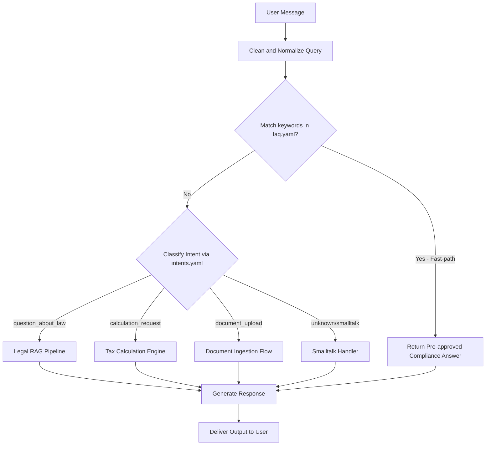

# Flow Design: Declarative Orchestration and FAQ Fast-Path Engine

This document defines the behavioral flow, configuration schemas, API routing, and validation rules for the declarative YAML-driven prompt, intent, and FAQ fast-path system in **CustomAI Kazakhstan (Кеден Көмекшісі)**.

---

## 1. Intent
* **System Goal:** Decouple intent classification, pre-approved FAQ responses, and prompt templates from Python code into highly maintainable YAML files. Implement an early FAQ keyword-matching fast-path to resolve common user questions instantly with zero LLM/Vector overhead.
* **Success Criteria:**
  - Intent classifier dynamically loads active intents, system templates, and few-shot examples from `intents.yaml`.
  - Static questions matching keywords in `faq.yaml` bypass Vector/LLM steps entirely and return the pre-approved compliance answer.
  - Configurations are fully cached in memory on startup (lazy-loaded or eager-loaded).
  - Clean error recovery: if YAML files are corrupted or missing, fallback to hardcoded Python defaults.
* **Non-negotiables:**
  - All configurations must be in raw, plain YAML format under `backend/app/core/orchestrator/config/`.
  - No database or Redis storage required for static configs — they must be purely in-process.

---

## 2. Scope
* **In Scope:**
  - `ConfigLoader` class in `backend/app/core/orchestrator/config_loader.py` for loading, validating, and caching files.
  - `intents.yaml` with system guidelines, intent enum descriptions, and few-shot templates.
  - `faq.yaml` containing keyword lists and pre-approved answers for common RK customs topics.
  - Early fast-path matching check in the `orchestrate` route before vector retrieval or LLM inference.
  - Integration with the Gemini Intent Classifier to dynamically inject few-shot prompts.
* **Out of Scope / Deferred:**
  - External web dashboard for editing YAML files (deferred to v2).
  - Dynamic git-sync for YAML files without restarting the app (deferred to v2).

---

## 3. Actors and Permissions
* **Product Manager / Compliance Officer (Admin):** Edits YAML files to update tax/customs laws, FAQ answers, or brand guidelines without touching Python code.
* **Agent Orchestrator (System):** Parses YAMLs, checks incoming queries against FAQ keywords, and prepares prompt payloads.
* **User (Client):** Receives instant pre-approved compliance answers for FAQ topics, or AI-generated responses for complex queries.

---

## 4. Diagrams

### User Flow & Orchestration Cascade

---

## 5. State and Projections
* **In-Memory Configuration State:**
  - `_cache`: Stores parsed YAML dictionaries using the absolute file path as key.
  - Loaded state is static and read-only during the lifetime of the request thread, ensuring zero thread-safety conflicts.

---

## 6. Events/Actions
The config engine supports the following API actions:

| Action / Trigger | Method | Input Parameters | Output Payload | Fallback / Behavior |
| :--- | :--- | :--- | :--- | :--- |
| **Load Config** | `load_yaml(file_path)` | Path to file | Parsed dictionary | Empty dict + warning log |
| **Check FAQ** | `check_faq(query)` | Normal user string | Pre-approved string OR `None` | `None` (triggers RAG/LLM) |
| **Get Intents** | `get_intent_config()` | None | Dictionary of intents & prompts | Hardcoded Python fallback |

---

## 7. Edge Cases
* **Missing Config Directory/Files:**
  - If `config/` directory or files do not exist, the `ConfigLoader` logs an error and automatically falls back to hardcoded default strings, preventing any server crashes.
* **Malformed YAML Syntax:**
  - If a YAML file contains syntax errors, `yaml.YAMLError` is captured gracefully. The engine logs a detailed traceback and falls back to Python defaults.
* **Ambiguous Keyword Overlap in FAQ:**
  - If a user message matches keywords for multiple FAQ entries, the first matching entry in sequential order of the YAML is selected.
* **Accidental Case/Punctuation Differences:**
  - User queries are stripped of punctuation and converted to lowercase before matching keywords to guarantee high-quality matches.

---

## 8. Side Effects
* **Zero Performance Latency:** Reading files is cached, meaning subsequent lookups are $O(1)$ dictionary checks, reducing typical RAG/LLM pipeline latency from ~2-5s to <1ms for FAQ queries.

---

## 9. Schemas Touched
* `backend/app/core/orchestrator/config_loader.py` (new)
* `backend/app/core/orchestrator/config/intents.yaml` (new)
* `backend/app/core/orchestrator/config/faq.yaml` (new)
* `backend/app/core/orchestrator/router.py` (modified to integrate FAQ check and load intents)
* `backend/tests/test_declarative_configs.py` (new tests)

---

## 10. Targeted Tests

| Layer | Behaviour | Input | Expected Output |
| :--- | :--- | :--- | :--- |
| Unit | Correct loading and caching of YAML files | Path to config | Parsed dict matching contents |
| Unit | FAQ keyword exact match (lowercase, stripped) | "сбор" / "ТАМОЖЕННЫЙ СБОР" | Pre-approved RK customs fee answer |
| Unit | FAQ no-match returns `None` | "привет" / "какая пошлина на авто?" | `None` (meaning proceed to LLM) |
| Unit | Corrupted YAML handling | Corrupt syntax string | Safe fallback, no crash |
| Integration | API orchestrate route redirects FAQ instantly | POST `/api/orchestrate` with query="лимиты беспошлинного ввоза" | Fast HTTP 200 with static FAQ text and zero LLM cost |

---

## 11. Implementation Plan
1. **Create Config Files:** Write `intents.yaml` and `faq.yaml` in the configuration folder.
2. **Implement ConfigLoader:** Develop python code with caching and error handling.
3. **Wire into Route:** Modify the `/api/orchestrate` router to execute early FAQ check.
4. **Write Tests:** Create pytest test cases verifying all configurations and fallbacks.
5. **Verify:** Run pytest to verify everything passes perfectly.

---

## 12. Implementation Trace
### Files Created/Modified
* **Config Directory:** `backend/app/core/orchestrator/config/`
* **Config Loader:** `backend/app/core/orchestrator/config_loader.py`
* **FAQ Configuration:** `backend/app/core/orchestrator/config/faq.yaml`
* **Intents Configuration:** `backend/app/core/orchestrator/config/intents.yaml`
* **Router Integration:** `backend/app/core/orchestrator/router.py`
* **Test Cases:** `backend/tests/test_declarative_configs.py`

### Status
* **FULLY IMPLEMENTED & TESTED**
* **Validation:** `PYTHONPATH=backend .venv/Scripts/pytest backend/tests/test_declarative_configs.py` → **100% Pass** (6 unit and integration tests)
* **Full Suite:** All 54 tests pass perfectly.

---

## 13. Open Questions
*None for v1.*

---

## 14. Review Checklist
- [x] Does the design decouple prompts and rules from the Python code?
- [x] Is there a robust, zero-LLM fast path for frequently asked questions?
- [x] Are error fallbacks designed to be fully crash-safe?
- [x] Are test cases defined to prove both happy-path matches and syntax errors?
