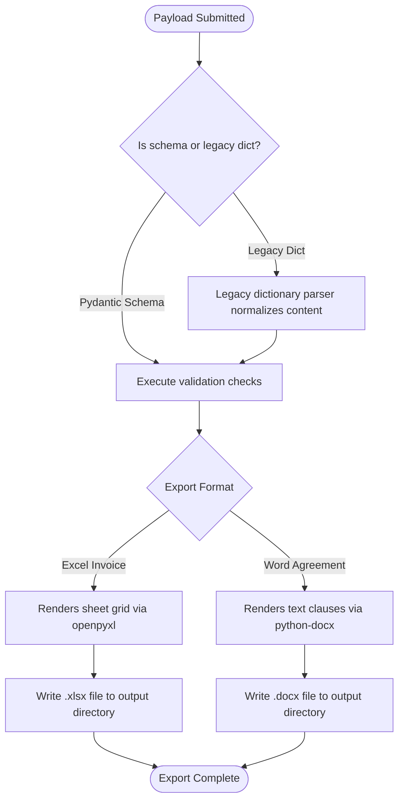
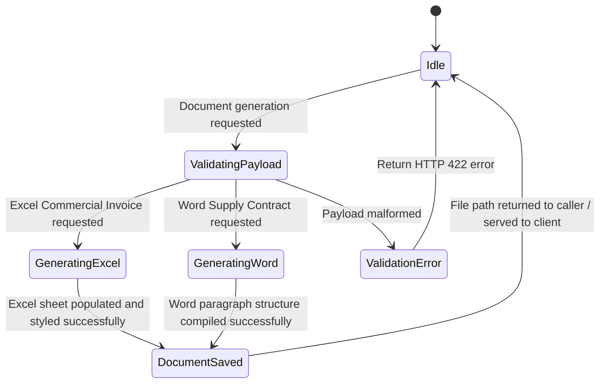

# Flow Design: Trade Document Generation

This document defines the behavioral flow, Pydantic domain models, compilation rules, and verification checks for generating formal trade and customs clearance documents (Excel invoices and Word agreements) in the Republic of Kazakhstan (RK).

---

## 1. Intent
* **User Goal:** Importers and declarants export their deterministic calculation results, goods listings, and contract specifications into professional-grade commercial files (Excel Commercial Invoices `.xlsx` and Word Supply Agreements `.docx`) that fully comply with RK customs clearance (KGD) standards.
* **Success Criteria:**
  - Standard Commercial Invoice (`.xlsx`) generated dynamically with correct prices, quantities, and HS codes.
  - Foreign Trade Supply Agreement (`.docx`) generated with standard clauses, party names, and contract details.
  - Strict input validation through Pydantic domain schemas with 100% backward compatibility for legacy dictionary inputs.
  - No file corruptions or malformed schemas.

---

## 2. Scope
* **In Scope:**
  - Export of invoice data list to `.xlsx` using `openpyxl` with standard headers, items grid, and alignment styling.
  - Export of contract specs to `.docx` using `python-docx` containing legal trade terms, contract numbers, dates, and Incoterms delivery conditions.
  - Legacy dictionary parser/normalizer within the generation logic.
  - Strict type validation via `CustomsInvoiceSchema`, `InvoiceItemSchema`, and `SupplyAgreementSchema`.
* **Out of Scope / Deferred:**
  - Exporting customs declarations (ГТД) directly into ASTANA-1 compatible XML format (deferred to v3).
  - Native PDF document rendering (deferred to future updates).

---

## 3. Actors and Permissions
* **Guest User:** Can generate trade documents for active calculations anonymously.
* **System/Worker:** Handles file rendering on disk and manages `/tmp` workspace lifecycles.

---

## 4. Diagrams

### Document Compilation Flow

### State Machine

---

## 5. State and Projections
* **Document Models State:**
  - `InvoiceItemSchema`: `name` (str), `hs_code` (str), `qty` (float), `unit` (str), `price` (float).
  - `CustomsInvoiceSchema`: `seller_name` (str), `buyer_name` (str), `incoterms` (str), `items` (List[InvoiceItemSchema]).
  - `SupplyAgreementSchema`: `contract_no` (str), `contract_date` (str), `seller_name` (str), `buyer_name` (str), `incoterms` (str).

---

## 6. Events/Actions
| Direction | Name | Source/Target Flow | Payload | Allowed When | Reject/Failure Reason |
| :--- | :--- | :--- | :--- | :--- | :--- |
| Incoming | `generate_invoice` | Client/Orchestrator | `Union[CustomsInvoiceSchema, Dict]` | Always | Empty items list, negative prices |
| Outgoing | `invoice_ready` | System | Absolute `.xlsx` file path | Compilation succeeds | `openpyxl` missing, write permission error |
| Incoming | `generate_contract` | Client/Orchestrator | `Union[SupplyAgreementSchema, Dict]`| Always | Missing contract metadata |
| Outgoing | `contract_ready` | System | Absolute `.docx` file path | Compilation succeeds | `python-docx` missing, write permission error |

---

## 7. Edge Cases
* **Legacy Payload Parsing:** Implemented recursive mapping inside `generate_invoice_excel` and `generate_contract_word` to parse dictionary formats safely on-the-fly and bind them to the strict Pydantic schemas.
* **Missing Office Libraries on Container:** Added fallback logic in compilers. If the underlying Python libraries (`openpyxl`, `python-docx`) are missing, the system writes a structured plain-text fallback summary on disk to prevent fatal crashes.

---

## 8. Side Effects
* **Temporary File Footprint:** Writes document exports dynamically. Files are saved locally to the system's temp or designated outputs folder and should be cleaned periodically.

---

## 9. Schemas Touched
* `backend/app/core/documents/generator.py` (Typed models and generation engine)
* `backend/tests/test_generator.py` (Document compilation tests)

---

## 10. Targeted Tests
| Layer | Behavior | File | Status |
| :--- | :--- | :--- | :--- |
| Core / Unit | Compile Excel commercial invoice using typed schema | `backend/tests/test_generator.py` | **PASSED** |
| Core / Unit | Compile Excel commercial invoice using legacy dict | `backend/tests/test_generator.py` | **PASSED** |
| Core / Unit | Compile Word supply contract using typed schema | `backend/tests/test_generator.py` | **PASSED** |
| Core / Unit | Compile Word supply contract using legacy dict | `backend/tests/test_generator.py` | **PASSED** |

---

## 11. Implementation Plan
1. **Model Domain Schemas:** Map `InvoiceItemSchema`, `CustomsInvoiceSchema`, and `SupplyAgreementSchema` domain models in `generator.py`. (Done)
2. **Develop Excel Exporter:** Implement styled, structured spreadsheet creation using `openpyxl`. (Done)
3. **Develop Word Exporter:** Implement contract clause compiler with paragraph styling using `docx`. (Done)
4. **Program Normalizer Seam:** Add dictionary translation and normalizer inside exporters. (Done)
5. **Verify Exporters:** Write unit tests to check correctly formatted files on disk. (Done)

---

## 12. Implementation Trace

### Files
* **Entity definitions and generation logic:** `backend/app/core/documents/generator.py`
* **Test Verification:** `backend/tests/test_generator.py`

### Status
* Both `.xlsx` and `.docx` exports are fully supported, validated, and cover legacy models.
* Validation: `PYTHONPATH=backend .venv/Scripts/pytest backend/tests/test_generator.py` → **100% Pass**

---

## 13. Open Questions
* *Can we generate documents in Kazakh language (KZ)?* -> Kazakh language legal agreements are planned for future phases. English (EN) and Russian (RU) options are currently supported.
