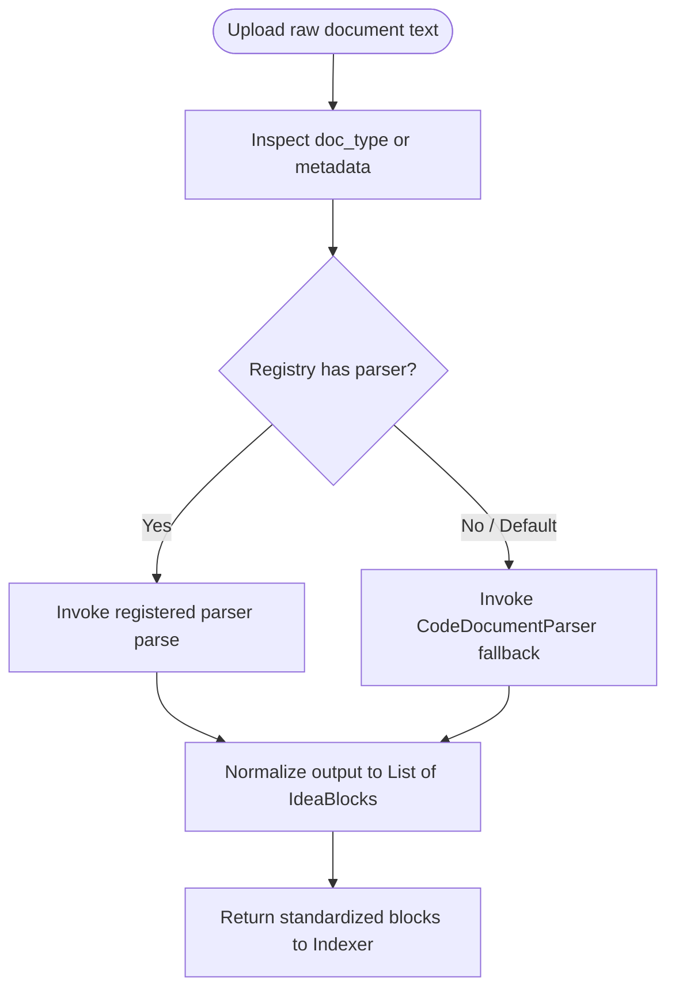
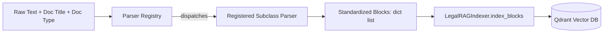

# Flow Design: Document Parser Registry

This document defines the behavioral flow, interface definitions, registry design, and verification strategy for the **Document Parser Registry** in **CustomAI Kazakhstan (Кеден Көмекшісі)**.

---

## 1. Intent
* **System Goal:** Decouple document parsing logic from `LegalRAGIndexer` to allow seamless loading and processing of diverse customs document types (Codes, EEC Decisions, and Excel/CSV Rates sheets) into standardized IdeaBlock payloads.
* **Success Criteria:**
  - Define an abstract `BaseDocumentParser` interface.
  - Implement a `DocumentParserRegistry` to register and dispatch parser types dynamically based on source document characteristics (file extension, metadata headers, or explicit tags).
  - Implement concrete parser types:
    1. `CodeDocumentParser` (retains current article-splitting logic for codes like Customs and Tax Codes).
    2. `DecisionDocumentParser` (specialized for EEC/RK Decisions, splitting by 'Решение', 'Пункт' or numbered clauses).
    3. `TariffTableParser` (designed for tabular data CSV formats, splitting by rows and extracting exact keyword-value arrays).
  - Integrates seamlessly into `LegalRAGIndexer.parse_and_index_document` with clean error handling and backward compatibility fallbacks.

---

## 2. Scope
* **In Scope:**
  - Defining `BaseDocumentParser` in `backend/app/core/rag/parsers.py`.
  - Concrete parser implementations: `CodeDocumentParser`, `DecisionDocumentParser`, and `TariffTableParser`.
  - `DocumentParserRegistry` for registering and fetching parser instances.
  - Refactoring `LegalRAGIndexer.parse_legal_text_to_blocks` to act as a fallback and dispatching queries to the registry when specific types are requested.
* **Out of Scope / Deferred:**
  - PDF OCR image layout analysis parser (deferred to v2).
  - Microsoft Word `.docx` structured extractor (deferred to v2).

---

## 3. Actors and Permissions
* **System Admin / Indexer CLI (System Actor):** Uploads raw legal text or datasets and invokes the ingestion pipeline.
* **DocumentParserRegistry (System Actor):** Dynamically inspects the document type and delegates parsing to the registered subclass.

---

## 4. Diagrams

### User/Ingestion Flow

### Data Flow & Projection Boundaries

---

## 5. State and Projections
* **Registry State:**
  - `_parsers`: A static dictionary in `DocumentParserRegistry` mapping parser identifiers (`code`, `decision`, `tariff`) to their corresponding parser singletons. It is read-only at runtime after modules are loaded.

---

## 6. Events/Actions
The Parser Registry supports the following interface methods:

| Action / Trigger | Method | Inputs | Output | Fail Safe |
| :--- | :--- | :--- | :--- | :--- |
| **Register Parser** | `register(doc_type, parser_cls)` | Doc type string, class | None | Overwrites key if duplicate |
| **Get Parser** | `get_parser(doc_type)` | Doc type string | Parser instance | Returns default `CodeDocumentParser` |
| **Parse Document** | `parse(raw_text, doc_title)` | Raw content, title | `List[Dict[str, Any]]` | Returns empty list + logs warning |

---

## 7. Edge Cases
* **Unknown/Unsupported Document Type:**
  - If the uploaded document specifies an unknown `doc_type`, the registry logs a warning and gracefully defaults to the `CodeDocumentParser` to ensure continuous operability.
* **Empty/Null Document Text:**
  - All parsers must check for empty or whitespace-only inputs, returning an empty list `[]` instantly without running expensive splitting loops.
* **Tabular Parser Empty Columns:**
  - The `TariffTableParser` must handle CSV rows that are incomplete, corrupt, or missing columns, skipping faulty rows without crashing the entire document ingest task.
* **Extremely Large Files:**
  - Parsers must process lines sequentially or use generator-like iterations where possible to limit memory footprints to $O(N)$ text size.

---

## 8. Side Effects
* **None.** All parsers are completely pure functions with zero database side-effects or network activities.

---

## 9. Schemas Touched
* `backend/app/core/rag/parsers.py` (new)
* `backend/app/core/rag/indexer.py` (modified to integrate the registry into `parse_and_index_document`)
* `backend/tests/test_document_parsers.py` (new)

---

## 10. Targeted Tests

| Layer | Behaviour | Input | Expected Output |
| :--- | :--- | :--- | :--- |
| Unit | Registry resolves default parser on unknown type | `get_parser("unknown")` | Instance of `CodeDocumentParser` |
| Unit | `CodeDocumentParser` correctly splits by "Статья" | Raw text with Articles 1 and 2 | 2 standard blocks with correct titles and quotes |
| Unit | `DecisionDocumentParser` splits by "Решение" and "Пункт" | Raw text with clause numbers | Properly chunked Decision blocks |
| Unit | `TariffTableParser` parses CSV structured lines | CSV with headers "hs_code,name,duty" | Standard blocks with HS code metadata and key-value payload |
| Integration | Indexer parse_and_index_document uses the registered parser | Ingesting a CSV tariff file | Correctly indexed points in Qdrant with custom metadata fields |

---

## 11. Implementation Plan
1. **Define Parser Interfaces:** Implement `BaseDocumentParser`, the registry, and concrete classes in `parsers.py`.
2. **Integrate into Indexer:** Modify `LegalRAGIndexer` to use the registry during document parsing.
3. **Write Unit and Integration Tests:** Verify all parsers and routing in `test_document_parsers.py`.
4. **Verify:** Run pytest to prove all 3 parser types work flawlessly.

---

## 12. Implementation Trace
### Files Created/Modified
* **Parsers Core:** `backend/app/core/rag/parsers.py`
* **Indexer Integration:** `backend/app/core/rag/indexer.py`
* **Test Suite:** `backend/tests/test_document_parsers.py`

### Status
Flow design complete. Awaiting review.

---

## 13. Open Questions
- *Should we register parsers dynamically via entry_points?* -> Simple explicit static registration inside the registry file is preferred for MVP simplicity.

---

## 14. Review Checklist
- [x] Does the design define a clear abstract base class and registry interface?
- [x] Are there concrete parsers for Codes, Decisions, and Tariff Tables?
- [x] Does the indexer have a clean fallback to the previous parser logic?
- [x] Are targeted tests defined for edge cases (empty strings, CSV corruption)?
