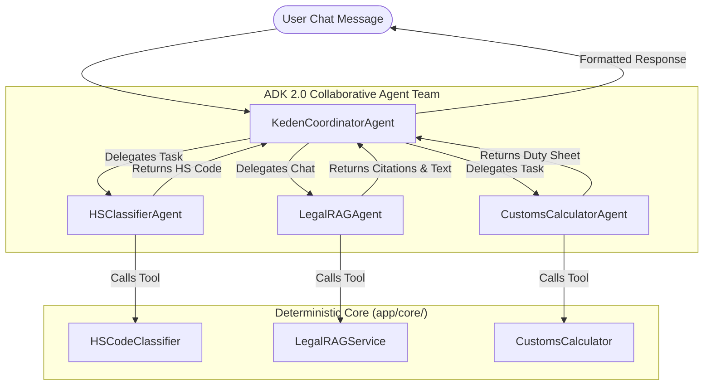
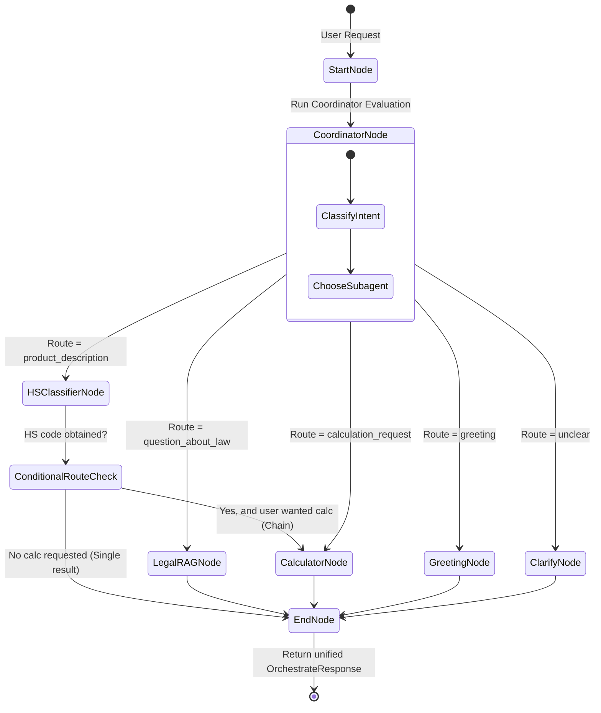

# Flow Design: Google ADK 2.0 Multi-Agent Orchestration

This document defines the transition from our manual, static `IntentClassifier` router to a **Google Agent Development Kit (ADK) 2.0** multi-agent graph-based workflow. It outlines the team of specialized subagents, the orchestration graph, tools, and session management.

---

## 1. Intent
* **User Goal:** User interacts with a single, highly intelligent interface that can autonomously coordinate multiple complex customs-related subtasks (e.g. classification of a complex product, checking import restrictions on that item, and performing a legal duty calculation) in a single unified chat session.
* **Success Criteria:**
  - Standardize multi-agent coordination using Google ADK 2.0 Python SDK (`google-adk`).
  - Improve intent classification and tool routing precision to >95% using ADK's native agent capabilities.
  - Correctly execute multi-turn, multi-agent tasks (e.g. `HSClassifierAgent` passes data directly to `CalculatorAgent` within an ADK Workflow).
  - Clean separation of concerns: Agents are thin wrappers for orchestration; existing business logic in `app/core/` remains fully deterministic and independent.
* **Non-negotiables:** 
  - Agents MUST NOT bypass core deterministic calculation engines in `app/core/calculation/`. All calculations must run via the Python engine, not LLM guesses.
  - Multi-agent routing must be fully observable in Langfuse (using ADK native telemetry or custom tracing).

---

## 2. Scope
* **In Scope:**
  - Migrating `backend/app/core/orchestrator/router.py` to use ADK 2.0.
  - Definition of `KedenCoordinatorAgent` as the main coordinator.
  - Definition of specialized subagents using ADK 2.0 Operating Modes:
    - `HSClassifierAgent` (`Single-turn` / `Task` mode)
    - `LegalRAGAgent` (`Chat` mode)
    - `CustomsCalculatorAgent` (`Task` mode)
  - Definition of an ADK 2.0 **Graph-based Workflow** (`KedenCustomsWorkflow`) to handle sequential and parallel agent execution (e.g. HS Classify -> check legal registry/RAG -> calculate duties).
  - Session history mapping between Next.js/FastAPI request payloads and ADK's native Session state.
  - Support for **unified multimodal file uploads** (PDFs, images, Excel sheets) inside the single orchestrator chat, mapping uploaded files to ADK session/context state (`ctx.state["uploaded_file_bytes"]`, etc.) for multimodal subagent execution (e.g., image-based HS classification).
* **Out of Scope / Deferred:**
  - Replacing the frontend UI with ADK-specific widgets (the existing chat component in `frontend/app/page.tsx` is kept, and we preserve backward compatibility of the `/api/orchestrate` endpoint).
  - Storing ADK sessions in GCP Vertex AI Agent Engine database (we maintain stateless server requests using memory-based ADK sessions or lightweight SQLite persistence).
---

## 3. Actors and Permissions
* **User (Client):** Initiates session, provides product descriptions, uploaded files, or customs queries.
* **KedenCoordinatorAgent (ADK Coordinator):** Evaluates user messages, coordinates subagent delegation, prompts for missing parameters.
* **HSClassifierAgent (Subagent):** Uses product description and visual files to map goods to customs HS Codes (ТН ВЭД).
* **LegalRAGAgent (Subagent):** Resolves legal queries from the RAG knowledge base.
* **CustomsCalculatorAgent (Subagent):** Automatically aggregates parameters (HS Code, country of origin, value, currency) and invokes the local deterministic calculation engine.

---

## 4. Diagrams

### Multi-Agent Team Architecture (ADK 2.0)

### Graph-Based Workflow State Machine (`KedenCustomsWorkflow`)

---

## 5. State and Projections
* **Workflow Session State:**
  - **ADK Session Context**: Maintained via `adk.Session`. Stores intermediate results like `extracted_hs_code`, `product_category`, `customs_value`, and `calculation_results`.
  - **History Projections**: Map client-provided `history` directly to ADK's `adk.ConversationHistory` schema to preserve conversation memory across calls.

---

## 6. Events/Actions (ADK API Integration)
| Direction | Event Name / API Method | Source/Target | Payload | Trigger Conditions |
| :--- | :--- | :--- | :--- | :--- |
| Incoming | `POST /api/orchestrate` | Next.js -> FastAPI | **Multipart Form Data**: `text` (string), optional `session_id` (string), optional `history` (JSON-stringified history), optional `file` (UploadFile) | User sends a chat message or uploads a file |
| Internal | `adk.Agent.delegate_task()` | Coordinator -> Subagent | `TaskRequest(task_description, context_data)` | Coordinator decides to utilize specialized agent |
| Internal | `adk.Agent.call_tool()` | Subagent -> Core Tool | `ToolCall(func_name, arguments)` | Subagent executes its primary logic |
| Outgoing | `/api/orchestrate` response | FastAPI -> Next.js | `OrchestrateResponse(text, intent, confidence, calculation?)` | Graph execution completes |

## 7. Edge Cases
* **Subagent fails / returns invalid schema**: The Coordinator catches `AgentExecutionError` and executes a deterministic fallback, returning: *"Извините, не удалось завершить операцию. Вы можете выполнить классификацию вручную."*
* **Incomplete parameters for CalculatorAgent**: If the user wants a calculation but lacks parameters (e.g. missing value or country of origin), `CalculatorAgent` is executed in `Multi-turn / Task` mode, prompting the user for the missing values step-by-step instead of failing.
* **Low-confidence routing**: If the coordinator's confidence is < 0.7, it falls back to a clarifying menu offering the user specific action buttons.
* **Unsupported or corrupted file uploaded**: Returns a clear API validation error or system message: *"Неподдерживаемый формат файла или файл поврежден. Пожалуйста, загрузите изображение, PDF или Excel-таблицу."*
* **File uploaded without text message**: The `KedenCoordinatorAgent` inspects the file type. If it is an image, it defaults to routing to `HSClassifierAgent` with an implicit classification intent. If it is an unclassifiable file or unclear, it asks the user: *"Какую операцию вы хотите выполнить с этим файлом?"*

## 8. Side Effects
* **Vertex AI / Gemini API Calls**: Parallel tool execution might trigger multiple concurrent model calls. We utilize local caching where possible (e.g. for identical embeddings or static classification lookups).
* **Langfuse Telemetry**: Since ADK has its own telemetry model, we map ADK spans/runs to Langfuse decorators (`@observe`) or use direct OpenTelemetry exporters provided by ADK.

---

## 9. Schemas Touched
* `backend/requirements.txt`: Add `google-adk>=2.0.0`
* `backend/app/core/orchestrator/router.py`: Re-implement `dispatch_intent` and `orchestrate` endpoint using the ADK 2.0 `adk.Workflow` and `adk.Agent` APIs.
* `backend/app/core/orchestrator/adk_agents.py` (New): Definition of agents, workflows, and tools.
* `backend/tests/test_orchestrator.py`: Refactor tests to mock/validate the ADK graph execution and agent delegation.

---

## 10. Targeted Tests
| Layer | Test Scenario | Expected Behavior |
| :--- | :--- | :--- |
| Integration | `test_adk_coordination_rag` | Query about law triggers `LegalRAGAgent` and returns citations. |
| Integration | `test_adk_coordination_hs` | Product description triggers `HSClassifierAgent` in Single-turn mode. |
| Integration | `test_adk_chained_workflow` | Coordinated workflow correctly executes HS Classifier node and cascades to Calculator node. |
| Unit | `test_adk_session_history_mapping` | Session history from the API is successfully translated to ADK session history. |
| Unit | `test_adk_error_handling` | Subagent timeout/exception is gracefully handled by the Coordinator. |

---

## 11. Implementation Plan
1. **Dependency Installation**: Install `google-adk` package in `.venv` and update `requirements.txt`.
2. **Drafting ADK Agents (`adk_agents.py`)**:
   - Initialize `google-genai` client within ADK configurations.
   - Define tools wrapping existing services (`search_customs_law`, `calculate_duties`, `classify_hs_code`).
   - Define subagents `HSClassifierAgent`, `LegalRAGAgent`, `CustomsCalculatorAgent`.
   - Define coordinator `KedenCoordinatorAgent`.
3. **Drafting the Workflow**:
   - Construct the graph-based workflow `KedenCustomsWorkflow` using ADK's workflow builder.
   - Define conditional edges and routing nodes.
4. **Updating the Orchestrator Router**:
   - Refactor `backend/app/core/orchestrator/router.py` to route all incoming POST requests through the ADK 2.0 workflow execution.
5. **Testing and Sync**:
   - Update tests in `backend/tests/test_orchestrator.py` to cover the new ADK graph behaviors.
   - Run linter/formatters.
   - Run `sync-flows` to verify implementation matches design.

---

## 12. Implementation Trace
* **Files Created:** `backend/app/core/orchestrator/adk_agents.py`
* **Files Modified:** `backend/app/core/orchestrator/router.py`, `backend/tests/test_orchestrator.py`, `backend/requirements.txt`
* **Status:** Complete & Verified
* **Validation Command:** `PYTHONPATH=backend .venv/Scripts/pytest backend/tests/test_orchestrator.py`

---

## 13. Open Questions
* *How do we pass file attachments (images, PDFs) through the ADK Task API?* → ADK 2.0 multi-modal support allows passing file byte objects or GCS URIs inside the session context. We will map the uploaded files into the ADK Session.
* *What is the telemetry overhead?* → We will ensure that the monkeypatched Langfuse v2 correctly intercepts `google-genai` calls initiated by ADK, preserving our existing performance dashboard.

---

## 14. Review Checklist
- [x] Are all 3 ADK subagents clearly defined with their specific operating modes?
- [x] Is the graph-based routing transition explicitly diagrammed with conditional edges?
- [x] Are the existing core deterministic engines guaranteed to remain as the sole executors of business/tax logic?
- [x] Is backward compatibility with Next.js API payloads preserved?
- [x] Is the error fallback design robust enough to handle model API dropouts?