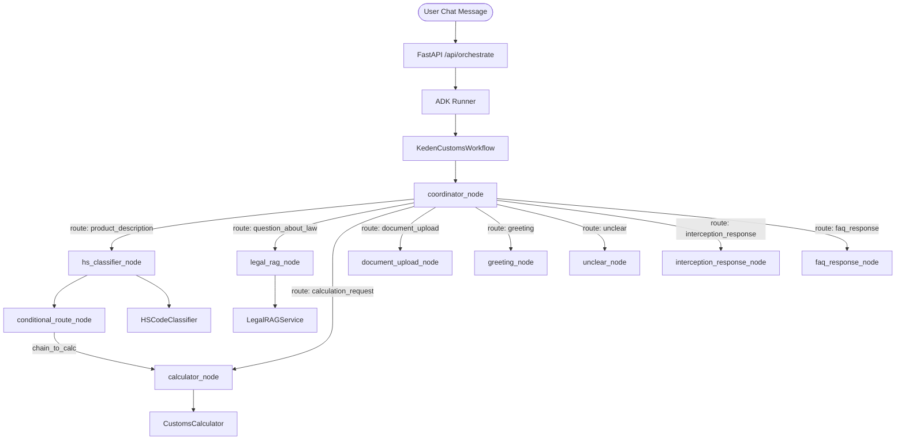
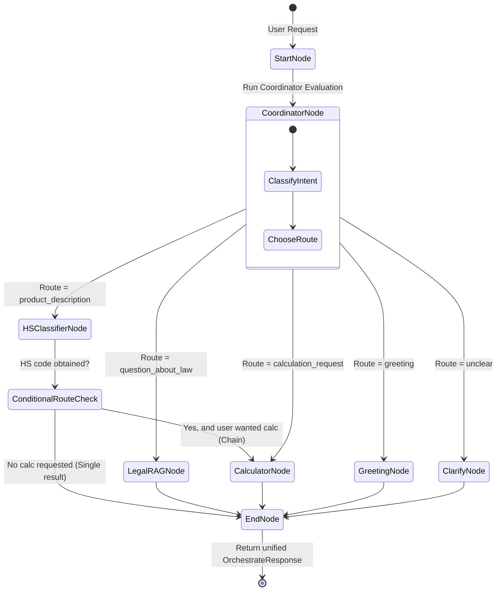

# Flow Design: Google ADK 2.0 Multi-Agent Orchestration

This document defines the transition from the manual `IntentClassifier` router to a **Google Agent Development Kit (ADK) 2.0** graph-based workflow. The implementation uses ADK `Workflow`, `Runner`, and node functions instead of ADK Agent subclasses.

---

## 1. Intent
* **User Goal:** User interacts with a single, highly intelligent interface that can autonomously coordinate multiple complex customs-related subtasks (e.g. classification of a complex product, checking import restrictions on that item, and performing a legal duty calculation) in a single unified chat session.
* **Success Criteria:**
  - Standardize multi-agent coordination using Google ADK 2.0 Python SDK (`google-adk`).
  - Improve intent classification and tool routing precision using ADK workflow routing.
  - Correctly execute multi-turn, multi-step tasks through explicit workflow nodes (e.g. HS classifier node can chain into calculator node).
  - Clean separation of concerns: workflow nodes are thin orchestration wrappers; existing business logic in `app/core/` remains fully deterministic and independent.
* **Non-negotiables:** 
  - Agents MUST NOT bypass core deterministic calculation engines in `app/core/calculation/`. All calculations must run via the Python engine, not LLM guesses.
  - Multi-agent routing must be fully observable in Langfuse (using ADK native telemetry or custom tracing).

---

## 2. Scope
* **In Scope:**
  - Migrating `backend/app/core/orchestrator/router.py` to use ADK 2.0.
  - Definition of `KedenCustomsWorkflow` in `backend/app/core/orchestrator/workflow_graph.py`.
  - Definition of specialized ADK node functions in `backend/app/core/orchestrator/workflow_nodes.py`:
    - `coordinator_node`
    - `hs_classifier_node`
    - `legal_rag_node`
    - `calculator_node`
    - `document_upload_node`
    - `greeting_node`, `unclear_node`, `interception_response_node`, `faq_response_node`
  - Session history mapping between Next.js/FastAPI request payloads and ADK's native Session state.
  - Support for **unified multimodal file uploads** (PDFs, images, Excel sheets) inside the single orchestrator chat, mapping uploaded files to ADK session/context state (`ctx.state["uploaded_file_bytes"]`, etc.) for multimodal subagent execution (e.g., image-based HS classification).
* **Out of Scope / Deferred:**
  - Replacing the frontend UI with ADK-specific widgets (the existing chat component in `frontend/app/page.tsx` is kept, and we preserve backward compatibility of the `/api/orchestrate` endpoint).
  - Storing ADK sessions in GCP Vertex AI Agent Engine database (we maintain stateless server requests using memory-based ADK sessions or lightweight SQLite persistence).
---

## 3. Actors and Permissions
* **User (Client):** Initiates session, provides product descriptions, uploaded files, or customs queries.
* **Coordinator Node (ADK):** Evaluates user messages and selects a workflow route.
* **HS Classifier Node:** Uses product description and visual files to map goods to customs HS Codes (ТН ВЭД).
* **Legal RAG Node:** Resolves legal queries from the RAG knowledge base.
* **Calculator Node:** Accumulates customs parameters and invokes the local deterministic calculation engine.

---

## 4. Diagrams

### Workflow Node Architecture (ADK 2.0)

### Graph-Based Workflow State Machine (`KedenCustomsWorkflow`)

---

## 5. State and Projections
* **Workflow Session State:**
  - **ADK Session Context**: Maintained in ADK session state. Stores request-scoped values like `user_text`, `history`, uploaded file bytes, classification output, and calculation results.
  - **History Projections**: Map client-provided `history` into workflow state so nodes can preserve conversation memory across calls.

---

## 6. Events/Actions (ADK API Integration)
| Direction | Event Name / API Method | Source/Target | Payload | Trigger Conditions |
| :--- | :--- | :--- | :--- | :--- |
| Incoming | `POST /api/orchestrate` | Next.js -> FastAPI | **Multipart Form Data**: `text` (string), optional `session_id` (string), optional `history` (JSON-stringified history), optional `file` (UploadFile) | User sends a chat message or uploads a file |
| Internal | ADK `Workflow` edge routing | Coordinator node -> specialist node | Route string (`product_description`, `question_about_law`, `calculation_request`, etc.) | Coordinator classifies intent |
| Internal | Node invokes deterministic core | Specialist node -> Core service | Typed function/model inputs | Node has enough validated state |
| Outgoing | `/api/orchestrate` response | FastAPI -> Next.js | `OrchestrateResponse(text, intent, confidence, calculation?)` | Graph execution completes |

## 7. Edge Cases
* **Node fails / returns invalid schema**: The workflow node catches exceptions and returns a deterministic fallback response, e.g. *"Извините, не удалось завершить операцию. Вы можете выполнить классификацию вручную."*
* **Incomplete parameters for calculator node**: If the user wants a calculation but lacks parameters, `calculator_node` uses `ProfileExtractor` to prompt for missing values instead of guessing.
* **Low-confidence routing**: If the coordinator's confidence is < 0.7, it falls back to a clarifying menu offering the user specific action buttons.
* **Unsupported or corrupted file uploaded**: Returns a clear API validation error or system message: *"Неподдерживаемый формат файла или файл поврежден. Пожалуйста, загрузите изображение, PDF или Excel-таблицу."*
* **File uploaded without text message**: `document_upload_node` handles supported files; unclear uploads return *"Какую операцию вы хотите выполнить с этим файлом?"*

## 8. Side Effects
* **Vertex AI / Gemini API Calls**: Parallel tool execution might trigger multiple concurrent model calls. We utilize local caching where possible (e.g. for identical embeddings or static classification lookups).
* **Langfuse Telemetry**: Since ADK has its own telemetry model, we map ADK spans/runs to Langfuse decorators (`@observe`) or use direct OpenTelemetry exporters provided by ADK.

---

## 9. Schemas Touched
* `backend/requirements.txt`: Add `google-adk>=2.0.0`
* `backend/app/core/orchestrator/router.py`: Preserve `/api/orchestrate` FastAPI compatibility and delegate execution to the ADK runner.
* `backend/app/core/orchestrator/workflow_graph.py` (New): Definition of `KedenCustomsWorkflow`, edges, session service, and runner.
* `backend/app/core/orchestrator/workflow_nodes.py`: Node functions wrapping existing services and deterministic engines.
* `backend/tests/test_orchestrator.py`: Validate workflow graph routing and node behavior.

---

## 10. Targeted Tests
| Layer | Test Scenario | Expected Behavior |
| :--- | :--- | :--- |
| Integration | Legal query routing | Query about law triggers `legal_rag_node` and returns citations. |
| Integration | HS classification routing | Product description triggers `hs_classifier_node`. |
| Integration | Chained workflow | HS classifier node can cascade to `calculator_node` through `conditional_route_node`. |
| Unit | Session/history mapping | Request history is available in workflow state. |
| Unit | Error handling | Node exceptions return safe fallback responses. |

---

## 11. Implementation Plan
1. **Dependency Installation**: Install `google-adk` package in `.venv` and update `requirements.txt`.
2. **Drafting Workflow Nodes (`workflow_nodes.py`)**:
   - Define node functions wrapping existing services (`LegalRAGService`, `HSCodeClassifier`, `CustomsCalculator`).
   - Keep deterministic tax/business logic inside `app/core/`.
3. **Drafting the Workflow (`workflow_graph.py`)**:
   - Construct `KedenCustomsWorkflow` using ADK `Workflow` and `Edge`.
   - Define conditional edges and routing nodes.
4. **Updating the Orchestrator Router**:
   - Route incoming POST requests through ADK `Runner`.
5. **Testing and Sync**:
   - Update tests in `backend/tests/test_orchestrator.py` to cover the new ADK graph behaviors.
   - Run linter/formatters.
   - Run `sync-flows` to verify implementation matches design.

---

* **Files Created:** `backend/app/core/orchestrator/workflow_graph.py`
* **Files Modified:** `backend/app/core/orchestrator/workflow_nodes.py`, `backend/app/core/orchestrator/router.py`, `backend/tests/test_orchestrator.py`, `backend/requirements.txt`
* **Status:** Complete & Verified
* **Validation Command:** `PYTHONPATH=backend .venv/Scripts/pytest backend/tests/test_orchestrator.py`
* **Implementation Note:** The final implementation uses ADK workflow nodes rather than ADK Agent subclasses; no `adk_agents.py` source file is part of the project.
---

## 13. Open Questions
* *How do we pass file attachments (images, PDFs) through the ADK Task API?* → ADK 2.0 multi-modal support allows passing file byte objects or GCS URIs inside the session context. We will map the uploaded files into the ADK Session.
* *What is the telemetry overhead?* → We will ensure that the monkeypatched Langfuse v2 correctly intercepts `google-genai` calls initiated by ADK, preserving our existing performance dashboard.

---

## 14. Review Checklist
- [x] Are all workflow nodes clearly defined with their specific responsibilities?
- [x] Is graph-based routing explicitly diagrammed with conditional edges?
- [x] Are the existing core deterministic engines guaranteed to remain as the sole executors of business/tax logic?
- [x] Is backward compatibility with Next.js API payloads preserved?
- [x] Is the error fallback design robust enough to handle model API dropouts?