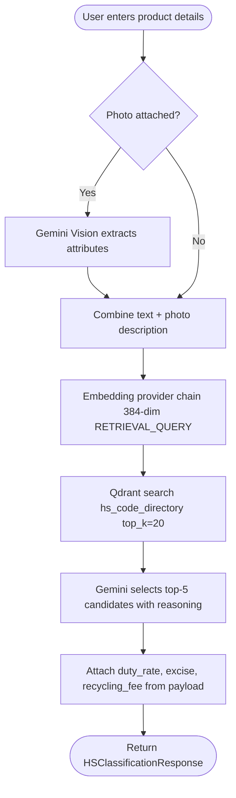
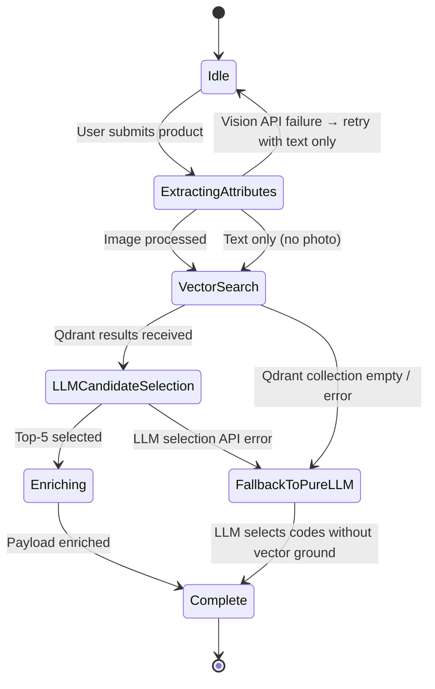

# Flow Design: HS Code Classification Pipeline

This document defines the behavioral flow, state transitions, API contracts, and validation rules for the multimodal HS Code classification pipeline using **Gemini Vision**, **Gemini Embedding 2**, and **Qdrant** vector search.

---

## 1. Intent
* **User Goal:** Importer or declarant submits a product description (text + optional photo) and gets the top-5 most accurate 10-digit EAEU HS Code candidates with reasoning, duty rates, excise rates, and recycling fee flags.
* **Success Criteria:**
  - Photo analysis extracts brand, material, purpose, technical features via Gemini Vision.
  - Vector search in Qdrant `hs_code_directory` collection returns relevant candidates.
  - LLM selects and validates top-5 candidates with exact article references.
  - Each candidate includes confidence score, duty rate, excise flag, recycling fee flag.
  - Full Russian-language reasoning for each candidate.
* **Non-negotiables:** HS Code candidate search MUST use real Qdrant vector search — never ask LLM to guess codes without vector grounding.

---

## 2. Scope
* **In Scope:**
  - Multimodal input (text + photo) with Gemini Vision attribute extraction.
  - Qdrant collection `hs_code_directory` with 384-dim local-first embeddings.
  - Vector search with top_k=20 candidates, LLM reranks to top-5.
  - Duty rate lookup from payload metadata.
  - Recycling fee flag based on HS group: vehicles (8701-8705), engines (8407-8409), tires (4011-4013), pneumatics (8414), batteries (8507), electronics (8415, 8418, 8450, 8451, 8471, 8472, 8516, 8528, 8529), furniture (9401-9403), lighting (8539, 9405), medical (9018-9022). Full list per RK Government Decree on утильсбор.
* **Out of Scope / Deferred:**
  - Direct image embedding search (deferred to v2).
  - Full TH VED EAEU directory parsing from state directory (manual ingest for now).

---

## 3. Actors and Permissions
* **Guest User:** Can classify products without authentication. No write access.
* **Admin / System Indexer:** Can trigger document ingestion, create/recreate Qdrant collections, and seed the hs_code_directory. Write access to vector database.
* **System (Scheduler):** Can trigger scheduled re-indexing of updated regulations. Read/write access to Qdrant.

---

## 4. Diagrams

### User Flow

### System State Machine

### Data & Event Flow

```mermaid
flowchart LR
  Input[Product Description + Photo] --> Vision[Gemini Vision]
  Vision -->|extracted_attributes| Text[Unified Text Description]
  Text --> Embedder[Embedding provider chain RETRIEVAL_QUERY]
  Embedder -->|384-dim vector| Qdrant[(Qdrant hs_code_directory)]
  Qdrant -->|top-20 candidates| Selector[Gemini Structured Output]
  Selector -->|top-5 with reasoning| Output[HSClassificationResponse]
```

**Projection Boundary:** Raw photo bytes are consumed by Gemini Vision and discarded immediately after attribute extraction. No image data is stored or passed downstream. The unified text description is the only data crossing into the search pipeline.

---

## 5. State and Projections
* **Qdrant Collection `hs_code_directory`:**
  - Each point = one HS Code entry (10-digit).
  - Vector: 384-dim embedding of product_name_ru + explanatory notes.
  - Payload: `{hs_code, product_name_ru, product_name_en, duty_rate_percent, excise_rate_percent, is_subject_to_recycling_fee, section, group, reasoning_notes}`
* **User Session:** Client stores recent classification results for reuse in calculation.

---

## 6. Events/Actions
|Direction|Name|Source/Target Flow|Payload|Allowed When|Reject/Failure Reason|
|:---|:---|:---|:---|:---|:---|
|Incoming|`classify`|Importer|`{description, image_bytes?}`|Qdrant collection exists or fallback mode|Empty description, API quota exceeded, all backends unavailable|
|Outgoing|`vision_extract`|Gemini Vision|`{extracted_attributes}`|Photo attached|Image corrupt, API error|
|Outgoing|`embedding_query`|Embedding provider chain|`{text, task_type: RETRIEVAL_QUERY}`|Text ready|Provider unavailable; falls back according to semantic embedding flow|
|Outgoing|`vector_search`|Qdrant|`{vector, collection, top_k}`|Embedding ready|Qdrant connection error|
|Outgoing|`llm_selection`|Gemini Flash|`{candidates, description}`|Qdrant results|LLM API error|
|Outgoing|`selected_hs_code`|Customs Calculation Flow|`{hs_code, duty_rate_percent, excise_rate_percent, is_subject_to_recycling_fee}`|User chooses or classifier returns best candidate|No candidate selected|

---

## 7. Edge Cases
* **Empty Qdrant collection:** If `hs_code_directory` has no data, fall back to pure LLM classification (Gemini selects codes from training knowledge). The response MUST include a warning flag `qdrant_backed: false`.
* **Ambiguous products:** If the product could fit multiple codes (e.g. electronic device vs component), the LLM must explain the ambiguity and rank by best fit.
* **Photo too dark / blurry:** Vision extraction returns confidence flag; if low, fall back to text-only.
* **Recycling fee not found:** Default to `false`; flag with `recycling_fee_unknown: true`.

---

## 8. Side Effects
* **API/CPU Cost:** Vision and LLM structured output may consume Gemini API quota; embeddings are local by default and only use Gemini when explicitly enabled.
* **Rate Limiting:** Gemini generation calls have provider quotas. Batch large classification jobs with exponential backoff; local embeddings avoid embedding API quota.

---

## 9. Schemas Touched
* `backend/app/core/hs_classifier/classifier.py` (HSCodeCandidate, HSClassificationResponse)
* `backend/app/core/vertex_client.py` (Gemini calls)
* `backend/app/core/rag/indexer.py` (Qdrant collection setup for hs_code_directory)
* `backend/app/main.py` (POST /api/classify endpoint)

---

## 10. Targeted Tests
|Layer|Behavior|File|Status|
|:---|:---|:---|:---|
|Core / Unit|Embedding dimension validation (384)|`backend/tests/test_vertex_client.py`|**PASSED**|
|API / Route|HS classification endpoint returns valid candidates|`backend/tests/test_api.py`|**PASSED**|
|Service / DB|Vector search in hs_code_directory returns results|`backend/tests/test_rag.py`|**PASSED**|
|Integration|End-to-end: photo > vision > search > selection|`backend/tests/test_hs_classifier.py`|**PASSED**|
---

## 11. Implementation Plan
1. Create Qdrant collection `hs_code_directory` with 384-dim Cosine config.
2. Ingest TH VED EAEU directory data (manual CSV/JSON seed).
3. Replace `# TODO stub` in HSCodeClassifier with real Qdrant vector search.
4. Wire recycling fee and excise flag logic from HS group number.
5. Add fallback to pure LLM when Qdrant is empty.
6. Write integration test.

---

## 12. Implementation Trace

### Files Created
* `backend/app/core/rag/indexer.py` — `setup_hs_code_collection()`, `seed_hs_code_directory()`
* `backend/tests/test_hs_classifier.py` — 6 tests

### Files Modified
* **Classifier Logic:** `backend/app/core/hs_classifier/classifier.py` — replaced # TODO stub with real Qdrant search + LLM fallback
* **Embedding Client:** `backend/app/core/vertex_client.py`
* **Collection Indexer:** `backend/app/core/rag/indexer.py`
* **API Route:** `backend/app/main.py` (POST /api/classify)
* `backend/app/core/rag/service.py` — query_points integration

### Status
* All 6 tests in `backend/tests/test_hs_classifier.py` pass.
* Validation: `PYTHONPATH=backend .venv/Scripts/pytest backend/tests/test_hs_classifier.py`
* Embeddings are local-first with 384 dimensions; Gemini embeddings are opt-in fallback via the semantic embedding flow.
---

## 13. Open Questions
* *Where do we source the initial TH VED EAEU directory data?* -> Need to source from KGD RK or EEC official XML/CSV exports. Manual seed for MVP.

---

## 14. Review Checklist
- [x] Does the diagram capture both happy path and Qdrant-empty fallback?
- [x] Does the classifier always use vector search before LLM?
- [x] Are recycling fee rules documented by HS group?
- [x] Is there a test for the fallback path?
- [x] Are failure paths (Vision/Embedding/LLM) shown in state machine?
- [x] Is rate limiting documented?
- [x] Are actor permissions complete?