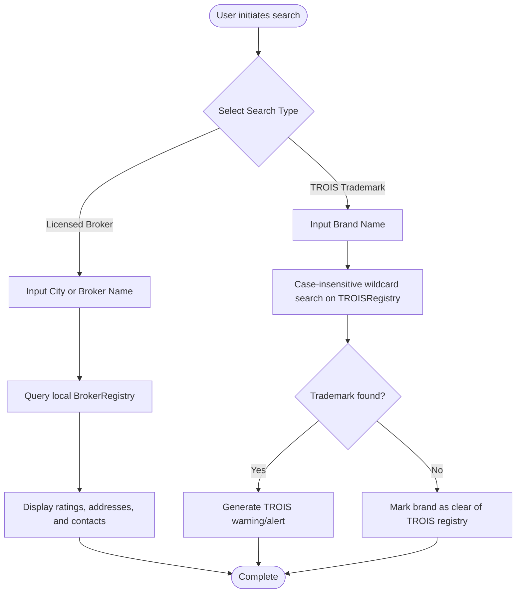
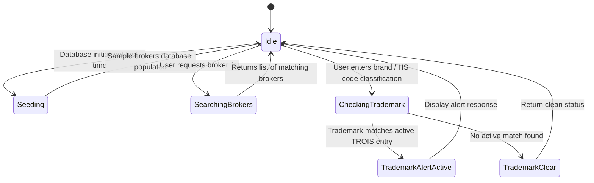

# Flow Design: KGD Registry & Trademark Protection (TROIS)

This document defines the behavioral flow, state transitions, API contract, and verification rules for licensed customs brokers searching and TROIS trademark protection checks in the Republic of Kazakhstan (RK).

---

## 1. Intent
* **User Goal:** Importers and declarants query licensed customs brokers to represent them during customs clearance and check brand names against the Customs Register of Intellectual Property Objects (ТРОИС - ТРОИС РК) to prevent trademark copyright infringements, delays, or confiscation of goods.
* **Success Criteria:**
  - Search returns verified, rated brokers sorted by relevance, license state, and operating city.
  - Trademark query detects potential TROIS copyright hits using case-insensitive wildcard comparisons.
  - Correct warning tags/messages are returned to prompt importers to seek consent from the trademark holder.

---

## 2. Scope
* **In Scope:**
  - Broker Registry querying by city, license number, or brand name.
  - rating-based sorting and address/contact retrieval for brokers.
  - TROIS registry checking (exact and substring matching) against registered brands.
  - SQLite auto-seeding of verified sample brokers for major RK hubs (Almaty, Astana, Aktau).
* **Out of Scope / Deferred:**
  - Automated direct messaging to customs brokers via the platform (deferred to v2).
  - Online trademark holder consent request workflow (deferred to v3).

---

## 3. Actors and Permissions
* **Guest User:** Can query brokers and search the TROIS registry anonymously.
* **Registered Broker:** Can claim their profile and update ratings, contacts, and active offices (deferred to v2).

---

## 4. Diagrams

### User Search Flow

### System State Machine

---

## 5. State and Projections
* **BrokerRegistry Database State:**
  - Columns: `id` (int), `license_number` (string), `company_name` (string), `bin_number` (string), `city` (string), `address` (string), `contacts` (string), `rating` (float).
* **TROISRegistry Database State:**
  - Columns: `id` (int), `registration_number` (string), `trademark_name` (string), `right_holder_name` (string), `contact_details` (string).

---

## 6. Events/Actions
| Direction | Name | Source/Target Flow | Payload | Allowed When | Reject/Failure Reason |
| :--- | :--- | :--- | :--- | :--- | :--- |
| Incoming | `search_brokers` | Declarant | `{city?: str, query?: str}` | Always | Internal DB connection failure |
| Outgoing | `brokers_found` | System | `List[BrokerRegistry]` | Query successful | Empty search fields or DB error |
| Incoming | `check_trademark` | Declarant / HS Classifier | `{query_name: str}` | Always | Brand query too short (<2 chars) |
| Outgoing | `trademark_checked` | System | `Optional[TROISRegistry]` | Check complete | Case-insensitive error / database error |

---

## 7. Edge Cases
* **Wildcard Trademark Collisions:** A brand named `"Alibaba Tech"` must flag a warning if `"Alibaba"` is protected in the TROIS registry. Implemented case-insensitive SQL `%query%` checks.
* **No Seeding in Production:** Ensure `seed_initial_brokers` is only triggered if the broker count is 0 to avoid overwriting production broker adjustments.

---

## 8. Side Effects
* **Auto-population on Launch:** Startup event invokes `seed_initial_brokers` automatically to populate initial customs brokers data in `customs_ai.db`.

---

## 9. Schemas Touched
* `backend/app/services/kgd_registry.py` (Registry business logic)
* `backend/app/core/models.py` (SQLAlchemy Broker and TROIS schemas)
* `backend/app/core/database.py` (Session engine boundaries)

---

## 10. Targeted Tests
| Layer | Behavior | File | Status |
| :--- | :--- | :--- | :--- |
| Core / Service | Licensed brokers seeding and wildcard search | `backend/tests/test_database.py` | **PASSED** |
| Core / Service | TROIS registered brand exact and substring detection | `backend/tests/test_database.py` | **PASSED** |

---

## 11. Implementation Plan
1. **Define SQLAlchemy Entities:** Map `BrokerRegistry` and `TROISRegistry` matching KGD RK requirements. (Done)
2. **Implement Registry Services:** Program search and rating methods in `KGDRegistryService`. (Done)
3. **Write Seed Script:** Package sample data matching official Kazakhstan directories. (Done)
4. **Unit Test Registry Logic:** Assert correct database persistence, queries, and filters. (Done)

---

## 12. Implementation Trace

### Files
* **Entity Definitions:** `backend/app/core/models.py`
* **Service Handlers:** `backend/app/services/kgd_registry.py`
* **Test Verification:** `backend/tests/test_database.py`

### Status
* Licensed brokers and TROIS registry search functions are fully covered.
* Validation: `PYTHONPATH=backend .venv/Scripts/pytest backend/tests/test_database.py` → **100% Pass**

---

## 13. Open Questions
* *How often does the KGD update its official licenced brokers registry?* -> The state database updates monthly. Auto-sync scrapers are planned for future releases.
