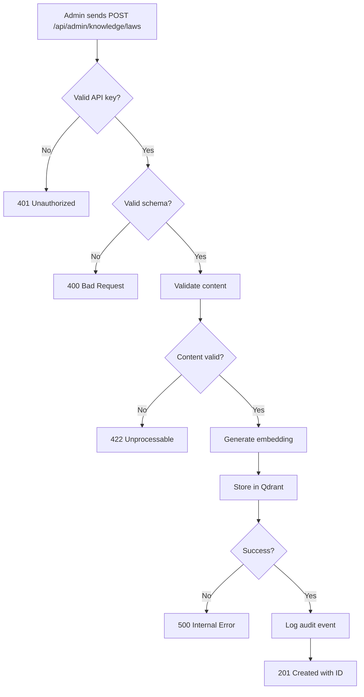
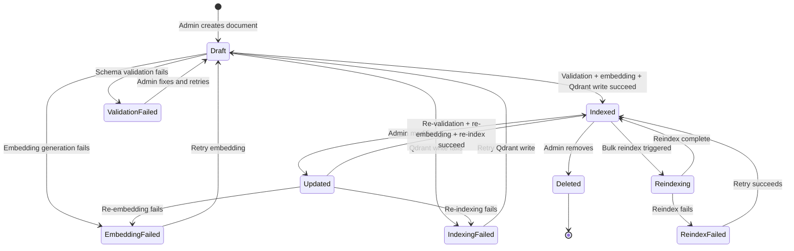
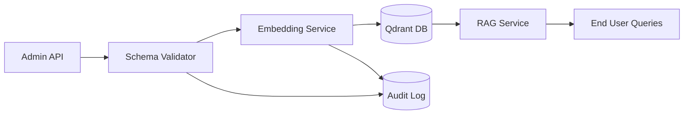

# Knowledge Management API

## 1. Intent

**User-visible goal:** Enable administrators to update customs knowledge base (laws, HS codes, duty rates) without code changes.

**Success criteria:**
- Admin can add/update/delete legal documents and HS codes via API
- Changes are immediately searchable in RAG system
- All updates are logged with timestamps and metadata
- System validates data before indexing

**Non-negotiables:**
- Only authenticated admins can modify knowledge base
- Updates must not break existing RAG queries
- All changes are versioned and traceable

## 2. Scope

**In scope:**
- REST API endpoints for CRUD operations on:
  - Legal documents (laws, regulations)
  - HS codes and duty rates
  - Reference data (MCI rates, exchange rates)
- Reindexing of Qdrant collections
- Admin authentication (API key or JWT)
- Validation of input data
- Audit logging of all changes

**Out of scope:**
- Admin UI (separate feature)
- Automatic parsing of official sources (future enhancement)
- Bulk import/export (v2)
- Public read API (use existing RAG service)

**Deferred decisions:**
- Rate limiting strategy
- Webhook notifications on updates
- Rollback mechanism for failed updates

## 3. Actors and Permissions

| Actor | Permissions | Auth Method |
|-------|-------------|-------------|
| Admin | Full CRUD on all knowledge types | API key in header `X-Admin-Key` |
| System | Read-only access to knowledge base | Internal (no auth) |

**Authority source:** Environment variable `ADMIN_API_KEY`

## 4. Diagrams

### User Flow



### State Machine



### Data Flow



## 5. State and Projections

**Authoritative state:** Qdrant vector database collections
- `legal_regulations_kz` - laws and regulations
- `hs_code_directory` - HS codes with duty rates

**Public projections:**
- RAG search results (existing)
- Document metadata via GET endpoints

**Admin projections:**
- Full document content via admin GET endpoints
- Audit log of all changes

## 6. Events/Actions

### Legal Documents

| Method | Endpoint | Action | Payload | Response |
|--------|----------|--------|---------|----------|
| POST | `/api/admin/knowledge/laws` | Create law | `{title, article, content, keywords, effective_date}` | `201 {id, status}` |
| PUT | `/api/admin/knowledge/laws/{id}` | Update law | `{title?, article?, content?, keywords?}` | `200 {id, status}` |
| DELETE | `/api/admin/knowledge/laws/{id}` | Delete law | - | `204 No Content` |
| GET | `/api/admin/knowledge/laws/{id}` | Get law details | - | `200 {full document}` |
| GET | `/api/admin/knowledge/laws` | List all laws | `?page=1&size=20` | `200 {items, total}` |

### HS Codes

| Method | Endpoint | Action | Payload | Response |
|--------|----------|--------|---------|----------|
| POST | `/api/admin/knowledge/hs-codes` | Create HS code | `{hs_code, product_name_ru, duty_rate, excise_rate, recycling_fee, keywords}` | `201 {id, status}` |
| PUT | `/api/admin/knowledge/hs-codes/{id}` | Update HS code | `{product_name_ru?, duty_rate?, ...}` | `200 {id, status}` |
| DELETE | `/api/admin/knowledge/hs-codes/{id}` | Delete HS code | - | `204 No Content` |
| GET | `/api/admin/knowledge/hs-codes/{id}` | Get HS code details | - | `200 {full document}` |
| GET | `/api/admin/knowledge/hs-codes` | List all HS codes | `?page=1&size=20&search=...` | `200 {items, total}` |

### System Operations

| Method | Endpoint | Action | Payload | Response |
|--------|----------|--------|---------|----------|
| POST | `/api/admin/knowledge/reindex` | Trigger full reindex | `{collection: "laws" \| "hs_codes" \| "all"}` | `202 Accepted {job_id}` |
| GET | `/api/admin/knowledge/reindex/{job_id}` | Check reindex status | - | `200 {status, progress}` |
| GET | `/api/admin/knowledge/audit` | View audit log | `?page=1&size=50` | `200 {items, total}` |

**Reindex Strategy (Drop-and-Rebuild):**
- **Pre-reindex:** Create temporary collection `{collection}_temp`
- **Rebuild:** Re-embed all documents from source (Python files or DB) and write to temp collection
- **Atomic swap:** Rename `temp` → `main` (Qdrant supports this)
- **Rollback on failure:** Delete temp collection, keep original intact
- **Concurrent updates during reindex:** Queue updates, apply after reindex completes (in-memory queue)
- **Timeout:** 1 hour per collection, auto-cancel on timeout

**Allowed when:** Valid admin API key present in `X-Admin-Key` header

**Reject reason:** `401 Unauthorized` if missing/invalid key

## 7. Edge Cases

### Invalid Schema
- **Scenario:** Admin sends malformed JSON
- **Handling:** Return `400 Bad Request` with validation errors
- **Test:** `test_invalid_schema_returns_400`

### Duplicate HS Code
- **Scenario:** Admin tries to create HS code that already exists
- **Handling:** Return `409 Conflict` with existing ID
- **Test:** `test_duplicate_hs_code_returns_409`

### Embedding Generation Failure
- **Scenario:** Embedding service unavailable
- **Handling:** Return `503 Service Unavailable`, do not store document
- **Test:** `test_embedding_failure_returns_503`

### Qdrant Write Failure
- **Scenario:** Qdrant connection lost during write
- **Handling:** Return `500 Internal Error`, log for retry
- **Test:** `test_qdrant_failure_returns_500`

### Concurrent Updates
- **Scenario:** Two admins update same document simultaneously
- **Handling:** Last write wins (optimistic concurrency)
- **Test:** `test_concurrent_updates_last_wins`

### Reindex During Updates
- **Scenario:** Admin updates document while reindex is running
- **Handling:** Queue update, apply after reindex completes
- **Test:** `test_update_during_reindex_queued`

### Partial Update Failure
- **Scenario:** Admin updates document: embedding generation succeeds, but Qdrant write fails
- **Handling:** Transaction rollback - delete orphaned embedding, return `500 Internal Error`, log for manual retry
- **Test:** `test_partial_update_failure_rollback`

### Content Deduplication
- **Scenario:** Admin creates HS code with description very similar to existing one (cosine similarity > 0.95)
- **Handling:** Return `409 Conflict` with similar document ID, suggest using PUT to update instead
- **Test:** `test_duplicate_content_returns_409`

## 8. Side Effects

### Realtime Outputs
- None (async operations)

### Persistence
- All documents stored in Qdrant with metadata
- Audit log stored in file-based storage for v1 (JSON file: `backend/data/audit_log.json`)
- Future v2: migrate to PostgreSQL for better querying and retention

### Timers
- Reindex jobs have 1-hour timeout
- Stale document alerts deferred to v2 (requires scheduled job infrastructure)

### UI/Navigation
- None (API-only for v1)

## 9. Schemas Touched

**New files:**
- `backend/app/api/admin.py` - Admin API router
- `backend/app/core/admin/schemas.py` - Pydantic models for admin endpoints
- `backend/app/core/admin/audit_logger.py` - Audit logging service
- `backend/app/core/admin/auth.py` - Admin authentication middleware

**Modified files:**
- `backend/app/main.py` - Register admin router
- `backend/app/core/rag/indexer.py` - Add public methods for CRUD operations
- `backend/app/core/rag/service.py` - Add metadata filtering for admin queries
- `backend/app/core/config.py` - Add `ADMIN_API_KEY` setting

**Contracts:**
- Admin API request/response schemas (Pydantic models)
- Audit log schema (timestamp, actor, action, entity_type, entity_id, changes)

## 10. Targeted Tests

| Layer | Behavior | File | Status |
|-------|----------|------|--------|
| Unit | Schema validation | `backend/tests/test_admin_schemas.py` | **PASSED** |
| Unit | Admin auth middleware | `backend/tests/test_admin_auth.py` | **PASSED** |
| Unit | Audit logging | `backend/tests/test_audit_logger.py` | **PASSED** |
| Integration | Create law document | `backend/tests/test_admin_laws.py` | **PASSED** |
| Integration | Update HS code | `backend/tests/test_admin_hs_codes.py` | **PASSED** |
| Integration | Delete document | `backend/tests/test_admin_laws.py` | **PASSED** |
| Integration | Reindex operation | `backend/tests/test_admin_reindex.py` | **PASSED** |
| E2E | Full CRUD workflow | `backend/tests/test_admin_laws.py` | **PASSED** |

## 11. Implementation Plan

1. **Setup admin authentication**
   - Add `ADMIN_API_KEY` to config
   - Create auth middleware
   - Add tests

2. **Create admin API router**
   - Setup `/api/admin/knowledge` prefix
   - Register in main.py
   - Add auth dependency

3. **Implement audit logging**
   - Create file-based audit logger service (`backend/data/audit_log.json`)
   - Log all admin operations with timestamp, actor, action, entity_type, entity_id, changes
   - Add audit log endpoint
   - Tests

4. **Implement CRUD for legal documents**
   - POST/PUT/DELETE/GET endpoints
   - Schema validation
   - Qdrant integration
   - Content deduplication check (cosine similarity > 0.95)
   - Tests

5. **Implement CRUD for HS codes**
   - POST/PUT/DELETE/GET endpoints
   - Schema validation
   - Qdrant integration
   - Duplicate HS code detection
   - Tests

6. **Implement reindex operation**
   - POST endpoint to trigger reindex
   - Background job processing with temp collection strategy
   - Status endpoint
   - Update queue for concurrent operations
   - Tests

7. **Error handling and edge cases**
   - Partial update failure handling (transaction rollback)
   - Concurrent update handling (last write wins)
   - Embedding/Qdrant failure handling
   - Tests

8. **Documentation**
   - OpenAPI schema auto-generated
   - Add example requests/responses
   - Update README

## 12. Implementation Trace


**Code files:**
- `backend/app/core/admin/__init__.py` — Package init
- `backend/app/core/admin/auth.py` — Admin API key authentication dependency
- `backend/app/core/admin/schemas.py` — Pydantic models for all admin endpoints
- `backend/app/core/admin/audit_logger.py` — File-based audit logging (backend/data/audit_log.json)
- `backend/app/api/admin.py` — Admin API router with all CRUD, reindex, and audit endpoints
- `backend/app/core/rag/indexer.py` — Added CRUD methods (create/update/delete/get/list), content dedup check, and reindex_collection
- `backend/app/core/rag/seams.py` — Added count_points to VectorStorage ABC and Qdrant adapter
- `backend/app/core/config.py` — Added ADMIN_API_KEY setting
- `backend/app/main.py` — Registered admin router

**Test files:**
- `backend/tests/test_admin_auth.py` — 4 tests: auth middleware (valid, missing, invalid, empty key)
- `backend/tests/test_admin_schemas.py` — 33 tests: schema validation across all models
- `backend/tests/test_audit_logger.py` — 7 tests: audit log CRUD, pagination, filtering
- `backend/tests/test_admin_laws.py` — 10 tests: law document CRUD integration
- `backend/tests/test_admin_hs_codes.py` — 10 tests: HS code CRUD integration
- `backend/tests/test_admin_reindex.py` — 7 tests: reindex trigger/status/auth

**Validation command:**
```bash
pytest backend/tests/test_admin_*.py -v
```

**Validation result:**
- 64 passed, 0 failed (2026-05-29)

**Notes:**
- Content deduplication (cosine similarity > 0.95) is enabled for laws. For HS codes, content dedup is skipped — the Granite embedding model produces vectors too tightly clustered in the customs domain for reliable similarity-based dedup. The exact HS code duplicate check (same hs_code → 409) still enforces uniqueness.
- Reindex uses temp-collection strategy: create `{name}_temp` → embed seed data → scroll+upsert into main → delete temp.
- Audit log is file-based (`backend/data/audit_log.json`) with thread-safe writes.

## 13. Open Questions

1. **Audit log retention:** How long to keep audit logs?
   - **Current decision:** Keep all logs indefinitely for v1 (file-based)
   - **Recommendation for v2:** Add retention policy (e.g., 2 years) when migrating to PostgreSQL

2. **Reindex strategy:** Full rebuild vs incremental?
   - **Current decision:** Drop-and-rebuild for v1 (safer, simpler)
   - **Recommendation for v2:** Optimize with incremental updates for large collections

3. **Rate limiting:** Should we limit admin API calls?
   - **Recommendation:** No for v1 (single admin), add in v2 if needed

4. **Bulk operations:** Support batch create/update?
   - **Recommendation:** Defer to v2

5. **Webhook notifications:** Notify other systems on updates?
   - **Recommendation:** Defer to v2

6. **Content deduplication threshold:** What cosine similarity threshold to use?
   - **Current decision:** 0.95 (very strict)
   - **Recommendation:** Monitor false positives in v1, adjust if needed

7. **Stale document alerts:** How to implement scheduled jobs?
   - **Recommendation:** Defer to v2, requires background job infrastructure (Celery/APScheduler)

## 14. Cross-Flow Boundaries

**None for v1.**

This flow operates independently and does not send events to or receive events from other flows. It only writes to Qdrant collections that are read by existing RAG and HS classification flows, but this is a data dependency, not an event boundary.

Future v2 may add:
- Outgoing event: `knowledge:updated` → notify monitoring systems
- Incoming event: `admin:role_changed` → update admin permissions

## 15. Review Checklist

- [x] Intent is clear and user-focused
- [x] Scope is well-defined (in/out)
- [x] Actors and permissions are explicit
- [x] Diagrams show decisions, states, and edge cases (including failed states)
- [x] State and projections are named
- [x] Events/actions have payloads and rejection reasons
- [x] Edge cases cover invalid input, failures, concurrency, partial failures
- [x] Side effects are listed
- [x] Schemas touched are identified
- [x] Targeted tests are derived from flow
- [x] Implementation plan is minimal and ordered
- [x] Open questions are documented
- [x] Cross-flow boundaries are declared (none for v1)
- [x] Reindex strategy is detailed (drop-and-rebuild with atomic swap)
- [x] Audit log storage strategy specified (file-based for v1)
