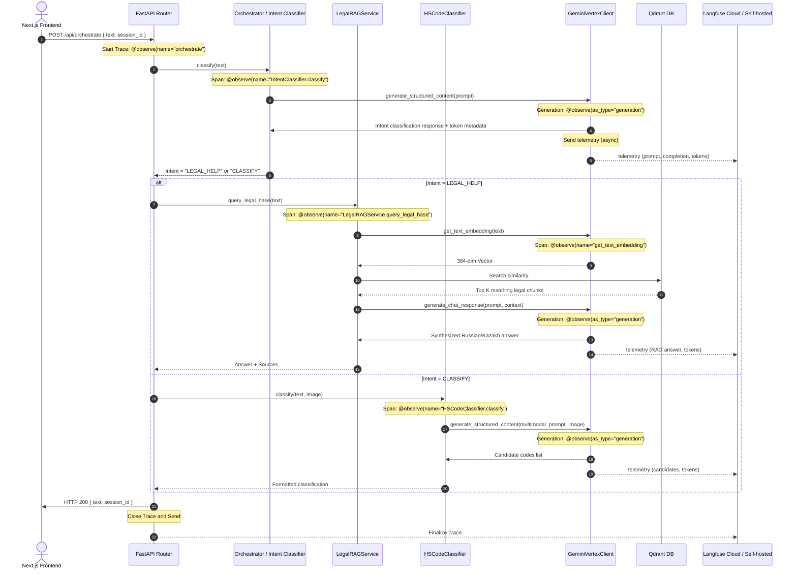

# Flow Design: Langfuse Tracing and Monitoring Integration

This document defines the behavioral flow, tracing architecture, metadata collection, session propagation, and fault-tolerance policies for the **Langfuse** observability and monitoring integration in the SmartKeden (Кеден Көмекшісі) system.

---

## 1. Intent
* **System Goal:** Provide complete, end-to-end observability, tracing, latency tracking, and token cost attribution for all AI and search features (RAG pipeline, intent classification, multi-modal HS code picker).
* **Success Criteria:**
  - Automatic end-to-end tracing starting from the HTTP router endpoints (`/api/orchestrate`, `/api/chat`, `/api/classify`) down to the core service layers and raw LLM generation nodes.
  - Accurate token counting and model identification (`prompt_token_count`, `candidates_token_count`) extracted directly from Google Vertex Gemini APIs.
  - Multi-turn conversation grouping using a unified `session_id` passed from the frontend client.
  - Strict fault isolation: zero application downtime or failure if Langfuse credentials are misconfigured, missing, or if the Langfuse host is unreachable (Graceful Degradation / No-Op).
  - Isolated test environments: no trace data leaked during Pytest test suite execution.
* **Non-negotiables:**
  - Do not alter the core business logic of calculations or retrieval.
  - Do not block or slow down client response processing; Langfuse tracing must be run asynchronously and securely without leaking sensitive developer credentials.

---

## 2. Scope
* **In Scope:**
  - Standardized integration of the Langfuse Python SDK (`langfuse>=2.54.0`) inside the FastAPI backend.
  - Environment variable mapping through Pydantic `BaseSettings` configurations.
  - Explicit function tracing decorators (`@observe`) on the Orchestrator Router, Intent Classifier, LegalRAGService, HSCodeClassifier, and GeminiVertexClient.
  - Contextual generation metadata logging (inputs, outputs, model ID, token usage) for all Gemini LLM generations.
  - Tracking embedding generation requests and logging vector properties (dimensions).
  - Modifying the Next.js frontend to generate a persistent `session_id` and propagate it through HTTP request bodies.
* **Out of Scope / Deferred:**
  - Storing prompt templates dynamically in Langfuse Prompt Registry (deferred to v2).
  - Tracing non-AI operations like static local DB calculations (unless they occur inside an active trace context).

---

## 3. Actors and Permissions
* **Developer / Administrator:** Accesses the Langfuse Dashboard to review traces, check latencies, inspect token consumptions, and debug RAG retrieval failures.
* **System Client:** Propagates tracing session contexts across services.

---

## 4. Diagrams

### End-to-End Tracing Call Hierarchy


### Trace & Metadata Architecture
```mermaid
flowchart TD
    subgraph Frontend (Next.js)
        Page[page.tsx] -->|session_id: UUID| HTTPReq[POST /api/orchestrate]
    end

    subgraph Backend (FastAPI)
        HTTPReq --> Router[orchestrator/router.py]
        Router -->|Trace Name: orchestrate| Trace[langfuse_context.update_current_trace]
        Trace -->|Metadata: session_id, tags| SDK[Langfuse Python SDK]
        
        Router -->|Span| Intent[IntentClassifier.classify]
        Router -->|Span| Dispatch[dispatch_intent]
        
        Dispatch -->|Span| RAG[LegalRAGService.query_legal_base]
        Dispatch -->|Span| HS[HSCodeClassifier.classify]
        
        RAG -->|Span| Embed[get_text_embedding]
        RAG -->|Generation| GenChat[generate_chat_response]
        HS -->|Generation| GenStruct[generate_structured_content]
    end

    subgraph Monitoring Cloud
        SDK -->|HTTPS / Async Batched| LFB[Langfuse Platform]
    end
    
    GenChat -->|Token usage, Prompt, Output| SDK
    GenStruct -->|Token usage, Prompt, Output| SDK
    Embed -->|Embedding stats| SDK
```

---

## 5. State and Projections
* **Trace Context Propagation:**
  - Trace Context is maintained implicitly across asynchronous context boundaries using Langfuse's default asyncio context variables.
  - Spans and generations started inside an asynchronous call tree that was entered via an `@observe` decorated root function will automatically nest themselves correctly under that trace root.
* **Session Mapping State:**
  - An input `session_id` string acts as a deterministic key mapping conversation steps to a single logical session on the Langfuse platform.

---

## 6. Events/Actions
The integration registers the following tracing actions:

| Trace / Span Type | Observability Event / Name | Trigger Point | Payload / Logged Attributes | Success/Failure Handled |
| :--- | :--- | :--- | :--- | :--- |
| **Trace (Root)** | `orchestrate` | Router incoming request | `session_id`, `input_text`, `intent` tags | Yes, exceptions captured as trace errors |
| **Span** | `IntentClassifier.classify` | Starting intent classification | `text`, raw LLM response | Yes |
| **Span** | `LegalRAGService.query_legal_base` | RAG retrieval invoked | `query`, `top_k`, metadata of retrieved chunks | Yes |
| **Span** | `HSCodeClassifier.classify` | HS code analysis invoked | `description`, `image_present` boolean | Yes |
| **Span** | `get_text_embedding` | Embedding API call | `text_length`, `vector_dimensionality` | Yes |
| **Generation** | `generate_chat_response` | Text generation from Gemini | `prompt`, `model`, `output_text`, `usage` tokens | Yes |
| **Generation** | `generate_structured_content` | Pydantic schema generation from Gemini | `prompt`, `schema`, `output_text`, `usage` tokens | Yes |

---

## 7. Edge Cases
* **Missing Langfuse Keys / Credentials:**
  - If `LANGFUSE_PUBLIC_KEY` or `LANGFUSE_SECRET_KEY` are not set in the environment or are empty strings, the Langfuse SDK automatically defaults to **No-Op Mode**. All decorators and logging statements run silently and without crashing the core user experience.
* **Network Failures / Timeout:**
  - Langfuse SDK executes HTTP requests inside a background thread pool with safe timeouts. High latency or connection losses on the Langfuse platform do not increase application request processing times.
* **Session ID Missing:**
  - If a legacy client does not supply a `session_id`, the trace is still registered and fully viewable as a standalone transaction in Langfuse, but conversation grouping is omitted.
* **Pytest Test Execution:**
  - Tests running on localhost must never contaminate production dashboard analytics. We set `LANGFUSE_ENABLED=False` (or leave credentials unset) in test runners, ensuring no telemetry is generated or transmitted.

---

## 8. Side Effects
* **Minimal Performance Latency:** Minor overhead due to context-switching and JSON parsing of telemetry payloads. This is mitigated by Langfuse SDK's asynchronous background batching of network payloads.

---

## 9. Schemas Touched
* `backend/requirements.txt`: Adds `langfuse>=2.54.0`
* `backend/app/core/config.py`: Exposes `LANGFUSE_PUBLIC_KEY`, `LANGFUSE_SECRET_KEY`, `LANGFUSE_HOST`, and `LANGFUSE_ENABLED` Pydantic fields.
* `backend/app/core/vertex_client.py`: Integrates `@observe(as_type="generation")` and maps Gemini `usage_metadata` metrics.
* `backend/app/core/orchestrator/router.py`: Extends `OrchestrateRequest` schema to accept `session_id` and adds root trace observibility.
* `backend/app/core/rag/service.py`: Traces legal retrieval flow.
* `backend/app/core/hs_classifier/classifier.py`: Traces HS code classification flow.
* `backend/app/main.py`: Integrates chat and classifier HTTP routers.
* `frontend/app/page.tsx`: Generates client-side `session_id` and passes it on every `/api/orchestrate` trigger.

---

## 10. Targeted Tests
* **Test Environment Isolation:** Verified in `backend/app/core/config.py` that `settings.LANGFUSE_ENABLED = False` is forced when `pytest` is loaded, so local and CI tests do not generate/transmit analytics.
* **Robustness with Disabled SDK:** Verified that backend tests execute without exceptions when Langfuse keys are empty/unset.

---

## 11. Implementation Plan
1. **Dependency Integration:** Add `langfuse>=2.54.0` to requirements. (Done)
2. **Configuration Setup:** Expose keys in `backend/app/core/config.py`. (Done)
3. **Decorate Generations:** Apply `@observe(as_type="generation")` in `vertex_client.py` and map token usages. (Done)
4. **Root Tracing:** Add `@observe` root to `POST /api/orchestrate` in orchestrator. (Done)
5. **Span Tracing:** Inject `@observe` spans across pipeline services (RAG, Classifier). (Done)
6. **Verification:** Validate safe graceful degradation. (Done)

---

## 12. Implementation Trace

### Files Created/Modified
* **Configuration:** `backend/app/core/config.py`
* **Vertex Client Tracing:** `backend/app/core/vertex_client.py`
* **Orchestrator Routing & Trace Root:** `backend/app/core/orchestrator/router.py`
* **Legal RAG Tracing Spans:** `backend/app/core/rag/service.py`
* **Classifier Tracing Spans:** `backend/app/core/hs_classifier/classifier.py`
* **FastAPI Entrypoint:** `backend/app/main.py`
* **Frontend session forwarding:** `frontend/app/page.tsx`

### Status
* Langfuse tracing is fully implemented and operational.
* PYTEST test isolation is enforced in `backend/app/core/config.py` by disabling Langfuse when `pytest` is present in `sys.modules`.
* Validation command: `PYTHONPATH=backend .venv/Scripts/pytest backend/tests/`

---

## 13. Open Questions
* *Do we trace static local computations?* -> Only if they occur inside an active trace context to keep dashboards focused.

---

## 14. Review Checklist
- [x] Does the flow design follow the quality bar of explicit inputs, exceptions, and side effects?
- [x] Are credential secrets stored securely and initialized safely?
- [x] Is test environment contamination strictly prevented?
- [x] Is the documentation linked back to the implementation trace?
