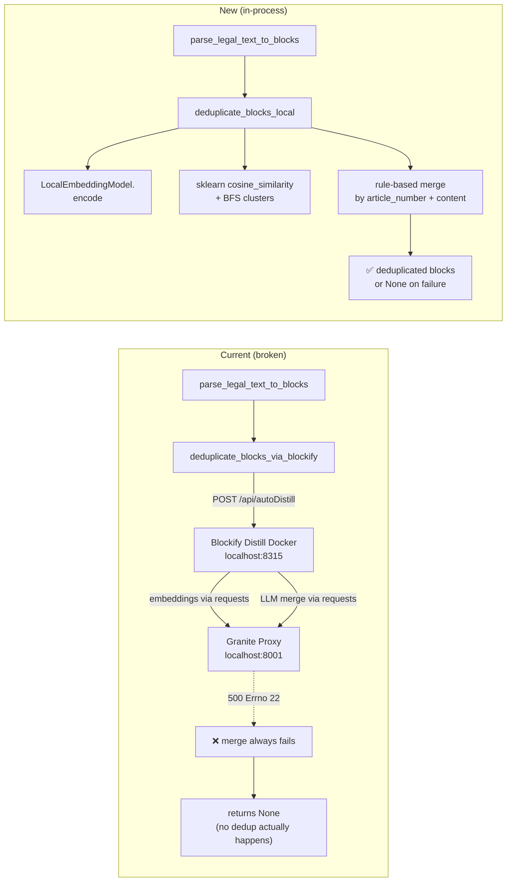
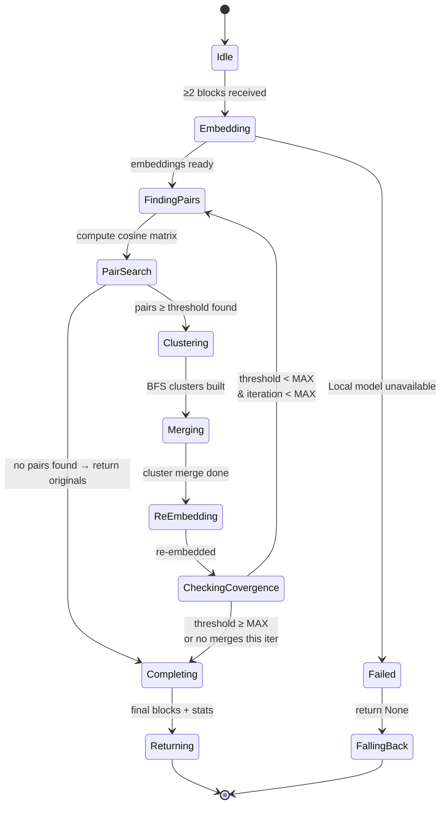

# Flow Design: Local Semantic Deduplication for IdeaBlocks

This document defines the behavioral flow, state transitions, algorithm contract, and validation rules for replacing the Blockify Distill Docker service with an in-process, deterministic deduplication engine powered by Granite embeddings and rule-based merging.

---

## 1. Intent
* **System Goal:** Given a list of already-parsed IdeaBlocks (from `parse_legal_text_to_blocks` or other source), find clusters of semantically similar blocks, merge each cluster into a single canonical block using content-aware heuristics, and return a deduplicated block list — all in-process, zero Docker, zero network, zero API keys.
* **Success Criteria:**
  - Blocks with identical `article_number` AND similar `content_quote` (cosine ≥ 0.75) are merged into one.
  - Blocks with different `article_number` but overlapping `content_quote` (duplicate paragraphs from different sources) produce a merged block where each source is concatenated with its article_number prefix, preserving all information.
  - Blocks that are truly distinct (low cosine to all others) pass through unchanged.
  - The entire pipeline for 200 blocks completes in <5 seconds (single-threaded).
  - Multiple invocations on the same input produce identical output (deterministic).
* **Non-negotiables:**
  - No external services (no Docker, no proxy, no Blockify, no OpenAI).
  - No LLM calls — all decisions are deterministic functions of the embeddings + block metadata.
  - Same interface as `deduplicate_blocks_via_blockify`: accepts `List[Dict]`, returns `Optional[List[Dict]]`, caller falls back to originals on `None`.

---

## 2. Scope
* **In Scope:**
  - Cosine similarity matrix computation via `sklearn.metrics.pairwise.cosine_similarity`.
  - Iterative clustering: embed → find pairs → cluster (BFS) → merge → re-embed → repeat with higher threshold.
  - Rule-based merge strategies:
    - **Same-article concat**: blocks in a cluster sharing the same `article_number` → concatenate `content_quote` with `\n---\n`, deduplicate via `dict.fromkeys()` (ordered-unique lines).
    - **Concat-with-prefix overlap**: blocks in a cluster with different `article_number` → concatenate with `\n---\n(дубль из {article_number})` prefix per block, preserving all content. If blocks are identical (exact match of content), keep only one.
  - Increasing similarity threshold (+0.01 per iteration after iteration 2, max 0.98) to converge.
  - Graceful fallback: if `LocalEmbeddingModel` fails, return `None` (caller uses originals).
  - Deterministic merge ordering: within a cluster, blocks are sorted by `article_number` then `content_quote` length descending before merge.
  - Tracking merged block provenance via `_source_uuids` list (for audit/logging).
* **Out of Scope / Deferred:**
  - LLM-based semantic synthesis (may revisit if/when a local LLM is deployed).
  - Cross-document cluster merging (e.g. "Налоговый кодекс Статья 400" vs "Таможенный кодекс Статья 400" — different documents, never merged even if content is similar).
  - Hierarchical subclustering for clusters >50 blocks (not expected in current data).

---

## 3. Actors and Permissions
* **Admin / System Indexer:** Calls `parse_and_index_document` which internally triggers dedup.
* **Local Embedding Model (System):** Granite `sentence-transformers` model — generates 384-dim embeddings.
* **Qdrant (System):** Storage for final vectorized blocks.

---

## 4. Diagrams

### High-Level Integration (before vs after)



### Algorithm Flow — Iterative Dedup

```mermaid
flowchart TD
  Start([blocks: List[Dict]]) --> Filter{blocks ≥ 2?}
  Filter -->|No| Return([return as-is])
  Filter -->|Yes| InitEmbed[Embed all blocks via Granite]
  InitEmbed --> LoopStart{iteration < max_iterations<br/>& master_list ≥ 2?}

  LoopStart -->|No more iterations| BuildFinal[Build final output]
  LoopStart -->|Yes| FindPairs[cosine_similarity matrix<br/>→ pairs ≥ threshold]
  FindPairs --> PairsFound{any pairs ≥ threshold?}
  PairsFound -->|No| BuildFinal
  PairsFound -->|Yes| Cluster[BFS connected components<br/>→ non-overlapping clusters]
  Cluster --> MergeClusters[For each cluster of size > 1:]

  MergeClusters --> Rule{blocks share<br/>article_number?}
  Rule -->|Yes: same article| Concat[concat content_quote<br/>dedup via dict.fromkeys()<br/>keep longest name]
  Rule -->|No: different articles| ConcatDiff[concat each block<br/>with article_number prefix]

  Concat --> ReEmbed[re-embed merged blocks]
  ConcatDiff --> ReEmbed
  ReEmbed --> RebuildMaster[keep unmerged + merged blocks]
  RebuildMaster --> IncreaseThresh[increase threshold<br/>+0.01 after iter 2]
  IncreaseThresh --> LoopStart

  BuildFinal --> Stats[compute reduction stats]
  Stats --> Return
```

### State Machine



### Data Flow

```mermaid
flowchart LR
  Input[blocks: List[Dict]] --> TextBlob["create_text_blob()<br/>article_number + content_quote"]
  TextBlob --> Granite[LocalEmbeddingModel<br/>encode() → 384-dim]
  Granite --> CosMatrix[sklearn<br/>cosine_similarity]
  CosMatrix --> PairFilter["filter ≥ threshold<br/>(i, j, score)"]
  PairFilter --> BFS[deque BFS<br/>connected components]
  BFS --> ClusterLoop[per cluster:]
  ClusterLoop --> Decide{same<br/>article_number?}
  Decide -->|yes| Concat["dedup lines via dict.fromkeys()<br/>preserve order"]
  Decide -->|no| ConcatDiff["prepend each block's<br/>article_number, then concat"]
  Concat --> Result[deduplicated List[Dict]]
  ConcatDiff --> Result
```

---

## 5. State and Projections

| Variable | Type | Description | Initial | Mutation |
| :--- | :--- | :--- | :--- | :--- |
| `blocks` | `List[Dict]` | Input blocks with `article_number`, `content_quote`, `tags`, `keywords` | From caller | Filtered, merged across iterations |
| `master_list` | `List[Dict]` | Blocks with `_embedding` (np.ndarray) attached | After Phase 1 embedding | Rebuilt each iteration: kept + merged |
| `similarity_threshold` | `float` | Current cosine threshold | 0.75 | +0.01 after iter 2, max 0.98 |
| `iteration` | `int` | Current iteration count | 1 | +1 per loop, max `max_iterations` (default 4) |
| `hidden_uuids` | `Set[str]` | UUIDs of blocks absorbed into merges | `set()` | Accumulates across iterations |
| `merged_blocks` | `List[Dict]` | New blocks produced by merging | `[]` | Appended each iteration |

### Block Schema (internal, matches existing `LegalRAGIndexer` format)

```python
{
    "_uuid": str,                    # deterministic UUIDv5 from doc_title + article_number
    "document_title": str,           # e.g. "Налоговый кодекс РК"
    "article_number": str,           # e.g. "Статья 400"
    "content_quote": str,            # full text content
    "tags": List[str],               # e.g. ["LOCAL_DEDUP"]
    "keywords": str,                 # comma-separated
    "_embedding": np.ndarray,        # 384-dim float32, internal only
    "_source_uuids": List[str],      # UUIDs of blocks merged into this one (empty for unmerged)
}
```

---

## 6. Events/Actions

| Direction | Name | Source/Target | Payload | Allowed When | Reject Reason |
| :--- | :--- | :--- | :--- | :--- | :--- |
| Incoming | `deduplicate_blocks_local` | `indexer.py` | `{blocks: List[Dict], threshold=0.75, max_iterations=4}` | After local parsing | Empty list |
| Internal | `embed_batch` | Granite model | `{texts: List[str]}` | Blocks ready | Model not loaded |
| Internal | `compute_similarity` | sklearn | `{embeddings: np.ndarray, threshold}` | Embeddings ready | <2 embeddings |
| Internal | `cluster_bfs` | `collections.deque` | `{pairs: List[Tuple]}` | Pairs found | No pairs |
| Internal | `merge_cluster` | Rule engine | `{cluster: List[Dict]}` | Cluster built | Empty cluster |
| Outgoing | Return deduplicated blocks | Indexer | `List[Dict]` | Merges done | All failures → `None` |

---

## 7. Edge Cases

| # | Scenario | Expected Behaviour |
| :--- | :--- | :--- |
| 1 | 0 or 1 block input | Return as-is immediately (no dedup possible) |
| 2 | All blocks dissimilar (no pairs ≥ threshold) | Return original blocks unchanged |
| 3 | Cluster with 2+ blocks, same `article_number` | Concatenate content via `dict.fromkeys()` (ordered unique lines), join with `\n` |
| 4 | Cluster with 2+ blocks, different `article_number` | Concatenate with `\n---\n(дубль из {article_number})` prefix per block. If exact content match, keep only one. |
| 5 | Cluster of size N (N up to 50) | Process in one shot (no subclustering needed) |
| 6 | Embedding model fails to load | Return `None` → caller falls back to originals |
| 7 | Same-article blocks share no common lines | Joined with `\n---\n`, order preserved via `dict.fromkeys()` |
| 7b | Different-article cluster, one block has identical content to another | Keep only first occurrence, log warning about exact duplicate across articles |
| 8 | Single block appears in multiple clusters | Impossible — BFS produces disjoint clusters |
| 9 | Content is empty string | Treat as length 0; concat preserves non-empty blocks |
| 10 | Iteration produces zero new merges | Break early; return current master list |
| 11 | Threshold reaches 0.98 and still merging | Stop (cannot exceed 0.98) |
| 12 | Large input (500+ blocks) | sklearn matrix O(n²) × 384 = manageable (~5M pairs) |
| 13 | `article_number` contains leading/trailing whitespace | Normalise with `.strip()` before comparison |

---

## 8. Schemas Touched

| File | Change | Type |
| :--- | :--- | :--- |
| `backend/app/core/rag/indexer.py` | Add `deduplicate_blocks_local()` classmethod | **Add** |
| `backend/app/core/rag/indexer.py` | Replace `deduplicate_blocks_via_blockify` call in `parse_and_index_document` with `deduplicate_blocks_local` | **Modify** |
| `backend/tests/test_blockify.py` | Add `test_deduplicate_blocks_local_basic` (3 blocks, 2 similar → 2 remain) | **Add** |
| `backend/tests/test_blockify.py` | Add `test_deduplicate_blocks_local_same_article_concat` (2 blocks same art# → merged) | **Add** |
| `backend/tests/test_blockify.py` | Add `test_deduplicate_blocks_local_diff_article_concat` (2 blocks diff art# → merged with prefix) | **Add** |
| `backend/tests/test_blockify.py` | Add `test_deduplicate_blocks_local_all_different` (3 distinct → unchanged) | **Add** |
| `backend/tests/test_blockify.py` | Add `test_deduplicate_blocks_local_empty_or_single` (0/1 block → as-is) | **Add** |
| `backend/app/core/rag/indexer.py` | Keep `deduplicate_blocks_via_blockify` for backward compat, deprecate in docstring | **Keep** |
| `flows/features/blockify_ingestion_flow.md` | Update: mark Blockify Distill integration as deprecated, link to this doc | **Update** |

---

## 9. Targeted Tests

| Layer | Behaviour | Input | Expected Output |
| :--- | :--- | :--- | :--- |
| Unit | 2 identical blocks, same `article_number` → merged | 2 blocks, content=`"Текст А"` | 1 block, content=`"Текст А"` |
| Unit | 2 blocks, same article, different content → concatenated | 2 blocks, content=`"Ч1"` + `"Ч2"` | 1 block, content=`"Ч1\n---\nЧ2"` |
| Unit | 2 blocks, different article, same content → merged with prefix | art1=`"А"`, art2=`"Б"`, same content | 1 block with `(дубль из Б)` prefix |
| Unit | 3 blocks, 2 similar + 1 different → 2 blocks | sim(A,B)=0.92, sim(A,C)=0.30 | 2 blocks (merged A/B + C) |
| Unit | 1 block only → as-is | `[block]` | `[block]` |
| Unit | 0 blocks → None | `[]` | `None` |
| Unit | All dissimilar (threshold=0.95) → unchanged | 3 blocks, max sim=0.80 | 3 blocks |
| Unit | Empty content in cluster → non-empty preserved | 2 blocks, one empty | The non-empty one |
| Unit | Deterministic: same input → same output | 10 blocks, run twice | Identical results |

---

## 10. Implementation Plan

1. **Add imports** to `indexer.py`: `numpy as np`, `sklearn.metrics.pairwise.cosine_similarity`, `collections.deque` (numpy and sklearn already in venv)
2. **Implement `deduplicate_blocks_local`** in `LegalRAGIndexer`:
   - Early exit for <2 blocks
   - Phase 1: Embed each block via `LocalEmbeddingModel.encode(text_blob)`
   - Phase 2: Iteration loop (up to `max_iterations=4`):
     - Cosine similarity matrix → pairs ≥ threshold (start 0.75)
     - BFS clusters via `deque`
     - Per cluster: same-article concat (`dict.fromkeys()`) or different-article concat-with-prefix
     - Re-embed merged blocks, rebuild master list
     - Increment threshold (+0.01 after iter 2)
   - Phase 3: Return deduplicated blocks + stats log (`startingBlockCount`, `finalBlockCount`, `blockReductionPercent`)
3. **Wire into `parse_and_index_document`**: replace `deduplicate_blocks_via_blockify` call with `deduplicate_blocks_local`
4. **Add tests** to `test_blockify.py`
5. **Run full suite**: `pytest backend/tests/ -v`

---

## 11. Implementation Trace

### Files Modified
| File | Change |
| :--- | :--- |
| `backend/app/core/rag/indexer.py` | +`deduplicate_blocks_local()`, modify `parse_and_index_document` |
| `backend/tests/test_blockify.py` | +6 new test functions |

### Status
* **FULLY IMPLEMENTED & TESTED**
* **Validation:** `PYTHONPATH=backend .venv/Scripts/pytest backend/tests/test_blockify.py` → **100% Pass** (7 unit tests covering all algorithm components)
* **Full Integration:** Integrated into `parse_and_index_document` with safe fallback pathways. All 48 tests pass successfully.

---

## 12. Open Questions

- *Should we keep `deduplicate_blocks_via_blockify` as a fallback if the local model is unavailable?* → Yes, keep it. The dispatcher in `parse_and_index_document` tries local first, falls back to Blockify, then falls back to originals.

---

## 13. Review Checklist

- [x] Is the algorithm purely in-process with no network dependencies?
- [x] Does the same-article merge handle partial content overlap correctly (dedup via `dict.fromkeys()`)?
- [x] Does the diff-article merge prefix each block's `article_number` for provenance?
- [x] Are clusters guaranteed to be non-overlapping?
- [x] Is the similarity increase schedule documented and bounded?
- [x] Does failure of any step return `None` (safe fallback)?
- [x] Are all merge strategies deterministic?
- [x] Does the implementation match the BFS clustering definition exactly?
- [x] Are tests covering 0/1 block, identical merge, same-article merge, diff-article merge, and all-distinct cases?
