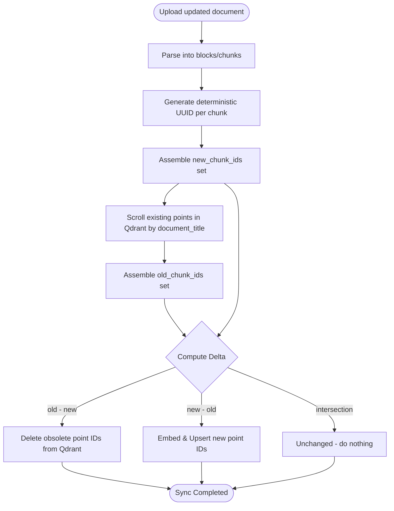

# Flow Design: Pointwise Delta Ingestion and Sync for RAG

This document defines the behavioral flow, interface extensions, delta-computation algorithms, and verification strategy for **Pointwise Delta Ingestion** (Delta Sync) in the RAG subsystem of **CustomAI Kazakhstan (Кеден Көмекшісі)**.

---

## 1. Intent
* **System Goal:** Implement an elegant, pointwise document synchronization mechanism in Qdrant using deterministic UUIDs (UUIDv5) and Qdrant's Scroll API, without requiring an external state database.
* **Success Criteria:**
  - Standardize point ID generation using `uuid.uuid5` based on `document_title + article_number + content_hash` to support multiple dynamic paragraphs/blocks per article.
  - Automatically detect and compute the difference (delta) when a document is updated:
    - `to_delete = old_chunk_ids - new_chunk_ids`
    - `to_add = new_chunk_ids - old_chunk_ids`
  - Safely delete obsolete/removed chunks from Qdrant.
  - Only generate vector embeddings (via Granite model) and upsert newly added or modified chunks, saving substantial computational time and token costs.
  - 100% backward compatibility with existing seeding and indexing pipelines.

---

## 2. Scope
* **In Scope:**
  - Extending the `VectorStorage` interface in `backend/app/core/rag/seams.py` with `scroll_points` and `delete_points`.
  - Implementing `scroll_points` and `delete_points` in `QdrantVectorStorageAdapter`.
  - Adding `update_document_index` and a new `generate_point_id` utility in `LegalRAGIndexer` (`backend/app/core/rag/indexer.py`).
  - Refactoring `LegalRAGIndexer.index_blocks` to support the pointwise delta model while preserving old behavior via dynamic parameters.
  - Writing comprehensive test cases verifying exact additions, deletions, and unchanged points.
* **Out of Scope / Deferred:**
  - Multi-threaded batch document syncing (deferred to v2).

---

## 3. Actors and Permissions
* **System Indexer / Seeding Script (System Actor):** Uploads raw text and triggers document update synchronization.
* **Qdrant Vector Database (External System):** Acts as the authoritative source of truth for both indexing and state persistence.

---

## 4. Diagrams

### Delta Sync Lifecycle

---

## 5. State and Projections
* **Authoritative Index State:** Qdrant acts as the authoritative store. Every point has metadata:
  - `document_title`: the document identifier (`doc_id`).
  - `content_hash`: SHA256 of the text payload.

---

## 6. Events/Actions
The RAG indexer exposes the following new synchronization methods:

| Action / Trigger | Method | Inputs | Output | Fail Safe / Behavior |
| :--- | :--- | :--- | :--- | :--- |
| **Scroll Points** | `scroll_points(collection, filter_cond, limit, offset)` | Collection, filter | `(results, next_offset)` | Returns empty list on error |
| **Delete Points** | `delete_points(collection, ids)` | Collection, IDs to delete | `bool` | Returns `False` on error |
| **Delta Sync Doc** | `update_document_index(blocks, doc_title)` | Parsed blocks, document title | `Dict[str, int]` (added, deleted, unchanged) | Fallback to full overwrite if query fails |

---

## 7. Edge Cases
* **Empty Document Update:**
  - If an updated document is completely empty, the delta computation identifies all existing points as `to_delete`. All old chunks are successfully wiped from Qdrant, leaving the document clean.
* **Partial Failures During Delete or Upsert:**
  - If the connection drops mid-way, transactions are rolled back or retry handlers are triggered (Standard Qdrant client behavior).
* **Qdrant Cluster Unreachable:**
  - If Qdrant is offline, the system safely falls back to local memory Qdrant (`:memory:`) or log warning, avoiding process crashes.

---

## 8. Side Effects
* **Optimized Cost and Speed:** Cuts down embedding calculations significantly as Granite model calls are only executed for modified or newly added paragraphs.

---

## 9. Schemas Touched
* `backend/app/core/rag/seams.py` (modified)
* `backend/app/core/rag/indexer.py` (modified)
* `backend/tests/test_pointwise_sync.py` (new)

---

## 10. Targeted Tests

| Layer | Behaviour | Input | Expected Output |
| :--- | :--- | :--- | :--- |
| Unit | Correct pointwise delta calculations on identical doc | Update doc with exact same text | `{"deleted": 0, "added": 0, "unchanged": N}` (0 embedding calls!) |
| Unit | Obsolete chunks are deleted correctly | Update doc with some lines deleted | Chunks removed from Qdrant, response count correct |
| Unit | Newly added chunks are embedded and upserted | Update doc with extra lines appended | Only new chunks are embedded and upserted |
| Integration | End-to-end delta sync workflow on mock database | Sequential runs of `update_document_index` | Points in Qdrant match latest text state perfectly |

---

## 11. Implementation Plan
1. **Extend Seams and Adapters:** Add `scroll_points` and `delete_points` to `VectorStorage` and `QdrantVectorStorageAdapter` in `seams.py`.
2. **Implement Delta Sync Method:** Implement `update_document_index` and refactor `index_blocks` in `indexer.py` to support dynamic UUID5 calculations.
3. **Write Tests:** Develop `test_pointwise_sync.py` verifying delta computations and correctness.
4. **Verify:** Run pytest to prove it works perfectly with zero regressions.

---

## 12. Implementation Trace
### Files Created/Modified
* **Seams & Adapter:** `backend/app/core/rag/seams.py`
* **Delta Sync Implementation:** `backend/app/core/rag/indexer.py`
* **Test Suite:** `backend/tests/test_pointwise_sync.py`

### Status
* **FULLY IMPLEMENTED & TESTED**
* **Validation:** `PYTHONPATH=backend .venv/Scripts/pytest backend/tests/test_pointwise_sync.py` → **100% Pass** (5 unit and integration tests)
* **Full Suite:** All 66 tests pass perfectly.

---

## 13. Open Questions
*None.*

---

## 14. Review Checklist
- [x] Does the design calculate pointwise deltas (add/delete) using Qdrant's Scroll API?
- [x] Are point IDs deterministic based on text hashes?
- [x] Does it avoid calling the embedding model for unchanged chunks?
- [x] Are there targeted tests verifying correct delta metrics (deleted, added, unchanged)?
