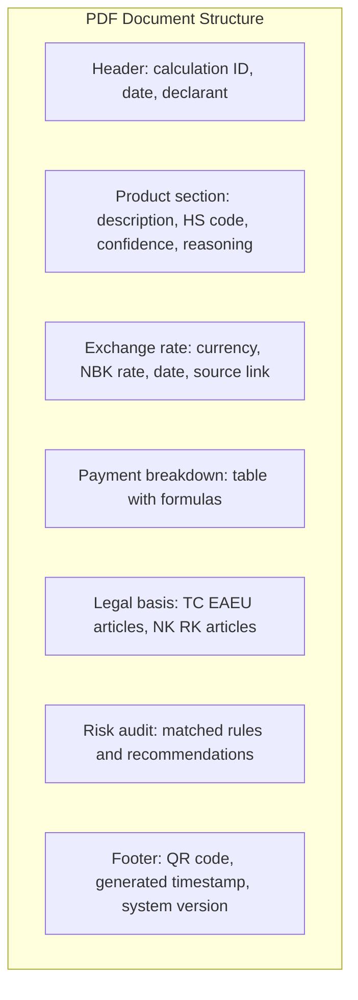

# Flow Design: Export Report (PDF Calculation Justification)

This document defines the flow for generating a downloadable PDF report containing the full financial calculation with legal justification — HS code reasoning, duty rate sources, NBK exchange rate reference, and all tax/fee breakdowns — for sharing with clients or attaching to customs declarations.

---

## 1. Intent
* **User Goal:** After a calculation is complete, the declarant clicks "Экспорт PDF" and receives a professionally formatted document with full calculation details, legal references, and the system's reasoning — suitable for sending to the client or attaching to the customs declaration.
* **Success Criteria:**
  - PDF includes: header (broker/declarant info, date), product description, selected HS code with reasoning, duty rate with legal basis (EAEU Code article), NBK exchange rate with date, full payment breakdown table, risk audit summary (if any warnings), footer with QR code link to live calculation.
  - PDF is generated server-side and returned as a downloadable file.
  - Language: Russian (KZ version deferred).
  - Generated in < 5 seconds.
  - PDF includes clickable hyperlinks for legal references.
  - Calculation ID and QR code link back to the live calculation page (for client verification).
* **Non-negotiables:**
  - All monetary values MUST include the calculation basis formula, not just the final number.
  - Legal references MUST be specific (article numbers, decree IDs), not generic ("according to EAEU law").
  - PDF MUST be generateable without the original product description (only structured data) — for re-generation from history.

---

## 2. Scope
* **In Scope:**
  - `POST /api/workspace/export/{calculation_id}` — generate PDF.
  - PDF template engine (WeasyPrint for HTML→PDF, or python-docx→PDF converter).
  - Content sections:
    1. Header: declarant info, calculation date, calculation ID.
    2. Product summary: description, HS code, classifier confidence.
    3. Exchange rate: currency, NBK rate, date.
    4. Payment breakdown table: base → customs value → duty → VAT → excise → recycling → fee → total.
    5. Legal references: EAEU Customs Code articles, RK Tax Code articles, KGD decrees.
    6. Risk audit summary (if applicable).
    7. Footer: generated by timestamp, QR code link.
  - Download through browser (Content-Disposition: attachment).
* **Out of Scope / Deferred:**
  - KZ language version — deferred.
  - Email report directly from system — deferred.
  - Batch PDF export (multiple calculations) — deferred.
  - Custom branding / logo per broker — deferred to v2.

---

## 3. Actors and Permissions

| Actor | Can Do | Cannot Do |
| :--- | :--- | :--- |
| **Guest** | Export PDF for their current calculation session | Access exported PDFs from history |
| **Authenticated User** | Export PDF for any of their past calculations | Export other users' calculations |
| **Admin** | Export any user's PDF | — |

---

## 4. Diagrams

### Report Export Flow

```mermaid
flowchart TD
  Start[User clicks "Экспорт PDF" on result panel] --> FetchCalc[GET calculation data by ID]
  FetchCalc --> CheckAccess{User owns this calc?}
  CheckAccess -->|No| 403[403 Forbidden]
  CheckAccess -->|Yes| FetchRates[Fetch NBK rates used]
  FetchRates --> FetchRisk[Fetch risk audit for HS code]
  FetchRisk --> BuildHTML[Build HTML from template]

  BuildHTML --> InsertSections[Populate sections: header, product, exchange rate, payments, legal, risk, footer]
  InsertSections --> GenerateQR[Generate QR code for calc share URL]
  GenerateQR --> RenderPDF[WeasyPrint HTML → PDF]
  RenderPDF --> Stream[Stream PDF as download]
  Stream --> Done([Browser downloads file])
```

### PDF Structure



### Payment Table Format (in PDF)

```
┌─────────────────────────────────────────────────────┐
│ Платеж                  │ База          │ Сумма КЗТ │
├─────────────────────────────────────────────────────┤
│ Таможенная стоимость    │ 1 200 USD     │   567 000 │
│ Курс НБ РК              │ 1 USD = 472.5 │           │
│ Таможенный сбор         │ фикс.         │    20 000 │
│ Пошлина (10%)           │ 567 000 × 10% │    56 700 │
│ НДС (12%)               │ (567 000 +    │    74 844 │
│                         │   56 700) × 12│           │
│                         │   %           │           │
│ Акциз                   │ —             │         0 │
│ Утильсбор               │ —             │         0 │
├─────────────────────────────────────────────────────┤
│ ИТОГО к оплате          │               │   718 544 │
└─────────────────────────────────────────────────────┘
```

---

## 5. State and Projections

### Export Request/Response

`POST /api/workspace/export/{calculation_id}`
```
Request: (empty — uses stored calculation data)

Response: application/pdf binary stream
Headers:
  Content-Disposition: attachment; filename="calc_{id}_2026-05-28.pdf"
  Content-Type: application/pdf
```

### Template Variables

| Variable | Source | Description |
| :--- | :--- | :--- |
| `calc_id` | calculation.id | Short ID for filename and header |
| `declarant_name` | user.name or "Гость" | |
| `generated_at` | now() | |
| `product_description` | calculation.product_text | |
| `hs_code` | classification.selected_code | |
| `hs_code_reasoning` | classification.reasoning | |
| `classifier_confidence` | classification.confidence | |
| `currency` | calculation.currency | |
| `exchange_rate` | calculation.exchange_rate | |
| `exchange_rate_date` | NBK fetch date | |
| `exchange_rate_source` | "НБ РК: https://..." | |
| `payments` | `List[PaymentRow]` | Array for table render |
| `total_kzt` | calculation.total | |
| `legal_refs` | `List[LegalRef]` | Array of article references |
| `risk_rules` | risk_audit.rules or null | |
| `qr_code_base64` | generated QR | |
| `share_url` | full URL to calc | |

---

## 6. Events/Actions

| Direction | Name | Source/Target | Payload | Allowed When | Reject/Failure Reason |
| :--- | :--- | :--- | :--- | :--- | :--- |
| Incoming | `export_pdf` | Client → Backend | `{calculation_id}` | Authenticated (or session match) | Calculation not found, access denied |
| Outgoing | `pdf_generated` | Backend → Client | `(binary PDF stream)` | Render OK | Template error, WeasyPrint failure |
| Incoming | `preview_report` | Client → Backend | `{calculation_id}` | Same as export | Returns HTML preview (for in-browser) |

---

## 7. Edge Cases

* **Calculation has risk warnings:** Include risk audit section. If `blocking` flags exist, add red callout: "ВНИМАНИЕ: требуются разрешительные документы".
* **Calculation uses approximate exchange rate:** Add footnote "Курс указан приблизительно (данные НБ РК на {date} временно недоступны)".
* **Calculation ID not found:** Return 404 with message "Расчёт не найден. Возможно, он был удалён."
* **User tries to export another user's calculation:** 403 Forbidden.
* **PDF generation fails (WeasyPrint error):** Return 500 with message "Ошибка генерации PDF. Попробуйте ещё раз или скачайте Excel-версию."
* **Calculation has no risk audit data (before risk audit feature):** Omit the risk audit section from PDF.
* **Very long product description (>500 chars):** Wrap and reduce font size in PDF.
* **QR code generation fails (libqrcode error):** Omit QR, still generate PDF — footer shows URL as plain text.

---

## 8. Side Effects

* PDF generated on-demand, never stored server-side (stateless).
* Each export consumes rendering resources (CPU for WeasyPrint). Heavy usage may require queuing.
* QR code generated inline with `qrcode` Python library.

---

## 9. Schemas Touched

* `backend/app/services/report/schemas.py` — ReportTemplateData, PaymentRow
* `backend/app/services/report/service.py` — ReportService (build HTML → render PDF)
* `backend/app/services/report/router.py` — `/api/workspace/export/{id}`
* `backend/app/services/report/templates/report.html.j2` — Jinja2 HTML template
* `backend/app/services/report/templates/report.css` — Print stylesheet
* `backend/app/core/config.py` — base URL for share links, QR config
* `frontend/components/workspace/ExportButton.tsx` — download button

---

## 10. Targeted Tests

| Layer | Behavior | File | Status |
| :--- | :--- | :--- | :--- |
| Unit | Generate PDF → returns valid PDF binary (starts with %PDF) | `backend/tests/test_report.py` | **DEFERRED** |
| Unit | PDF contains correct HS code | `backend/tests/test_report.py` | **DEFERRED** |
| Unit | PDF contains correct total amount | `backend/tests/test_report.py` | **DEFERRED** |
| Unit | PDF with risk audit → includes risk section | `backend/tests/test_report.py` | **DEFERRED** |
| Unit | PDF without risk audit → skips risk section | `backend/tests/test_report.py` | **DEFERRED** |
| Unit | Export non-existent calc → 404 | `backend/tests/test_report.py` | **DEFERRED** |
| Unit | Export another user's calc → 403 | `backend/tests/test_report.py` | **DEFERRED** |
| Unit | QR code generation included | `backend/tests/test_report.py` | **DEFERRED** |
| Integration | Full cycle: calc → export PDF → download → parse → verify content | `backend/tests/test_report.py` | **DEFERRED** |
| Frontend | Export button triggers download | `frontend/__tests__/workspace.test.tsx` | **DEFERRED** |

---

## 11. Implementation Plan

1. Create `backend/app/services/report/` package.
2. Create Jinja2 HTML template for the report.
3. Create print CSS stylesheet.
4. Implement `ReportService.build_html()` — populate template from calculation data.
5. Implement `ReportService.render_pdf()` — WeasyPrint HTML→PDF.
6. Implement QR code generation (qrcode Python lib → base64 → embed in HTML).
7. Create `POST /api/workspace/export/{calculation_id}` endpoint.
8. Build frontend `ExportButton` component with download handler.
9. Wire export button into workspace result panel.
10. Write tests.

---

## 12. Implementation Trace

*Deferred design-only flow. No report export service package, templates, frontend export button, or tests exist in the current codebase.*

### Files Created
* `backend/app/services/report/` (new package)
* `backend/app/services/report/schemas.py`
* `backend/app/services/report/service.py`
* `backend/app/services/report/router.py`
* `backend/app/services/report/templates/report.html.j2`
* `backend/app/services/report/templates/report.css`
* `frontend/components/workspace/ExportButton.tsx`

### Files Modified
* `backend/app/main.py` — mount report router
* `backend/app/core/config.py` — base URL, QR settings
* `backend/requirements.txt` — add `weasyprint`, `qrcode`
* `frontend/app/workspace/page.tsx` — add ExportButton to result panel

### Status
* **DEFERRED / NOT IMPLEMENTED** — no `backend/app/services/report/` package or `backend/tests/test_report.py` exists.

---

## 13. Open Questions

* *WeasyPrint vs pdfkit (wkhtmltopdf)?* → WeasyPrint preferred (pure Python, no system dep for wkhtmltopdf). If performance issues, fall back to pdfkit.
* *Should PDF be cached server-side?* → No for v1 (stateless). If export volume grows, cache by calculation_id hash with TTL.
* *Custom logo per broker company?* → Deferred to v2. For v1, generic SmartKeden logo.

---

## 14. Review Checklist

- [ ] Is the PDF structure documented with all sections?
- [ ] Are all monetary values shown with formula basis (not just result)?
- [ ] Are legal references specific (article numbers), not generic?
- [ ] Is QR code generation defined?
- [ ] Are guest and authenticated user permissions correct?
- [ ] Is the PDF generation stateless (no server-side storage)?
- [ ] Are there tests for PDF content verification?
