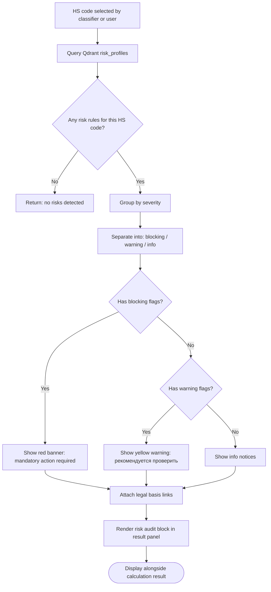
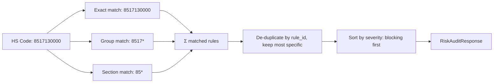
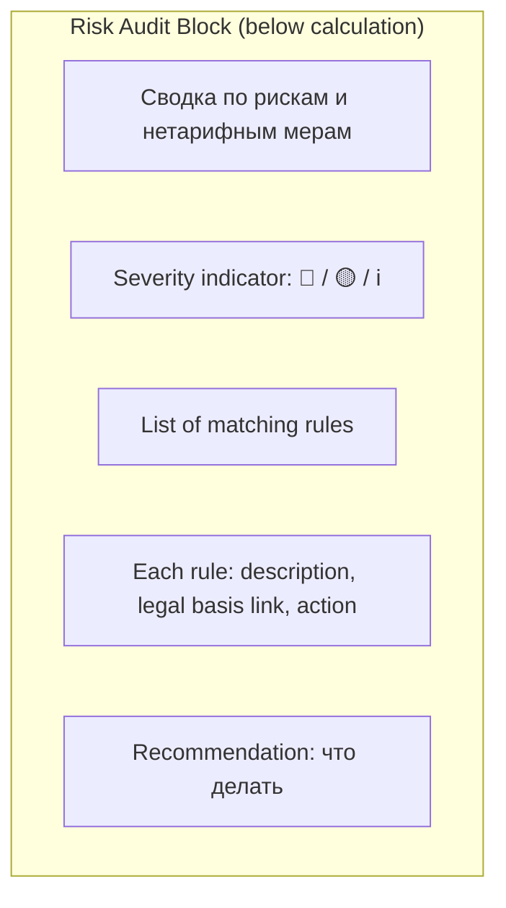

# Flow Design: Risk Audit & Non-Tariff Regulation Check

This document defines the flow for automated verification of the selected HS code against KGD RK risk profiles, licensing requirements, certification obligations, and other non-tariff regulation measures.

---

## 1. Intent
* **User Goal:** After HS code selection, the system automatically checks whether the product requires licenses, certificates, phytosanitary permits, or is flagged by KGD risk profiles — and displays clear warnings before the declarant submits the declaration.
* **Success Criteria:**
  - For each selected HS code, query a rules engine / RAG database for applicable non-tariff measures.
  - Display warnings grouped by severity: `blocking` (cannot import without document), `warning` (high audit risk), `info` (recommended check).
  - Link each warning to its legal basis (EAEU Treaty article, RK Government Decree, KGD order).
  - If risk profile match triggers a `blocking` flag, the calculation result panel shows a prominent red banner with required action.
  - Non-tariff measure rules are updatable without code deployment (DB-driven or RAG-ingested).
* **Non-negotiables:**
  - Risk audit NEVER blocks the calculation — user can always see the financial result, even with blocking flags.
  - Legal basis link MUST be a real document reference (article number, decree ID), not generic text.
  - The risk rules are initially seeded from the same RAG base as legal regulations (Qdrant `legal_regulations_kz`).

---

## 2. Scope
* **In Scope:**
  - Qdrant collection `risk_profiles` with rule entries per HS code group.
  - Rule schema: `{hs_code_mask, risk_type, severity, message_ru, message_kz, legal_basis, action_required}`.
  - Lookup by HS code (exact match + prefix/wildcard mask).
  - Integration into workspace result panel: risk audit block below the calculation.
  - Categories checked:
    - Licensing / permissions (лицензии, разрешения).
    - Certification / Declarations of Conformity (ТР ТС / ТР ЕАЭС сертификаты).
    - Phytosanitary / veterinary / sanitary controls.
    - KGD risk profile scoring (высокий, средний, низкий уровень риска).
    - Embargo / sanctions (sanctioned goods list).
    - Export/import quotas.
  - Admin endpoint: `POST /api/admin/risk-rules/upload` to batch-upload new rules from spreadsheet.
* **Out of Scope / Deferred:**
  - Real-time KGD API integration (КГД РК не предоставляет публичного API).
  - Automatic risk score calculation based on declarant history — deferred.
  - Machine learning risk prediction — deferred.

---

## 3. Actors and Permissions

| Actor | Can Do | Cannot Do |
| :--- | :--- | :--- |
| **User (any)** | View risk audit results for their calculation | Modify risk rules, dismiss blocking flags |
| **Admin** | Upload/update risk rules, view audit logs | — |
| **System (scheduler)** | Re-index risk rules from ingested regulations | — |

---

## 4. Diagrams

### Risk Audit Flow

### Rule Lookup Logic

### Result Panel — Risk Block

---

## 5. State and Projections

### Qdrant Collection `risk_profiles`

Each point represents one risk rule.

| Payload Field | Type | Description |
| :--- | :--- | :--- |
| `rule_id` | string | Unique identifier |
| `hs_code_mask` | string | Exact 10-digit or wildcard (e.g. `8517*`, `85*`) |
| `risk_type` | enum | `license`, `certification`, `phytosanitary`, `veterinary`, `sanctions`, `quota`, `kgd_risk_profile` |
| `severity` | enum | `blocking`, `warning`, `info` |
| `message_ru` | string | User-facing text on RU |
| `message_kz` | string | User-facing text on KZ |
| `legal_basis` | string | Document reference (e.g. "ТР ТС 020/2011, ст. 5", "КГД Приказ № 345") |
| `action_required` | string | What the declarant must do |
| `valid_from` | date | Effective from |
| `valid_until` | date | Expiry (null = permanent) |

### RiskAuditResponse

| Field | Type | Description |
| :--- | :--- | :--- |
| `total_rules_matched` | int | |
| `blocking_count` | int | |
| `warning_count` | int | |
| `info_count` | int | |
| `rules` | `List[RiskRuleMatch]` | All matched rules |
| `has_blockers` | boolean | Shortcut for UI |

---

## 6. Events/Actions

| Direction | Name | Source/Target | Payload | Allowed When | Reject/Failure Reason |
| :--- | :--- | :--- | :--- | :--- | :--- |
| Incoming | `audit_risk` | Workspace → Risk Service | `{hs_code}` | HS code confirmed | Qdrant connection error |
| Outgoing | `risk_audit_complete` | Risk Service → Workspace | `{RiskAuditResponse}` | Query OK | — |
| Incoming | `upload_rules` | Admin → Backend | `{file (CSV/XLSX)}` | Admin role | Invalid format, bad HS mask |
| Incoming | `get_rule` | Admin → Backend | `{rule_id}` | Admin role | Rule not found |
| Incoming | `delete_rule` | Admin → Backend | `{rule_id}` | Admin role | Rule in use |

---

## 7. Edge Cases

* **No risk rules for HS code:** Return empty `RiskAuditResponse` — no banner shown, silent pass.
* **Conflicting rules (same HS, same type, different severity):** Most specific match wins (10-digit > group > section). If same specificity, highest severity wins.
* **Expired rule:** `valid_until < now()` → exclude from results.
* **Future rule:** `valid_from > now()` → exclude, but schedule for inclusion on valid_from date.
* **Qdrant collection empty:** Return empty response + log admin warning "risk_profiles collection is empty — no rules loaded."
* **Admin upload with bad HS mask:** Validation rejects masks not matching pattern `^\d{2,10}\*?$`. Return line number with error.

---

## 8. Side Effects

* Risk audit runs synchronously within the workspace calculation pipeline (no extra blocking — runs in parallel with calculator).
* Admin rule upload triggers Qdrant collection rebuild for `risk_profiles`.

---

## 9. Schemas Touched

* `backend/app/services/risk_audit/schemas.py` — RiskRule, RiskRuleMatch, RiskAuditResponse
* `backend/app/services/risk_audit/service.py` — RiskAuditService (lookup, match, classify)
* `backend/app/services/risk_audit/router.py` — audit endpoint + admin endpoints
* `backend/app/services/risk_audit/seeder.py` — bulk upload from CSV/XLSX
* `backend/app/core/rag/indexer.py` — risk_profiles collection setup
* `frontend/components/workspace/RiskAuditBlock.tsx` — React component

---

## 10. Targeted Tests

| Layer | Behavior | File | Status |
| :--- | :--- | :--- | :--- |
| Unit | Exact HS code match → returns correct rule | `backend/tests/test_risk_audit.py` | **DEFERRED** |
| Unit | Group mask (8517*) match → returns rule | `backend/tests/test_risk_audit.py` | **DEFERRED** |
| Unit | No match → empty response | `backend/tests/test_risk_audit.py` | **DEFERRED** |
| Unit | Multiple matches → deduplicated, sorted by severity | `backend/tests/test_risk_audit.py` | **DEFERRED** |
| Unit | Expired rule excluded | `backend/tests/test_risk_audit.py` | **DEFERRED** |
| Unit | Future rule excluded | `backend/tests/test_risk_audit.py` | **DEFERRED** |
| Unit | Admin upload valid CSV → rules indexed in Qdrant | `backend/tests/test_risk_audit.py` | **DEFERRED** |
| Unit | Admin upload invalid HS mask → 422 with line error | `backend/tests/test_risk_audit.py` | **DEFERRED** |
| Integration | Workspace calc with risk audit → result + risk block | `backend/tests/test_risk_audit.py` | **DEFERRED** |
| Frontend | Warning block renders below calculation | `frontend/__tests__/workspace.test.tsx` | **DEFERRED** |

---

## 11. Implementation Plan

1. Create Qdrant collection `risk_profiles` (384-dim config if vector storage is required, but v1 can query by payload filter instead of vector similarity).
2. Build `RiskAuditService` — query by HS code with mask matching, dedup, sort.
3. Build admin upload endpoint for bulk rule ingestion.
4. Wire risk audit into workspace calculation pipeline (parallel call with calculator).
5. Build frontend `RiskAuditBlock` component (severity-colored cards).
6. Seed initial risk rules from EAEU and RK regulatory documents (manual batch).
7. Write tests.

---

## 12. Implementation Trace

*Deferred design-only flow. No risk audit service package, frontend risk block, or tests exist in the current codebase.*

### Files Created
* `backend/app/services/risk_audit/` (new package)
* `backend/app/services/risk_audit/schemas.py`
* `backend/app/services/risk_audit/service.py`
* `backend/app/services/risk_audit/router.py`
* `backend/app/services/risk_audit/seeder.py`
* `frontend/components/workspace/RiskAuditBlock.tsx`

### Files Modified
* `backend/app/main.py` — mount risk_audit router
* `backend/app/core/rag/indexer.py` — setup risk_profiles collection
* `backend/app/services/workspace/service.py` — integrate risk audit
* `frontend/app/workspace/page.tsx` — add RiskAuditBlock

### Status
* **DEFERRED / NOT IMPLEMENTED** — no `backend/app/services/risk_audit/` package or `backend/tests/test_risk_audit.py` exists.

---

## 13. Open Questions

* *Source of initial risk rules?* → Need to source from KGD RK public documents and EAEU technical regulations. MVP: manual seed of most common high-risk product groups (alcohol, tobacco, electronics, pharmaceuticals, vehicles).
* *Should risk audit run in real-time or pre-cached per HS code?* → Real-time per calculation (Qdrant query is sub-100ms). Pre-caching not needed for MVP volumes.
* *KGD risk profile scoring methodology?* → Not publicly documented in detail. For v1, use a simplified heuristic: certain HS groups (e.g. 27* mineral fuels) flag as "high risk profile" by default.

---

## 14. Review Checklist

- [ ] Are all risk types documented (license, certification, phytosanitary, etc.)?
- [ ] Is the HS code mask matching logic (exact → group → section) defined?
- [ ] Are expired/future rule edge cases handled?
- [ ] Does the risk audit block integrate into the workspace result panel?
- [ ] Are admin upload endpoints defined?
- [ ] Does risk audit NEVER block the calculation (parallel, non-blocking)?
- [ ] Is there a test for each matching scenario and failure mode?
