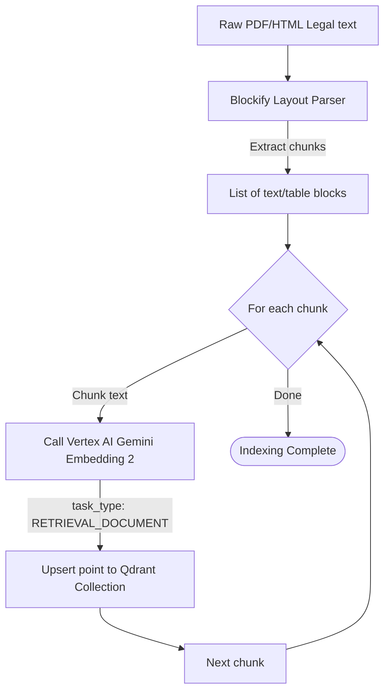
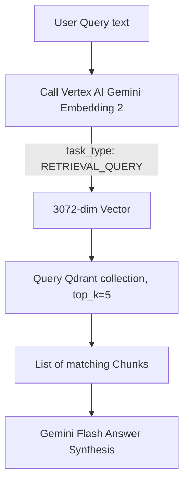
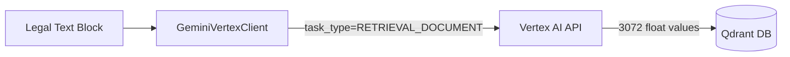

# Flow Design: Semantic Embedding & Indexing Pipeline

This document defines the behavioral flow, state transitions, API contract, and validation rules for the layout-aware document indexing and vector search pipeline using **Gemini Embedding 2** and **Qdrant**.

---

## 1. Intent
* **System Goal:** Take raw legal texts (RK Customs/Tax Codes, EAEU decisions) or product descriptors, segment them into structurally sound blocks using **Blockify**, convert them into high-dimensional semantic vectors using **Gemini Embedding 2** (3072 dimensions), and save/query them in **Qdrant**.
* **Success Criteria:**
  - High-precision semantic search over RK and EAEU regulations.
  - Multi-language queries (Kazakh, Russian, English) retrieve correct legal articles regardless of translation terms.
  - Indexing tasks are idempotent (re-running does not duplicate articles).
  - Explicit optimization of task types (`RETRIEVAL_DOCUMENT` vs `RETRIEVAL_QUERY`).
* **Non-negotiables:** Dimension parameters must strictly equal `3072` for Gemini Embedding 2.

---

## 2. Scope
* **In Scope:**
  - Layout segment chunking (simulated/mocked Blockify parser outputs).
  - Calling Google Vertex AI Gemini Embedding 2 with explicit `task_type`.
  - Storing payload metadata (article number, section, document origin, raw text) inside Qdrant points.
  - Querying Qdrant using vector similarity (Cosine metric).
* **Out of Scope / Deferred:**
  - Multi-page image document OCR indexing (deferred to v2).

---

## 3. Actors and Permissions
* **Admin / System Indexer:** Authorizes uploading and indexing new laws and Technical Regulations.
* **API User / Customs Assistant:** Queries the indexed base to get citations.

---

## 4. Diagrams

### Indexing Flow (User & System)

### Retrieval Query Flow (System)

### Data Flow Map

---

## 5. State and Projections
* **Qdrant Collection State:**
  - Collection Name: `legal_regulations_kz`
  - Vector Size: `3072`
  - Distance Metric: `Cosine`
* **Indexer State:** Stateful loop tracker monitoring processed line numbers / paragraph IDs to prevent partial ingestion.

---

## 6. Events/Actions
| Direction | Name | Source/Target Flow | Payload | Allowed When | Reject/Failure Reason |
| :--- | :--- | :--- | :--- | :--- | :--- |
| Incoming | `index_document` | System Indexer | `{ document_id, raw_html }` | Admin authorized | Invalid schema, empty document |
| Outgoing | `generate_vector` | System | `{ text, model: "gemini-embedding-2-preview" }` | Indexing chunk | Vertex API exception / quota limit |
| Incoming | `search_query` | Importer | `{ query_text, top_k: 5 }` | Always | Empty query |

---

## 7. Edge Cases
* **Matryoshka Scaling:** If saving RAM/storage is a future constraint, Gemini Embedding 2 can scale down to 1536 or 768 dimensions using `output_dimensionality` parameters. *We default to the full 3072 dimensions for max-fidelity EAEU legal cross-referencing.*
* **Truncation on Token Overflows:** Gemini Embedding 2 supports up to 8192 input tokens. Blockify segment chunks are capped at 1000 tokens (approx. 4000 characters) to remain far below limits and prevent truncation.

---

## 8. Side Effects
* **Cloud API Quota Consumption:** Large bulk document indexing triggers thousands of simultaneous API calls to Google Vertex AI. Batch/throttle limits must be enforced on indexers.

---

## 9. Schemas Touched
* `backend/app/core/vertex_client.py` (Embedding parameters and SDK configurations)
* `backend/app/core/rag/service.py` (Query embedding and retrieval operations)

---

## 10. Targeted Tests
| Layer | Behavior | File | Status |
| :--- | :--- | :--- | :--- |
| Core / API | Text embedding dimension validation for Gemini 2 (3072) | `backend/tests/test_vertex_client.py` | **PASSED** |
| Service / DB | Connecting and querying local Qdrant memory instances | `backend/tests/test_api.py` | **PASSED** |

---

## 11. Implementation Plan
1. **Define API contract:** Expose `get_text_embedding` supporting modern GCP structures. (Done)
2. **Setup Vector configuration:** Define collection metrics and dimensionality parameters. (Done)
3. **Draft Unit Test Cases:** Validate dimensions for custom and default embedding models. (Done)
4. **Implement Indexer Loop:** Ingest parsed blocks and map them to vectors. (Done)

---

## 12. Implementation Trace

### Files
* **Embedding Client:** `backend/app/core/vertex_client.py`
* **Test Verification:** `backend/tests/test_vertex_client.py`

### Status
* Embedding dimension validation (3072) passes
* Mock mode returns zeros when no API key; real API blocked (needs GCP billing)
* Full suite: 34 tests pass
* Validation: `PYTHONPATH=backend .venv/Scripts/pytest backend/tests/ -q` → 34 passed in 3.15s
---

## 13. Open Questions
* *Do we need image embeddings using Gemini Embedding 2 for product photo lookups?* -> In v1, the HS Classifier translates product images into text descriptions first, and performs text vector search. Direct image embeddings are deferred to v2.

---

## 14. Review Checklist
- [x] Does the flow design follow the quality bar of explicit inputs, exceptions, and side effects?
- [x] Are Google's official parameters (3072 dimensions, task types) strictly mapped?
- [x] Is the documentation linked back to the implementation trace?
