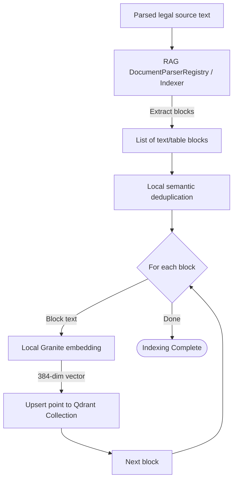
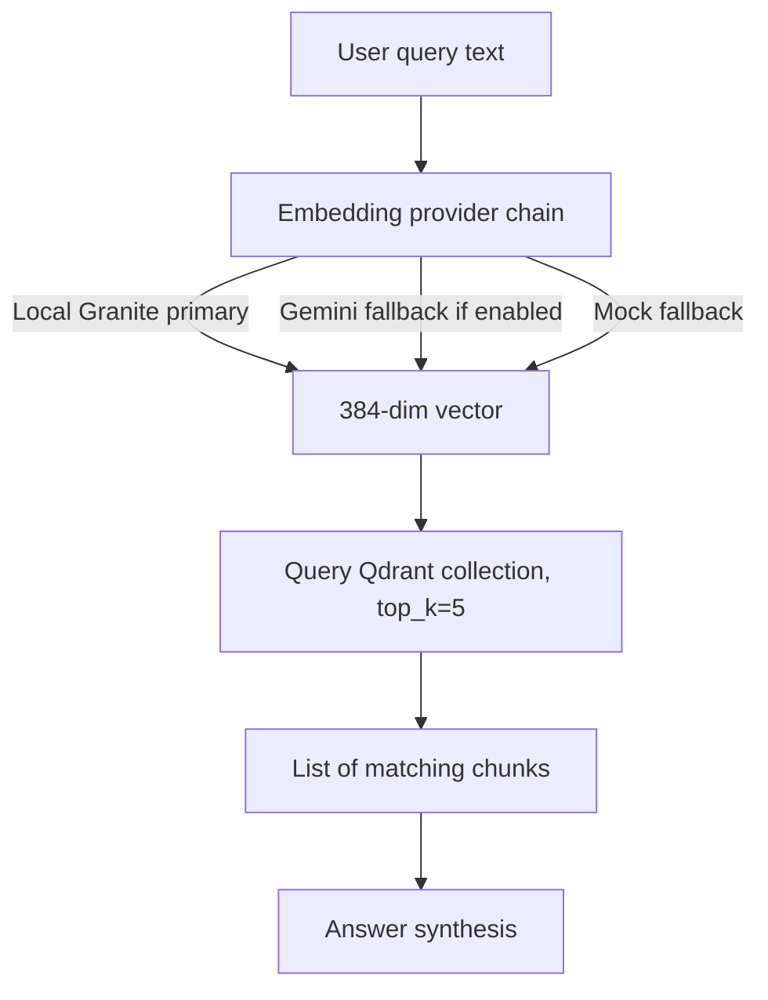
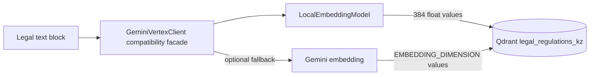

# Flow Design: Semantic Embedding & Indexing Pipeline

This document defines the behavioral flow, state transitions, API contract, and validation rules for local-first document indexing and vector search using **Granite multilingual embeddings** and **Qdrant**.

---

## 1. Intent
* **System Goal:** Take parsed RK/EAEU legal text blocks or product descriptors, convert them into semantic vectors using the local Sentence-Transformer model, and save/query them in Qdrant.
* **Success Criteria:**
  - High-precision semantic search over RK and EAEU regulations.
  - Multi-language queries (Kazakh, Russian, English) retrieve relevant legal articles.
  - Indexing tasks are idempotent and do not duplicate articles.
  - Embedding dimensions remain consistent across indexing, search, and Qdrant collection setup.
* **Non-negotiables:** The default embedding dimension is `384`, matching `EMBEDDING_DIMENSION` and the local Granite model. Gemini embeddings are optional fallback only, enabled explicitly via `USE_GEMINI_EMBEDDING=True`.

---

## 2. Scope
* **In Scope:**
  - Parsing legal source documents into internal text blocks via the RAG parser/indexer pipeline.
  - Generating embeddings with local model `ibm-granite/granite-embedding-97m-multilingual-r2`.
  - Optional Gemini/Vertex embedding fallback when explicitly enabled.
  - Last-resort mock zero vector fallback when all embedding providers fail.
  - Storing payload metadata (article number, section, document origin, raw text) inside Qdrant points.
  - Querying Qdrant using vector similarity (Cosine metric).
* **Out of Scope / Deferred:**
  - External document chunking services.
  - Multi-page image document OCR indexing (covered by document parsing flow).

---

## 3. Actors and Permissions
* **Admin / System Indexer:** Authorizes uploading and indexing new laws and Technical Regulations.
* **API User / Customs Assistant:** Queries the indexed base to get citations.

---

## 4. Diagrams

### Indexing Flow (User & System)

### Retrieval Query Flow (System)

### Data Flow Map

---

## 5. State and Projections
* **Qdrant Collection State:**
  - Collection Name: `legal_regulations_kz`
  - Vector Size: `384`
  - Distance Metric: `Cosine`
* **Embedding Provider State:**
  - Primary: `LocalEmbeddingModel` using `EMBEDDING_MODEL_NAME`.
  - Fallback 1: Gemini/Vertex embedding only when `USE_GEMINI_EMBEDDING=True`.
  - Fallback 2: deterministic zero vector with length `EMBEDDING_DIMENSION`.
* **Indexer State:** Stateful loop tracker monitoring processed blocks to prevent duplicate ingestion.

---

## 6. Events/Actions
| Direction | Name | Source/Target Flow | Payload | Allowed When | Reject/Failure Reason |
| :--- | :--- | :--- | :--- | :--- | :--- |
| Incoming | `index_document` | System Indexer | `{ document_id, raw_text }` | Admin authorized | Invalid schema, empty document |
| Internal | `generate_vector` | Embedding provider chain | `{ text, task_type }` | Indexing/search text available | Provider unavailable; falls back to next provider |
| Incoming | `search_query` | Importer | `{ query_text, top_k: 5 }` | Always | Empty query |

---

## 7. Edge Cases
* **Local model unavailable:** Skip directly to Gemini fallback when enabled; otherwise return a 384-dim zero vector.
* **Gemini fallback disabled:** Do not call cloud embedding APIs.
* **Embedding provider exception:** Log warning and continue to the next provider; never crash the request solely because embeddings are unavailable.
* **Dimension mismatch:** Collection setup and tests must use `settings.EMBEDDING_DIMENSION` (`384` by default).

---

## 8. Side Effects
* **Local Model Loading:** First local embedding call may load the Sentence-Transformer model into memory.
* **Optional Cloud API Consumption:** Gemini embedding calls happen only when explicitly enabled and local embedding did not return a vector.

---

## 9. Schemas Touched
* `backend/app/core/config.py` (embedding provider flags, model name, dimensions)
* `backend/app/core/vertex_client.py` (embedding provider chain and compatibility facade)
* `backend/app/core/rag/service.py` (query embedding and retrieval operations)

---

## 10. Targeted Tests
| Layer | Behavior | File | Status |
| :--- | :--- | :--- | :--- |
| Core / API | Text embedding returns configured 384 dimensions | `backend/tests/test_vertex_client.py` | **PASSED** |
| Service / DB | Connecting and querying local Qdrant memory instances | `backend/tests/test_api.py` | **PASSED** |

---

## 11. Implementation Plan
1. **Define API contract:** Preserve `GeminiVertexClient.get_text_embedding` compatibility facade. (Done)
2. **Setup Vector configuration:** Define collection metrics and dimensionality from `settings.EMBEDDING_DIMENSION`. (Done)
3. **Implement provider chain:** local Granite primary, Gemini fallback when enabled, mock zero vector last. (Done)
4. **Draft Unit Test Cases:** Validate configured dimensions and fallback behavior. (Done)
5. **Implement Indexer Loop:** Ingest parsed blocks and map them to vectors. (Done)

---

## 12. Implementation Trace

### Files
* **Embedding Configuration:** `backend/app/core/config.py`
* **Embedding Client Facade:** `backend/app/core/vertex_client.py`
* **Test Verification:** `backend/tests/test_vertex_client.py`

### Status
* Embedding dimension validation (`384`) passes.
* Local Granite embeddings are primary.
* Gemini embeddings are opt-in fallback via `USE_GEMINI_EMBEDDING=True`.
* Mock mode returns zero vectors with configured dimension when all providers are unavailable.
* Validation: `PYTHONPATH=backend .venv/Scripts/pytest backend/tests/test_vertex_client.py`.

---

## 13. Open Questions
* *Should we re-enable Gemini embeddings by default?* → No. Local Granite remains default for cost, privacy, and offline reliability. Gemini stays an explicit opt-in fallback.

---

## 14. Review Checklist
- [x] Does the diagram accurately represent local-first embeddings?
- [x] Is vector dimensionality consistent with config and tests?
- [x] Are cloud embedding calls opt-in only?
- [x] Is Qdrant collection sizing documented?
