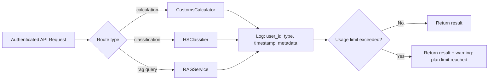
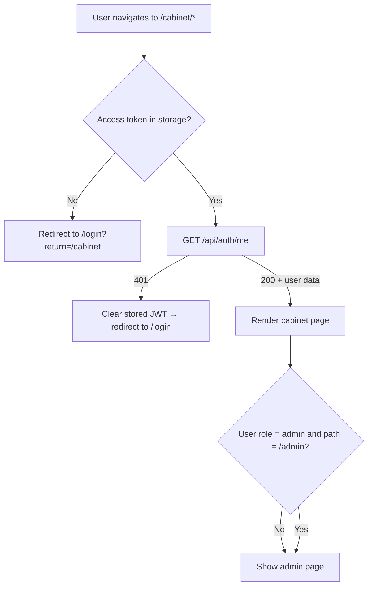

# Flow Design: User Cabinet & Admin Panel (SaaS)

This document defines the user-facing dashboard (кабинет), billing history, usage tracking, settings, and the admin panel for managing users/plans in the CustomAI Kazakhstan SaaS platform.

---

## 1. Intent
* **User Goal:** After login, users access a personal cabinet showing their current plan, usage limits, calculation history, billing history, and settings. Admins access a separate panel to manage users, view system health, and override plans.
* **Success Criteria:**
  - `/cabinet` shows: subscription status, remaining usage (X/100 calculations this month), quick actions.
  - `/cabinet/history` — paginated list of past calculations/classifications/RAG queries.
  - `/cabinet/billing` — payment history, invoices, plan change button.
  - `/cabinet/settings` — email change, password change, language preference.
  - `/admin` — user table with search, plan override (calls Billing API), payment logs.
  - Frontend routes are protected by auth middleware (redirect to `/login` if no JWT).
  - All API calls from cabinet go through auth middleware.
* **Non-negotiables:**
  - Usage counters are computed deterministically from database queries (not cached approximations for v1).
  - Cabinet API endpoints MUST check user_id from JWT — users can only see their own data.
  - Admin endpoints MUST check `role=admin`.
  - Frontend routes use Next.js middleware or layout-level auth check.

---

## 2. Scope
* **In Scope:**
  - Next.js pages: `/cabinet`, `/cabinet/history`, `/cabinet/billing`, `/cabinet/settings`.
  - Next.js page: `/admin` (user list calls Cabinet API, plan override calls Billing API).
  - Next.js page: `/pricing` (public, shows plans).
  - Backend API: `GET /api/cabinet/summary`, `GET /api/cabinet/history`, `GET /api/cabinet/billing`, `PATCH /api/cabinet/settings`.
  - Backend API: `GET /api/admin/users` (user list — owned by Cabinet).
  - Backend API: `PATCH /api/admin/billing/users/{id}/plan` (plan override — owned by Billing flow, consumed by admin page).
  - Usage tracking: `usage_logs` table logs every calculation/query with timestamp.
  - Language toggle (RU/KZ) in settings (stored in `users.preferred_lang`).
* **Out of Scope / Deferred:**
  - Statistics / charts on usage (deferred to v2).
  - Team/org management (deferred).
  - API key generation from cabinet (deferred).
  - Email notifications preferences (deferred).
  - Plan override logic — owned by Billing flow.
  - Payment processing — owned by Billing flow.

---

## 3. Actors and Permissions

| Actor | Role | Page Access | Cannot Access |
| :--- | :--- | :--- | :--- |
| **Guest** | — | `/pricing`, `/login`, `/register` only | `/cabinet/*`, `/admin/*`, any API endpoint |
| **Basic User** | `basic` | `/cabinet/*` (limited: N requests/period) | `/admin/*`, premium-only features |
| **Premium User** | `premium` | `/cabinet/*` (unlimited) | `/admin/*` |
| **Trial User** | `trial` | `/cabinet/*` (full premium access) | `/admin/*` |
| **Admin** | `admin` | `/cabinet/*`, `/admin/*`, all API endpoints | — |

---

## 4. Diagrams

### Cabinet — Page Structure

```mermaid
flowchart TD
  Start[User navigates to /cabinet/*] --> IsAuthed{Has valid JWT?}
  IsAuthed -->|No| LoginPage[/login page]
  IsAuthed -->|Yes| Cabinet(Cabinet layout)

  Cabinet --> Dashboard[Сводка / Summary]
  Cabinet --> History[История / History]
  Cabinet --> Billing[Платежи / Billing]
  Cabinet --> Settings[Настройки / Settings]

  Dashboard --> SummaryCard[Plan info, usage counter, quick actions]
  History --> HistoryList[Paginated calculation / RAG log]
  Billing --> PaymentsList[Payment history table + link to /pricing]
  Settings --> Lang[Language: RU / KZ]
  Settings --> Password[Change password]
  Settings --> Email[Change email]

  Cabinet --> IsAdmin{User role = admin?}
  IsAdmin -->|Yes| AdminPanel[/admin panel]
  AdminPanel --> UsersTable[User management table]
  AdminPanel --> PaymentLogs[Payment logs]
  AdminPanel --> Health[System health / stats]
  IsAdmin -->|No| Cabinet
```

### Usage Tracking — Request Pipeline



### Frontend Auth Guard



---

## 5. State and Projections

### Database Tables

**`usage_logs`:**
| Column | Type | Description |
| :--- | :--- | :--- |
| `id` | UUID PK | |
| `user_id` | UUID FK→users | |
| `action_type` | ENUM | `calculation`, `classification`, `rag_query`, `document_generation` |
| `metadata` | JSONB | Request context (hs_code, query, etc.) |
| `created_at` | TIMESTAMPTZ | |

### Usage Quota (Logic, not table)

Basic users have:
- `calculation`: 10 per month
- `classification`: 10 per month
- `rag_query`: 30 per month

Premium/trial: unlimited.

Quota is computed as `SELECT COUNT(*) FROM usage_logs WHERE user_id = X AND action_type = Y AND created_at >= date_trunc('month', now())`.

Because the quota check runs after logging the current request, the first over-limit request returns a warning (not a 403). Only the *next* request (which sees the count still over limit) returns 403.

### Settings (in `users` table)

| Column | Type | Description |
| :--- | :--- | :--- |
| `preferred_lang` | VARCHAR(2) | `ru` or `kz`, default `ru` |

---

## 6. Events/Actions

| Direction | Name | Source/Target | Payload | Allowed When | Reject/Failure Reason |
| :--- | :--- | :--- | :--- | :--- | :--- |
| Incoming | `get_dashboard_summary` | Client → Backend | `{}` | Authenticated | — |
| Incoming | `get_history` | Client → Backend | `{page, limit, type?}` | Authenticated | — |
| Incoming | `get_billing_history` | Client → Backend | `{page, limit}` | Authenticated | — |
| Incoming | `update_settings` | Client → Backend | `{preferred_lang?}` | Authenticated | Invalid locale |
| Incoming | `change_password` | Client → Backend | `{old_password, new_password}` | Authenticated | Wrong old password |
| Incoming | `list_users` | Admin → Backend | `{search?, page, limit}` | Admin role | — |
| Incoming | `override_plan` | Admin → Backend | `{user_id, plan_id, duration_days}` | Admin role | User not found |
| Outgoing | `usage_logged` | Backend → DB | `{user_id, action_type, metadata}` | Any authenticated request | — |

---

## 7. Edge Cases

* **Quota exceeded during request:** Calculation still runs and returns result, but response includes `"quota_warning": true`. Frontend shows banner "Вы превысили лимит. Следующие запросы будут недоступны до обновления тарифа."
* **On next request after quota exceeded:** Return `403 QuotaExceeded` with message "Лимит исчерпан. Обновите тариф / Подождите до следующего месяца."
* **User on trial but trial just expired mid-request:** On the next authenticated request, `get_current_user` checks trial expiry and downgrades. Response includes `"plan_expired": true`. Frontend shows upgrade prompt.
* **Admin overrides plan while user is active:** On next API call, JWT claims still show old role. Short TTL (15 min) means delay is bounded. Alternatively, user re-login or we implement a "force re-auth" mechanism.
* **History pagination:** Default 20 items/page, max 100. Cursor-based pagination preferred for large datasets.
* **Language toggle:** Stored in settings AND in JWT (optional). Frontend reads `preferred_lang` on load from `/api/auth/me`.
* **User tries to access another user's history via API:** Cabinet endpoints use JWT `user_id` to scope queries — user_id from path is ignored.

---

## 8. Side Effects

* `update_settings` → updates `users.preferred_lang`. Frontend re-renders with new locale.
* `change_password` → revokes all refresh tokens (user must re-login).
* `override_plan` → handled by Billing service; Cabinet merely calls the Billing API.
* `usage_logged` → inserts row in `usage_logs` (fire-and-forget, doesn't block response).

---

## 9. Schemas Touched

* `backend/app/services/cabinet/schemas.py` — Pydantic models
* `backend/app/services/cabinet/router.py` — `/api/cabinet/*`, `/api/admin/users`
* `backend/app/services/cabinet/service.py` — CabinetService
* `backend/app/services/cabinet/admin_service.py` — admin-only user listing
* `backend/app/core/database.py` — usage_logs table via existing database boundary
* `frontend/app/cabinet/page.tsx` — dashboard
* `frontend/app/cabinet/history/page.tsx`
* `frontend/app/cabinet/billing/page.tsx`
* `frontend/app/cabinet/settings/page.tsx`
* `frontend/app/admin/page.tsx`
* `frontend/app/pricing/page.tsx`

---

## 10. Targeted Tests

| Layer | Behavior | File | Status |
| :--- | :--- | :--- | :--- |
| Unit | Dashboard summary returns plan + usage + period | `backend/tests/test_cabinet.py` | **DEFERRED** |
| Unit | Dashboard returns 401 without JWT | `backend/tests/test_cabinet.py` | **DEFERRED** |
| Unit | History returns paginated results | `backend/tests/test_cabinet.py` | **DEFERRED** |
| Unit | History filtered by action_type | `backend/tests/test_cabinet.py` | **DEFERRED** |
| Unit | Settings update persists preferred_lang | `backend/tests/test_cabinet.py` | **DEFERRED** |
| Unit | Quota exceeded → 403 on next request | `backend/tests/test_cabinet.py` | **DEFERRED** |
| Unit | Admin list users → 200 with paginated results | `backend/tests/test_cabinet.py` | **DEFERRED** |
| Unit | Admin list users without admin role → 403 | `backend/tests/test_cabinet.py` | **DEFERRED** |
| Unit | Admin override plan → user role changes | `backend/tests/test_cabinet.py` | **DEFERRED** |
| Unit | User tries to access another user's history → 403 | `backend/tests/test_cabinet.py` | **DEFERRED** |
| Frontend | Unauthenticated redirect to /login | `frontend/__tests__/cabinet.test.tsx` | **DEFERRED** |
| Frontend | Cabinet renders subscription status | `frontend/__tests__/cabinet.test.tsx` | **DEFERRED** |

---

## 11. Implementation Plan

1. Create `usage_logs` table.
2. Implement usage logging middleware/interceptor on core pipeline endpoints.
3. Implement `CabinetService` — dashboard summary, history, billing history, settings.
4. Implement `AdminService` — user list (read-only, delegates plan override to Billing).
5. Create `/api/cabinet/*` and `/api/admin/*` routers.
6. Wire usage interceptor into existing pipeline orchestration.
7. Create frontend cabinet pages (dashboard, history, billing, settings).
8. Create frontend pricing page.
9. Create frontend admin page (user table + plan override button → calls Billing API).
10. Implement frontend auth guard (Next.js middleware or layout-level).
11. Write tests.

---

## 12. Implementation Trace

*Deferred design-only flow. No cabinet/admin service package, cabinet frontend route, or tests exist in the current codebase.*

### Files Created
* `backend/app/services/cabinet/` (new package)
* `backend/app/services/cabinet/schemas.py`
* `backend/app/services/cabinet/service.py`
* `backend/app/services/cabinet/router.py`
* `backend/app/services/cabinet/admin_service.py`
* `frontend/app/cabinet/` (new pages)
* `frontend/app/admin/` (new pages)
* `frontend/app/pricing/page.tsx` (new page)
* `frontend/__tests__/cabinet.test.tsx` (to be confirmed with chosen test framework)

### Files Modified
* `backend/app/main.py` — mount cabinet + admin routers
* `backend/app/core/database.py` — add usage_logs table via existing database boundary
* `backend/app/core/config.py` — usage limits config
* Existing pipeline endpoints — add usage logging calls
* `frontend/app/layout.tsx` — add auth guard
* `frontend/middleware.ts` — route protection

### Status
* **DEFERRED / NOT IMPLEMENTED** — no `backend/app/services/cabinet/` package or `backend/tests/test_cabinet.py` exists.

---

## 13. Open Questions

* *Frontend auth guard: Next.js middleware vs client-side redirect?* → App Router middleware + client-side check doubles security. Middleware checks JWT existence, client checks validity via `/api/auth/me`.
* *Usage limits: monthly calendar or rolling 30-day window?* → Calendar month (aligns with billing cycle). Simpler and expected by users.
* *Admin panel: build from scratch or use a library?* → Simple table from scratch (shadcn/ui Table + search input). No need for heavy admin frameworks.
* *Frontend test framework: Jest + Testing Library vs Vitest?* → To be decided during implementation. File paths in §10 are tentative.

---

## 14. Review Checklist

- [x] Is every cabinet page documented with its API dependency?
- [x] Are usage tracking quota limits and grace behavior covered?
- [x] Are admin-only routes protected by both frontend guard and backend middleware?
- [x] Is trial expiry handled gracefully (downgrade on next request)?
- [x] Is there a test for auth failure on each cabinet endpoint?
- [x] Is the language toggle flow defined?
- [x] Are usage limits configurable?
