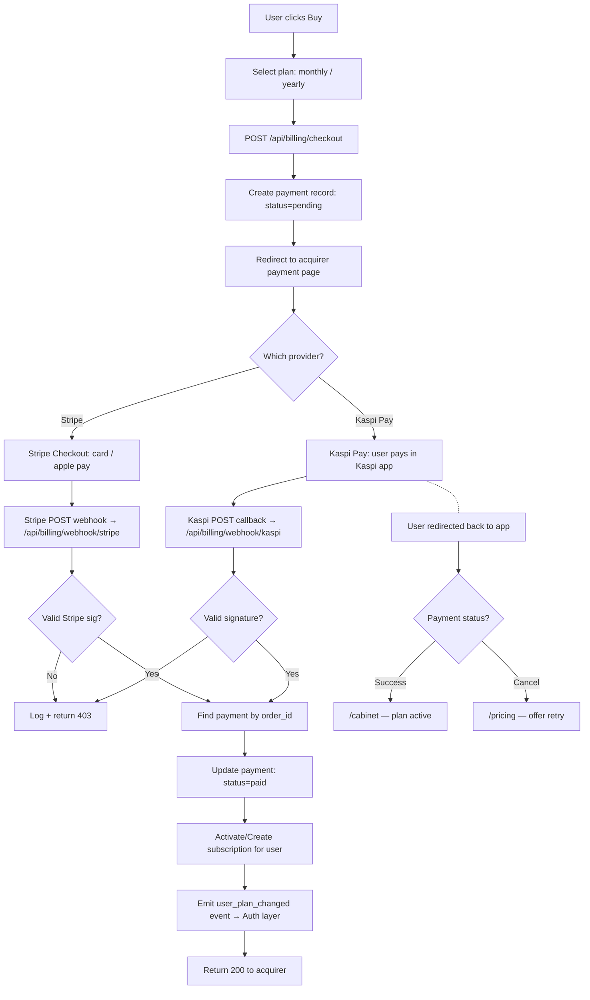
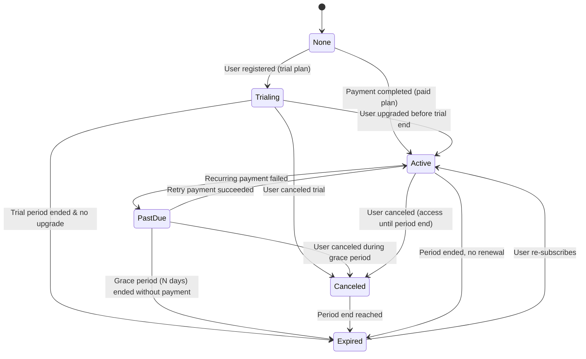
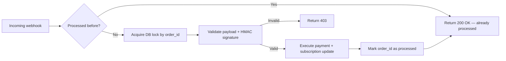

# Flow Design: Billing & Subscriptions (SaaS)

This document defines the subscription plans, payment lifecycle, acquirer integration (Kaspi Pay / Stripe), webhook handling, and plan change orchestration for the CustomAI Kazakhstan SaaS platform.

---

## 1. Intent
* **User Goal:** Users select a plan, pay for it via Kazakhstani-accepted payment methods (Kaspi Pay, card via Stripe/Halyk), and either get immediate access (digital goods) or a pro-rated trial. The platform tracks subscription state, invoices, and payment history.
* **Success Criteria:**
  - Pricing page displays available plans with features and prices in KZT.
  - User selects plan → redirected to payment page → success → plan activated.
  - Webhook from acquirer handles async payment confirmations (Kaspi callback / Stripe webhook).
  - Subscription lifecycle: active → past_due (payment failed) → canceled / expired.
  - Admin can manually set/override user plans.
  - All billing events logged for audit.
* **Non-negotiables:**
  - NEVER store raw card numbers or PCI-scoped data — use acquirer's hosted payment page or tokenized API.
  - Payment webhooks MUST verify signature (HMAC / Stripe signature header).
  - Idempotency on webhook processing (duplicate events don't double-activate).
  - Subscription state changes emit events consumed by the Auth/RBAC layer.

---

## 2. Scope
* **In Scope:**
  - PostgreSQL schema: `plans`, `subscriptions`, `payments`, `invoices`.
  - Plan model: `basic` (free, limited), `premium_monthly`, `premium_yearly`.
  - Checkout flow: select plan → redirect to acquirer → return → status page.
  - Kaspi Pay callback integration (redirect-based).
  - Stripe Checkout / Payment Links (for international users).
  - Webhook handler: `POST /api/billing/webhook/{provider}`.
  - Subscription state machine: `active`, `past_due`, `canceled`, `expired`, `trialing`.
  - Invoice generation (simple DB record for v1).
  - Admin endpoint: `POST /api/admin/billing/users/{id}/plan` — override.
* **Out of Scope / Deferred:**
  - Recurring billing with Saved Cards / auto-charge (Kaspi doesn't support — requires card tokenization via Halyk/Stripe).
  - Dunning system (automated retry on failed payment) — deferred.
  - Promo codes / discounts — deferred.
  - Tax receipt generation (EDI) — deferred.
  - Admin plan override UI is owned by Cabinet flow; the API endpoint is owned by Billing flow.

---

## 3. Actors and Permissions

| Actor | Can Do | Cannot Do |
| :--- | :--- | :--- |
| **User** | Browse plans, purchase, view own billing history, cancel own subscription | Modify payment amounts, refund payments, access other users' billing data |
| **Acquirer (Kaspi / Stripe)** | Send payment callbacks/webhooks, request payment status | Modify subscription state directly (must go via webhook handler) |
| **System (Cron)** | Expire trials, mark past_due subscriptions as expired | Create or modify subscriptions outside defined transitions |
| **Admin** | Override any user's plan, view all billing logs, issue refunds (via acquirer) | Modify payment amounts retroactively, access raw card numbers |

---

## 4. Diagrams

### Checkout & Payment Flow

### Subscription State Machine

### Billing Webhook — Idempotency

---

## 5. State and Projections

### Database Tables

**`plans`:**
| Column | Type | Description |
| :--- | :--- | :--- |
| `id` | VARCHAR PK | Slug: `basic`, `premium_monthly`, `premium_yearly` |
| `name_ru` | VARCHAR | Отображение на RU |
| `name_kz` | VARCHAR | KZ тілінде көрсету |
| `price_kzt` | INTEGER | Price in KZT (tenge) |
| `features_json` | JSONB | List of feature booleans/flags |
| `role` | ENUM | Maps to user role on activation (`premium`) |
| `duration_days` | INTEGER | 30 (monthly) / 365 (yearly) |
| `is_active` | BOOLEAN | Plan visible on pricing page? |

**`subscriptions`:**
| Column | Type | Description |
| :--- | :--- | :--- |
| `id` | UUID PK | |
| `user_id` | UUID FK→users | Owner |
| `plan_id` | VARCHAR FK→plans | Current plan |
| `status` | ENUM | `trialing`, `active`, `past_due`, `canceled`, `expired` |
| `current_period_start` | TIMESTAMPTZ | Billing period start |
| `current_period_end` | TIMESTAMPTZ | Billing period end |
| `canceled_at` | TIMESTAMPTZ | If user canceled |
| `created_at` | TIMESTAMPTZ | |
| `updated_at` | TIMESTAMPTZ | |

**`payments`:**
| Column | Type | Description |
| :--- | :--- | :--- |
| `id` | UUID PK | |
| `subscription_id` | UUID FK→subscriptions | |
| `order_id` | VARCHAR UNIQUE | Provider order ID (idempotency key) |
| `provider` | VARCHAR | `kaspi`, `stripe` |
| `amount_kzt` | INTEGER | |
| `status` | ENUM | `pending`, `paid`, `failed`, `refunded` |
| `provider_data` | JSONB | Raw webhook payload |
| `created_at` | TIMESTAMPTZ | |
| `paid_at` | TIMESTAMPTZ | |

**`invoices`:**
| Column | Type | Description |
| :--- | :--- | :--- |
| `id` | UUID PK | |
| `user_id` | UUID FK→users | |
| `subscription_id` | UUID FK→subscriptions | |
| `payment_id` | UUID FK→payments | |
| `number` | VARCHAR(50) UNIQUE | Human-readable invoice number (e.g. INV-2026-0001) |
| `amount_kzt` | INTEGER | |
| `status` | ENUM | `issued`, `paid`, `canceled` |
| `issued_at` | TIMESTAMPTZ | |
| `paid_at` | TIMESTAMPTZ | |

---

## 6. Events/Actions

| Direction | Name | Source/Target | Payload | Allowed When | Reject/Failure Reason |
| :--- | :--- | :--- | :--- | :--- | :--- |
| Incoming | `checkout` | Client → Backend | `{plan_id}` | Authenticated | Plan not found, already active |
| Incoming | `webhook/kaspi` | Kaspi → Backend | `{order_id, status, signature}` | Kaspi IP whitelist | Invalid signature, duplicate |
| Incoming | `webhook/stripe` | Stripe → Backend | `{type, data, id}` | Stripe IP whitelist | Invalid signature |
| Outgoing | `user_plan_changed` | Billing → Auth | `{user_id, old_role, new_role}` | Payment confirmed | — |
| Outgoing | `subscription_expired` | Cron → Billing | `{subscription_id, user_id}` | period_end < now() | — |
| Incoming | `cancel_subscription` | Client → Backend | `{}` | Authenticated, status=active | Already canceled/expired |
| Incoming | `admin_set_plan` | Admin → Backend | `{user_id, plan_id, duration_days}` | Admin only | User not found |

---

## 7. Edge Cases

* **Kaspi Pay callback race:** Kaspi sends callback + user returns to success page simultaneously. Idempotency on `order_id` prevents double-activation.
* **Webhook signature mismatch:** Log + return 403; no plan activation. Manual reconciliation via admin panel.
* **User closes browser after Kaspi redirect:** Kaspi callback still arrives and activates plan asynchronously. Next frontend load → `/cabinet` shows active.
* **Payment succeeded but subscription creation failed:** Payment is marked `paid`, subscription marked `past_due`. Admin alert; user sees "план активируется" on dashboard with a contact-support note.
* **Stripe 3D Secure / authentication required:** Stripe Checkout handles this natively (redirects user for 3DS, then completes). Webhook receives `checkout.session.completed` only after auth success.
* **Trial user upgrades to premium:** Current trial subscription ends, new subscription starts with prorated no charge for overlap. Emit `user_plan_changed`.
* **Kaspi Pay does NOT support recurring payments**: Kaspi Pay is redirect-based, one-time payment only. For monthly recurring, either: (a) user manually re-pays each month (Kaspi sends reminder?), (b) use Halyk acquiring with card tokenization, or (c) use Stripe with saved cards. For v1: user pays each month manually, we send email reminder.
* **Currency:** All amounts in KZT. Stripe converts to KZT if supported, else USD with rate displayed at checkout.
* **PastDue cancellation vs expiry:** If a user manually cancels during the grace period, status goes to `canceled` (they keep access until period end). If the grace period expires without payment and without user action, status goes to `expired` immediately.

---

## 8. Side Effects

* `checkout`: creates `payment` (pending) + `subscription` (trialing/active from period_start).
* `webhook` (payment success): sets payment→paid, subscription→active, user role→premium, emits `user_plan_changed`.
* `cancel_subscription`: sets subscription→canceled, `canceled_at=now()`. Access continues until `current_period_end`.
* Daily cron: finds subscriptions where `status=trialing AND trial_ends_at < now()` → emit `subscription_expired`, set status=expired, user role→basic.
* Daily cron: finds subscriptions where `status=past_due AND (now() - updated_at) > 7 days` → set expired.

---

## 9. Schemas Touched

* `backend/app/services/billing/schemas.py` — Pydantic models
* `backend/app/services/billing/router.py` — `/api/billing/*`
* `backend/app/services/billing/service.py` — BillingService
* `backend/app/services/billing/webhooks.py` — webhook handlers
* `backend/app/services/billing/providers/` — KaspiPayProvider, StripeProvider
* `backend/app/core/config.py` — acquirer API keys, webhook secrets
* `backend/app/database/postgres.py` — extends schema

---

## 10. Targeted Tests

| Layer | Behavior | File | Status |
| :--- | :--- | :--- | :--- |
| Unit | Checkout with valid plan → 200 + payment URL | `backend/tests/test_billing.py` | **TODO** |
| Unit | Checkout with non-existent plan → 404 | `backend/tests/test_billing.py` | **TODO** |
| Unit | Kaspi webhook valid payload → 200 + plan activated | `backend/tests/test_billing.py` | **TODO** |
| Unit | Kaspi webhook invalid HMAC → 403 | `backend/tests/test_billing.py` | **TODO** |
| Unit | Kaspi webhook duplicate order_id → 200 (idempotent) | `backend/tests/test_billing.py` | **TODO** |
| Unit | Stripe webhook valid event → 200 | `backend/tests/test_billing.py` | **TODO** |
| Unit | Cancel active subscription → status=canceled | `backend/tests/test_billing.py` | **TODO** |
| Unit | Cancel already expired → 400 | `backend/tests/test_billing.py` | **TODO** |
| Unit | Trial expiry cron → user downgraded to basic | `backend/tests/test_billing.py` | **TODO** |
| Unit | Admin set plan → user role updated | `backend/tests/test_billing.py` | **TODO** |
| Integration | Full checkout → Kaspi callback → plan active → protected endpoint accessible | `backend/tests/test_billing.py` | **TODO** |

---

## 11. Implementation Plan

1. Create `plans`, `subscriptions`, `payments`, `invoices` tables.
2. Implement `BillingService` — checkout, activate, cancel, admin override.
3. Implement Kaspi Pay provider: redirect URL generation + HMAC verification.
4. Implement Stripe provider: Checkout Session creation + webhook signature verification.
5. Implement webhook handler with idempotency.
6. Wire `user_plan_changed` event → Auth layer (`AuthService.sync_user_role`).
7. Daily cron for trial expiry and past_due cleanup.
8. Admin endpoints for manual plan override.
9. Write tests.

---

## 12. Implementation Trace

*To be filled during implementation.*

### Files Created
* `backend/app/services/billing/` (new package)
* `backend/app/services/billing/schemas.py`
* `backend/app/services/billing/service.py`
* `backend/app/services/billing/router.py`
* `backend/app/services/billing/webhooks.py`
* `backend/app/services/billing/providers/__init__.py`
* `backend/app/services/billing/providers/kaspi.py`
* `backend/app/services/billing/providers/stripe.py`

### Files Modified
* `backend/app/main.py` — mount billing router
* `backend/app/core/config.py` — add billing settings
* `backend/app/services/auth/service.py` — handle `user_plan_changed`
* `backend/app/database/postgres.py` — add billing tables
* `backend/requirements.txt` — add `stripe`

### Status
* **Not implemented** — awaiting flow-review approval

---

## 13. Open Questions

* *Kaspi Pay merchant account — already registered?* → Need confirmation.
* *Stripe account — Kazakhstan-registered or international?* → Stripe not yet available in KZ. Alternative: use Halyk acquiring or a Stripe Atlas entity. For now, design with Kaspi Pay as primary and Stripe as abstraction for future.
* *Does Kaspi Pay support sandbox testing?* → Yes, Kaspi предоставляет тестовый магазин.
* *What about taxes (НДС) on the plan price?* → For v1, price is inclusive. VAT compliance deferred.

---

## 14. Review Checklist

- [x] Is subscription state machine complete with all transitions?
- [x] Are payment provider webhook signatures verified?
- [x] Is idempotency for duplicate callbacks specified?
- [x] Are all failure states (payment failed, expired, past_due) handled?
- [x] Is the trial → basic downgrade path defined?
- [x] Are plan-to-role mappings documented?
- [x] Is there a test for each state transition?
- [x] Is Kaspi Pay's lack of recurring billing addressed?
