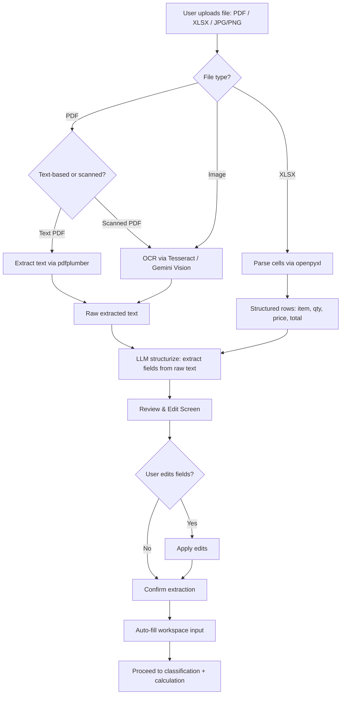
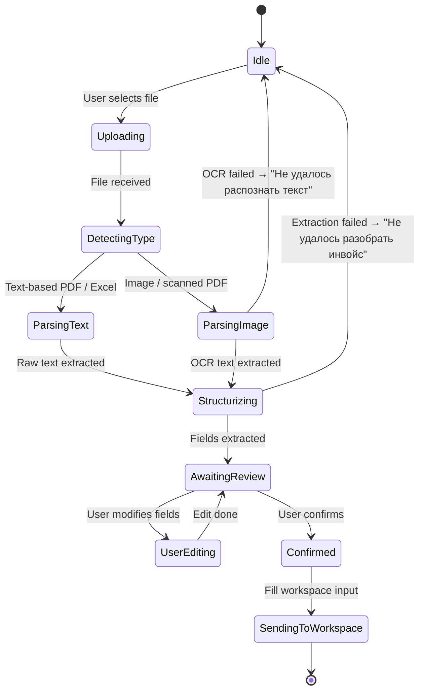
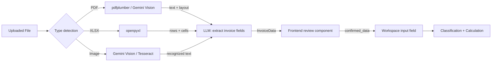

# Flow Design: Document Parsing & OCR (Invoice Intelligence)

This document defines the flow for uploading commercial invoices (PDF, Excel, image scans) and automatically extracting structured fields — product description, price, currency, weight, quantity, seller/buyer — for direct injection into the calculation workspace.

---

## 1. Intent
* **User Goal:** A declarant uploads a scanned invoice or digital file (PDF, XLSX, JPG) and the system extracts all shipment details automatically, populating the calculation workspace without manual data entry.
* **Success Criteria:**
  - Upload PDF/image → OCR extracts text + table data.
  - Upload Excel (.xlsx) → parse structured cells directly.
  - Extracted fields: product description (per line), quantity, unit price, total price, currency, weight (if present), seller/buyer names, invoice number, date.
  - Extracted data populates the workspace input field as structured text: "iPhone 15 Pro Max, 2 шт, по 1200 USD, общая 2400 USD, вес 0.3 кг".
  - User reviews extracted data before it enters the calculation pipeline.
  - Supported formats: PDF (text + scanned), XLSX, PNG/JPG/JPEG.
* **Non-negotiables:**
  - Original file is NEVER stored long-term — deleted after extraction.
  - OCR confidence < 70% → show warning "Низкое качество распознавания. Проверьте данные вручную."
  - Excel parsing reads all sheets; if multiple sheets have data, user selects which sheet to use.
  - Extracted data is editable before being sent to the workspace.

---

## 2. Scope
* **In Scope:**
  - File upload endpoint: `POST /api/workspace/parse-document`.
  - PDF text extraction (PyMuPDF / pdfplumber for text-based PDFs).
  - OCR for scanned PDFs and images (Tesseract or Gemini Vision).
  - Excel parsing (openpyxl for .xlsx).
  - LLM-based structurization: raw text → structured invoice fields.
  - Review step: user sees extracted fields in an editable form before sending to calculation.
* **Out of Scope / Deferred:**
  - Multi-page PDF with different products per page — deferred to v2.
  - PDF/A and encrypted PDFs — return error "Неподдерживаемый формат PDF."
  - Handwriting recognition — deferred.
  - Batch upload (multiple invoices at once) — deferred.

---

## 3. Actors and Permissions

| Actor | Can Do | Cannot Do |
| :--- | :--- | :--- |
| **Guest** | Upload file, view extracted fields, use in workspace (single calc) | Save parsing result for later, access previously parsed files |
| **Authenticated User** | Full: upload, extract, edit, send to workspace, save to history | Access other users' parsed documents |
| **Admin** | Full access + audit parsing logs | — |

---

## 4. Diagrams

### Document Parsing Flow

### System State Machine

### Data Flow

---

## 5. State and Projections

### Extracted Fields Schema (`InvoiceData`)

| Field | Type | Description |
| :--- | :--- | :--- |
| `invoice_number` | string | Invoice number from document |
| `invoice_date` | string | Date (YYYY-MM-DD) |
| `seller` | string | Seller company name |
| `buyer` | string | Buyer company name |
| `currency` | string | Invoice currency (USD, EUR, KZT) |
| `items` | `List[InvoiceLine]` | Product lines |

**`InvoiceLine`:**
| Field | Type | Description |
| :--- | :--- | :--- |
| `description` | string | Product name (as in invoice) |
| `quantity` | number | Units |
| `unit_price` | number | Price per unit in invoice currency |
| `total_price` | number | Line total |
| `weight_kg` | number | Optional |
| `hs_code_hint` | string | Optional, if present on invoice |

### Processing Metadata

| Field | Type | Description |
| :--- | :--- | :--- |
| `source_type` | `pdf_text`, `pdf_scanned`, `xlsx`, `image` | |
| `ocr_confidence` | number (0-1) | Only for scanned/OCR path |
| `parsed_at` | TIMESTAMPTZ | |
| `original_filename` | string | Deleted after processing |

---

## 6. Events/Actions

| Direction | Name | Source/Target | Payload | Allowed When | Reject/Failure Reason |
| :--- | :--- | :--- | :--- | :--- | :--- |
| Incoming | `upload_document` | Client → Backend | `{file}` | Any (guest OK) | Unsupported format, file >10MB |
| Outgoing | `extraction_complete` | Backend → Client | `{InvoiceData, processing_metadata}` | Parsing OK | OCR failed, parse error |
| Outgoing | `extraction_failed` | Backend → Client | `{error, error_code}` | Parse failure | Unsupported format, corrupted file |
| Incoming | `confirm_extraction` | Client → Backend | `{edited_InvoiceData}` | After review | — |
| Incoming | `send_to_workspace` | Client → Backend | `{InvoiceData}` | Confirmed | — |

---

## 7. Edge Cases

* **Scanned PDF with mixed text + images:** Try text extraction first; if < 100 chars, fall back to OCR on each page.
* **Excel with multiple sheets:** Show sheet selector in review screen. Default to first sheet with data.
* **Image too dark / skewed:** Gemini Vision handles this better than Tesseract. Try Gemini first; if confidence < 0.5, fall back to Tesseract + warning.
* **Invoice in Kazakh or Russian mixed:** LLM structurizer handles both languages. Output always in RU for consistency.
* **No invoice number found:** Generate placeholder "INV-[date]-[hash]".
* **File >10MB:** Reject immediately. Suggest compressing images or splitting PDF.
* **Encrypted PDF:** Return error "PDF защищён паролем. Загрузите версию без пароля."
* **Line items without prices (proforma):** Accept but mark lines as `price_estimated: true`. Calculator uses fallback: "Цена не указана, укажите вручную."

---

## 8. Side Effects

* Temporary file stored in `/tmp/uploads/{session_id}/` and deleted immediately after extraction + confirmation (max 30 min TTL cleanup).
* Each OCR/extraction consumes Gemini Vision or Tesseract resources.
* Processing metadata logged for monitoring (source_type, ocr_confidence, parse_time_ms).

---

## 9. Schemas Touched

* `backend/app/services/parser/schemas.py` — InvoiceData, InvoiceLine, ProcessingMetadata
* `backend/app/services/parser/router.py` — `/api/workspace/parse-document`
* `backend/app/services/parser/service.py` — ParserService (detect type → extract → structurize)
* `backend/app/services/parser/extractors/pdf_extractor.py`
* `backend/app/services/parser/extractors/excel_parser.py`
* `backend/app/services/parser/extractors/ocr_engine.py`
* `backend/app/core/config.py` — upload size limits, temp path
* `frontend/app/workspace/page.tsx` — add upload area + review component

---

## 10. Targeted Tests

| Layer | Behavior | File | Status |
| :--- | :--- | :--- | :--- |
| Unit | Text-based PDF → InvoiceData with items | `backend/tests/test_parser.py` | **TODO** |
| Unit | XLSX with 3 rows → 3 InvoiceLine items | `backend/tests/test_parser.py` | **TODO** |
| Unit | Scanned image → OCR → InvoiceData (Gemini mock) | `backend/tests/test_parser.py` | **TODO** |
| Unit | Upload encrypted PDF → 400 error | `backend/tests/test_parser.py` | **TODO** |
| Unit | Upload unsupported format (.doc) → 400 | `backend/tests/test_parser.py` | **TODO** |
| Unit | Upload >10MB → 413 Payload Too Large | `backend/tests/test_parser.py` | **TODO** |
| Unit | OCR confidence < 70% → warning flag in response | `backend/tests/test_parser.py` | **TODO** |
| Integration | Upload → extract → edit → confirm → workspace auto-fill | `backend/tests/test_parser.py` | **TODO** |
| Integration | Multi-sheet Excel → sheet selector → correct data | `backend/tests/test_parser.py` | **TODO** |
| Frontend | Upload area drag-and-drop works | `frontend/__tests__/workspace.test.tsx` | **TODO** |
| Frontend | Review screen shows editable fields | `frontend/__tests__/workspace.test.tsx` | **TODO** |

---

## 11. Implementation Plan

1. Create `backend/app/services/parser/` package.
2. Implement `pdf_extractor.py` — text-based PDF via pdfplumber.
3. Implement `ocr_engine.py` — Tesseract + Gemini Vision (fallback chain).
4. Implement `excel_parser.py` — openpyxl sheet reader.
5. Implement `ParserService` — file type detection, dispatch to extractor, LLM structurization.
6. Create `POST /api/workspace/parse-document` endpoint.
7. Build frontend upload component (drag-and-drop area).
8. Build frontend review component (editable table of extracted fields).
9. Wire "Send to workspace" button → fills workspace input.
10. Write tests.

---

## 12. Implementation Trace

*To be filled during implementation.*

### Files Created
* `backend/app/services/parser/` (new package)
* `backend/app/services/parser/schemas.py`
* `backend/app/services/parser/service.py`
* `backend/app/services/parser/router.py`
* `backend/app/services/parser/extractors/__init__.py`
* `backend/app/services/parser/extractors/pdf_extractor.py`
* `backend/app/services/parser/extractors/excel_parser.py`
* `backend/app/services/parser/extractors/ocr_engine.py`
* `frontend/components/workspace/FileUpload.tsx`
* `frontend/components/workspace/InvoiceReview.tsx`

### Files Modified
* `backend/app/main.py` — mount parser router
* `backend/app/core/config.py` — upload size, temp path
* `frontend/app/workspace/page.tsx` — add upload + review

### Status
* **Not implemented** — flow document complete

---

## 13. Open Questions

* *Tesseract or Gemini Vision as primary OCR?* → Gemini Vision first (better accuracy with layouts), Tesseract as fallback (free, offline-capable). Decision deferred to implementation benchmark.
* *Should parsed data auto-save to a draft before workspace confirmation?* → Yes, in frontend local state. No backend persistence for drafts in v1.
* *PDF form fields (XFA)?* → Not supported in v1. Standard PDF text or images only.

---

## 14. Review Checklist

- [ ] Are all supported file formats listed and tested?
- [ ] Is the OCR fallback chain (Gemini → Tesseract) documented?
- [ ] Is the data deletion policy for uploaded files specified?
- [ ] Are all extraction failure modes (encrypted PDF, >10MB, unsupported format) handled?
- [ ] Is the LLM structurization step shown in the diagram?
- [ ] Is the review-and-edit step mandatory before workspace auto-fill?
- [ ] Are there tests for each file format and failure mode?
