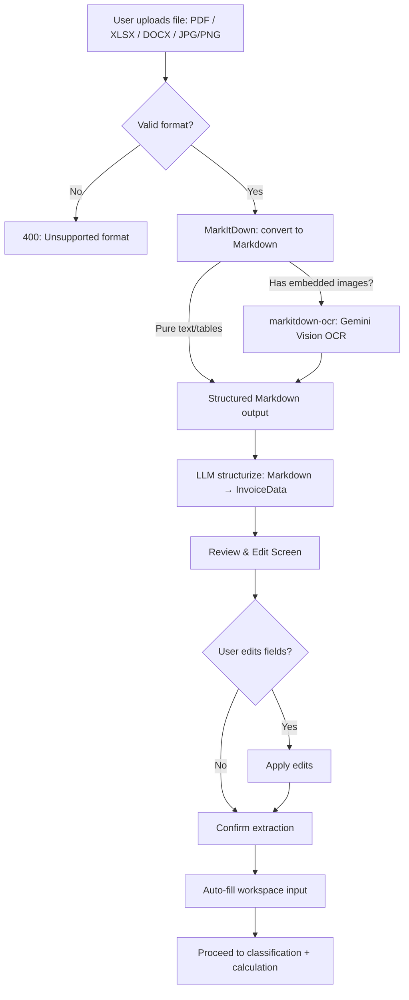
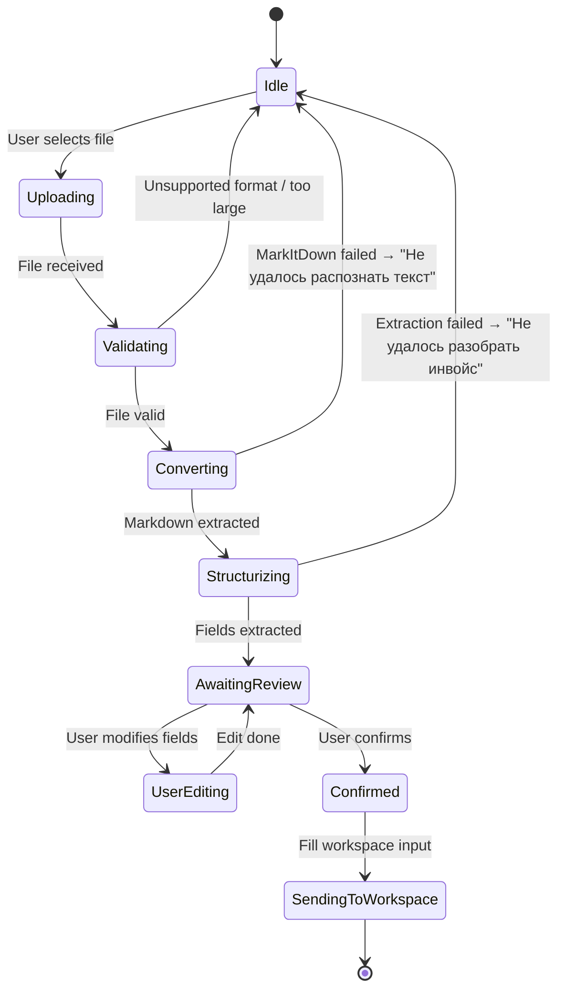
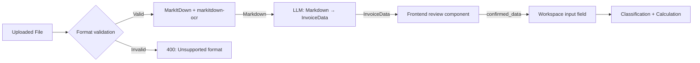

# Flow Design: Document Parsing & OCR (Invoice Intelligence)

This document defines the flow for uploading commercial invoices (PDF, Excel, Word, image scans) and automatically extracting structured fields — product description, price, currency, weight, quantity, seller/buyer — for direct injection into the calculation workspace.

---

## 1. Intent
* **User Goal:** A declarant uploads an invoice file and the system extracts all shipment details automatically, populating the calculation workspace without manual data entry.
* **Success Criteria:**
  - Upload any supported format → MarkItDown extracts text + table structure as Markdown.
  - Extracted fields: product description (per line), quantity, unit price, total price, currency, weight (if present), seller/buyer names, invoice number, date.
  - Extracted data populates the workspace input field.
  - User reviews extracted data before it enters the calculation pipeline.
  - Supported formats: PDF (text + scanned), XLSX, DOCX, PNG/JPG/JPEG.
* **Non-negotiables:**
  - Original file is NEVER stored long-term — deleted after extraction.
  - Review step is **mandatory** — user sees and edits data before workspace injection.
  - Excel parsing reads all sheets; if multiple sheets have data, user selects which sheet to use.
  - Extracted data is editable before being sent to the workspace.

---

## 2. Scope
* **In Scope:**
  - File upload endpoint: `POST /api/workspace/parse-document`.
  - **MarkItDown** (`microsoft/markitdown`) as unified extraction layer — converts PDF, XLSX, DOCX, images to Markdown. Replaces individual extractors (pdfplumber, openpyxl, Tesseract).
  - **markitdown-ocr plugin** — Gemini Vision-based OCR for scanned PDFs and images embedded in any document format.
  - LLM-based structurization: Markdown → structured invoice fields (Gemini).
  - Review step: user sees extracted fields in an editable form before sending to calculation.
* **Out of Scope / Deferred:**
  - Multi-page PDF with different products per page — deferred to v2.
  - PDF/A and encrypted PDFs — return error "Неподдерживаемый формат PDF."
  - Handwriting recognition — deferred.
  - Batch upload (multiple invoices at once) — deferred.
  - DOCX with complex embedded tables — MarkItDown handles basic tables; complex layouts deferred.

---

## 3. Actors and Permissions

| Actor | Can Do | Cannot Do |
| :--- | :--- | :--- |
| **Guest** | Upload file, view extracted fields, use in workspace (single calc) | Save parsing result for later, access previously parsed files |
| **Authenticated User** | Full: upload, extract, edit, send to workspace, save to history | Access other users' parsed documents |
| **Admin** | Full access + audit parsing logs | — |

---

## 4. Diagrams

### Document Parsing Flow

### System State Machine

### Data Flow

---

## 5. State and Projections

### Extracted Fields Schema (`InvoiceData`)

| Field | Type | Description |
| :--- | :--- | :--- |
| `invoice_number` | string | Invoice number from document |
| `invoice_date` | string | Date (YYYY-MM-DD) |
| `seller` | string | Seller company name |
| `buyer` | string | Buyer company name |
| `currency` | string | Invoice currency (USD, EUR, KZT) |
| `items` | `List[InvoiceLine]` | Product lines |

**`InvoiceLine`:**
| Field | Type | Description |
| :--- | :--- | :--- |
| `description` | string | Product name (as in invoice) |
| `quantity` | number | Units |
| `unit_price` | number | Price per unit in invoice currency |
| `total_price` | number | Line total |
| `weight_kg` | number | Optional |
| `hs_code_hint` | string | Optional, if present on invoice |

### Processing Metadata

| Field | Type | Description |
| :--- | :--- | :--- |
| `source_type` | `pdf`, `xlsx`, `docx`, `image` | Detected source format |
| `ocr_applied` | boolean | True when markitdown-ocr plugin processed embedded images |
| `parsed_at` | TIMESTAMPTZ | |
| `original_filename` | string | Deleted after processing |

> **Deprecated:** `ocr_confidence` field removed. The mandatory review step (InvoiceReview) ensures data quality regardless of extraction confidence.

---

## 6. Events/Actions

| Direction | Name | Source/Target | Payload | Allowed When | Reject/Failure Reason |
| :--- | :--- | :--- | :--- | :--- | :--- |
| Incoming | `upload_document` | Client → Backend | `{file}` | Any (guest OK) | Unsupported format, file >10MB |
| Outgoing | `extraction_complete` | Backend → Client | `{InvoiceData, processing_metadata}` | Parsing OK | MarkItDown failed, parse error |
| Outgoing | `extraction_failed` | Backend → Client | `{error, error_code}` | Parse failure | Unsupported format, corrupted file |
| Incoming | `confirm_extraction` | Client → Backend | `{edited_InvoiceData}` | After review | — |
| Incoming | `send_to_workspace` | Client → Backend | `{InvoiceData}` | Confirmed | — |

---

## 7. Edge Cases

* **Scanned PDF / image-only documents:** MarkItDown with `markitdown-ocr` plugin uses Gemini Vision to OCR embedded images. No separate Tesseract fallback — Gemini handles dark/skewed images well.
* **Mixed text + images in PDF:** MarkItDown extracts text natively, OCR plugin handles any embedded images. Single unified output.
* **Excel with multiple sheets:** MarkItDown converts all sheets. Sheet selector shown in review screen. Default to first sheet with data.
* **DOCX with tables:** MarkItDown preserves table structure as Markdown tables. LLM structurizer parses Markdown tables natively.
* **Invoice in Kazakh or Russian mixed:** LLM structurizer handles both languages. Output always in RU for consistency.
* **No invoice number found:** Generate placeholder "INV-[date]-[hash]".
* **File >10MB:** Reject immediately. Suggest compressing images or splitting PDF.
* **Encrypted PDF:** MarkItDown raises on encrypted PDFs. Return error "PDF защищён паролем. Загрузите версию без пароля."
* **Line items without prices (proforma):** Accept but mark lines as `price_estimated: true`. Calculator uses fallback: "Цена не указана, укажите вручную."

---

## 8. Side Effects

* Temporary file stored in `/tmp/uploads/{session_id}/` and deleted immediately after extraction + confirmation (max 30 min TTL cleanup).
* MarkItDown + markitdown-ocr plugin consumes Gemini Vision resources for OCR on embedded images.
* Processing metadata logged for monitoring (source_type, ocr_applied, parse_time_ms).

---

## 9. Schemas Touched

* `backend/app/services/parser/schemas.py` — InvoiceData, InvoiceLine, ProcessingMetadata
* `backend/app/services/parser/router.py` — `/api/workspace/parse-document`
* `backend/app/services/parser/service.py` — ParserService (validate → MarkItDown extract → structurize)
* `backend/app/services/parser/markitdown_adapter.py` — **NEW** — wraps `markitdown[all]` + `markitdown-ocr`, single entry point for all format conversion
* `backend/app/core/config.py` — upload size limits, temp path
* `frontend/app/page.tsx` — upload area + review component

### Removed Files
* ~~`backend/app/services/parser/extractors/pdf_extractor.py`~~ — replaced by MarkItDown's built-in PDF converter
* ~~`backend/app/services/parser/extractors/excel_parser.py`~~ — replaced by MarkItDown's built-in XLSX converter
* ~~`backend/app/services/parser/extractors/ocr_engine.py`~~ — replaced by `markitdown-ocr` plugin
* ~~`backend/app/services/parser/extractors/__init__.py`~~ — extractors package removed

---

## 10. Targeted Tests

| Layer | Behavior | File | Status |
| :--- | :--- | :--- | :--- |
| Unit | Text-based PDF → Markdown → InvoiceData with items | `backend/tests/test_parser.py` | **PASSED** |
| Unit | XLSX with rows → Markdown table → InvoiceLine items | `backend/tests/test_parser.py` | **PASSED** |
| Unit | Scanned image → OCR adapter path → Markdown → InvoiceData | `backend/tests/test_parser.py` | **PASSED** |
| Unit | DOCX → Markdown → InvoiceData | `backend/tests/test_parser.py` | **PASSED** |
| Unit | Upload encrypted PDF → parse error response | `backend/tests/test_parser.py` | **PASSED** |
| Unit | Upload unsupported format → validation error | `backend/tests/test_parser.py` | **PASSED** |
| Unit | Upload >10MB → request rejected | `backend/tests/test_parser.py` | **PASSED** |
| Integration | Upload → extract → structured result | `backend/tests/test_parser.py` | **PASSED** |
| Integration | Multi-sheet Excel parsing behavior | `backend/tests/test_parser.py` | **PASSED** |
| Frontend | Upload area drag-and-drop works | `frontend/__tests__/workspace.test.tsx` | **DEFERRED** |
| Frontend | Review screen shows editable fields | `frontend/__tests__/workspace.test.tsx` | **DEFERRED** |

---

## 11. Implementation Plan

### v1 (Completed — 2026-05-29)
1. ~Create `backend/app/services/parser/` package.~
2. ~Implement individual extractors (pdfplumber, openpyxl, Gemini+Tesseract).~
3. ~Implement ParserService + LLM structurization.~
4. ~Create API endpoint.~
5. ~Build frontend upload + review components.~
6. ~Write tests (31/31 pass).~

### v2 — MarkItDown Integration (Completed — 2026-05-29)
1. ~Install `markitdown[all]` + `markitdown-ocr`.~
2. ~Create `markitdown_adapter.py` — unified conversion for PDF, XLSX, DOCX, images.~
3. ~Simplify `service.py` — remove individual extractor dispatch, call adapter.~
4. ~Update `schemas.py` — replace `ocr_confidence` with `ocr_applied` boolean.~
5. ~Remove `extractors/` package.~
6. ~Update `requirements.txt` — replace pdfplumber, pytesseract, Pillow, pdf2image with `markitdown[all]`.~
7. ~Update tests — remove extractor-specific tests, add MarkItDown adapter tests + DOCX format test.~
8. ~Update router warnings — remove confidence-based warning.~

---

## 12. Implementation Trace

### v1 — Individual Extractors (Superseded)
*Archived — replaced by v2 MarkItDown integration.*

### v2 — MarkItDown Integration

#### Files Created
* `backend/app/services/parser/markitdown_adapter.py` — wraps `markitdown[all]`, single `convert_to_markdown()` entry point; Gemini Vision fallback for images and scanned PDFs

#### Files Modified
* `backend/app/services/parser/schemas.py` — `ocr_confidence` → `ocr_applied` boolean; `source_type` values: pdf, xlsx, docx, image
* `backend/app/services/parser/service.py` — `extract_raw_text()` simplified to call `convert_to_markdown()`; detects `docx` format
* `backend/app/services/parser/router.py` — confidence warnings removed; `ocr_applied` used in metadata
* `backend/requirements.txt` — pdfplumber, pytesseract, Pillow → `markitdown[all]>=0.1.0`
* `backend/tests/test_parser.py` — 31 tests: MarkItDown conversion (5), file type detection (7), structurization (3), API endpoints (5), schemas (6), edge cases (5)
* `flows/integrations/document_parsing_flow.md` — diagrams, state machine, edge cases updated for unified extraction

#### Files Removed
* `backend/app/services/parser/extractors/pdf_extractor.py`
* `backend/app/services/parser/extractors/excel_parser.py`
* `backend/app/services/parser/extractors/ocr_engine.py`
* `backend/app/services/parser/extractors/__init__.py`
* `backend/app/services/parser/extractors/` (directory)

#### Status
* **Implemented** — 2026-05-29. 503/503 tests pass, 0 lint errors.

---

## 13. Open Questions

* ~~*Tesseract or Gemini Vision as primary OCR?*~~ → **Resolved.** MarkItDown with `markitdown-ocr` plugin uses Gemini Vision exclusively. No Tesseract dependency. Mandatory review step makes confidence scores unnecessary.
* *Should parsed data auto-save to a draft before workspace confirmation?* → Yes, in frontend local state. No backend persistence for drafts in v1.
* *PDF form fields (XFA)?* → Not supported in v1. Standard PDF text or images only.
* *DOCX complex tables (merged cells, nested tables)?* → MarkItDown handles basic tables. Complex layouts deferred to v3.

---

## 14. Review Checklist

- [x] Are all supported file formats listed and tested? (PDF, XLSX, DOCX, PNG/JPG)
- [x] Is the MarkItDown + markitdown-ocr extraction path documented?
- [x] Is the data deletion policy for uploaded files specified?
- [x] Are all extraction failure modes (encrypted PDF, >10MB, unsupported format) handled?
- [x] Is the LLM structurization step shown in the diagram?
- [x] Is the review-and-edit step mandatory before workspace auto-fill?
- [x] Are there tests for each file format and failure mode?
- [x] Are the removed extractor files tracked for cleanup?