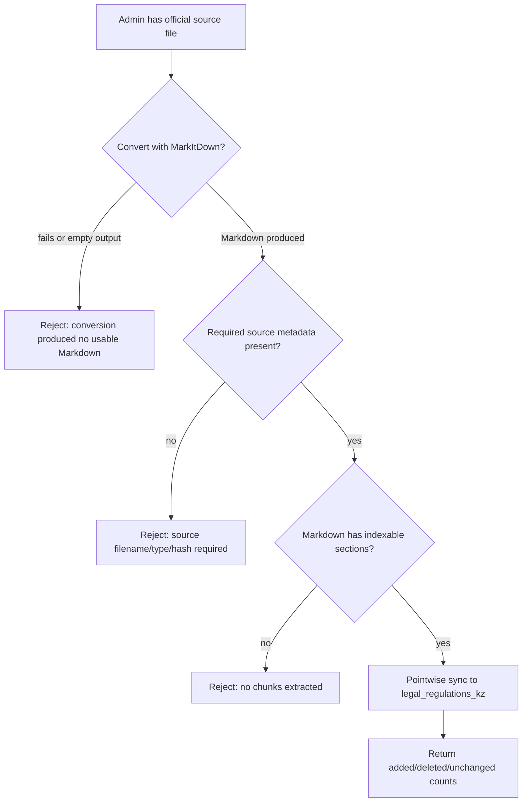
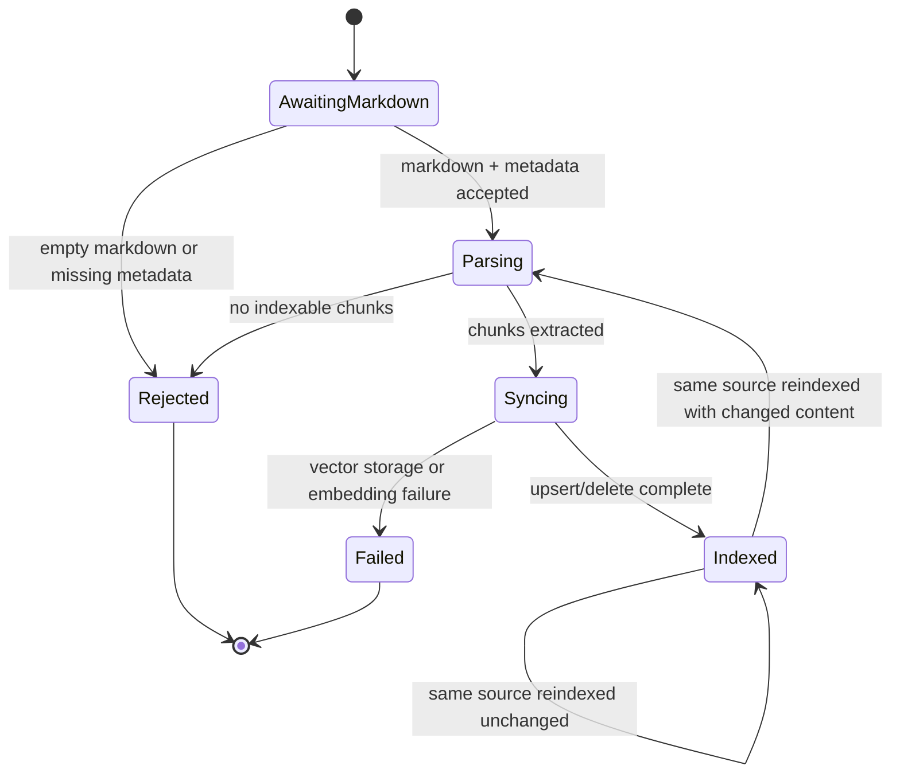
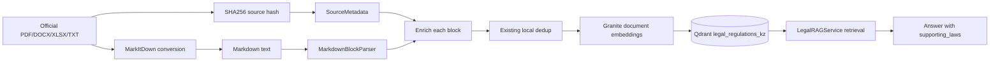

# Flow Design: Markdown RAG Ingestion with Source Provenance

This document defines how official source documents are converted through MarkItDown into auditable Markdown artifacts and then indexed into the legal RAG vector database with source provenance preserved.

---

## 1. Intent

* **User Goal:** Admins can ingest official legal/reference documents into the RAG knowledge base from source files, while future maintainers can see exactly which original file produced each indexed chunk.
* **Success Criteria:**
  - Supported source files are converted to Markdown before indexing.
  - Markdown is parsed into stable legal chunks without losing article/heading boundaries.
  - Each Qdrant legal payload includes source provenance: filename, source type, source hash, converter, OCR flag, and ingestion timestamp.
  - Existing `.txt`, Python-constant, and JSON seed ingestion keeps working.
  - Re-indexing the same Markdown source is idempotent through existing pointwise sync/content hashing.
* **Non-negotiables:**
  - Do not store original uploaded/source files through this slice.
  - Do not silently index empty or near-empty Markdown.
  - Do not index invoice/workspace uploads into legal RAG by default.
  - Existing legal RAG query behavior must not change.

---

## 2. Scope

* **In Scope:**
  - A Markdown parser for RAG legal/reference documents.
  - A `LegalRAGIndexer` entry point that accepts MarkItDown-produced Markdown plus source metadata.
  - Payload provenance fields for new/updated legal chunks.
  - Tests for Markdown heading/article parsing, provenance persistence, and idempotent pointwise sync.
* **Out of Scope / Deferred:**
  - Admin UI for uploading knowledge-base documents.
  - Long-term storage layout for original PDFs/DOCX/XLSX files.
  - Migration of every current seed source into Markdown.
  - HS-code Markdown ingestion; this slice targets `legal_regulations_kz` only.
  - Automatic indexing from `/api/workspace/parse-document`; workspace documents remain invoice-only unless a future admin flow opts in.

---

## 3. Actors and Permissions

| Actor | Can Do | Cannot Do |
| :--- | :--- | :--- |
| **Admin / maintenance script operator** | Convert official source documents to Markdown, pass metadata, reindex legal RAG chunks | Index arbitrary workspace invoices into legal RAG by default |
| **Backend service** | Validate Markdown, parse chunks, compute hashes, upsert/delete Qdrant points via pointwise sync | Invent missing source provenance or silently accept empty sources |
| **End user / guest** | Query legal RAG through orchestrator | Trigger knowledge-base indexing |

---

## 4. Diagrams

### User / Operator Flow

### State Machine

### Data/Event Flow

---

## 5. State and Projections

### Authoritative State

| State | Owner | Notes |
| :--- | :--- | :--- |
| Markdown text | Caller / maintenance script | Must be produced by MarkItDown or equivalent converter before indexer call |
| Source metadata | Caller / maintenance script | Must identify the source used to create Markdown |
| Legal chunks | `LegalRAGIndexer` | Derived from Markdown headings/articles |
| Vector points | Qdrant `legal_regulations_kz` | Derived state; may be rebuilt from source Markdown + metadata |

### Public Projection

Legal RAG responses continue to expose `document_title`, `article_number`, `content_quote`, and `relevance_score` through `supporting_laws`. Source provenance is stored in Qdrant payload for audit/admin use; user-facing citation rendering remains unchanged in this slice.

### Source Metadata Contract

| Field | Type | Required | Description |
| :--- | :--- | :--- | :--- |
| `source_filename` | string | yes | Original file name or controlled source artifact name |
| `source_type` | string | yes | `pdf`, `docx`, `xlsx`, `txt`, `markdown`, or `unknown` |
| `source_hash` | string | yes | SHA256 of original source bytes when available; SHA256 of Markdown otherwise |
| `converter` | string | yes | Usually `markitdown`; `manual` allowed for existing curated seeds |
| `ocr_applied` | boolean | yes | Whether OCR was used during conversion |
| `ingested_at` | string | yes | UTC ISO-8601 timestamp generated by indexer when absent |

---

## 6. Events/Actions

| Direction | Name | Source/Target | Payload | Allowed When | Reject/Failure Reason |
| :--- | :--- | :--- | :--- | :--- | :--- |
| Incoming | `rag_ingestion:markdown_ready` | Maintenance script → Indexer | `{markdown_text, doc_title, source_metadata}` | Admin/script context only | Empty Markdown, missing `doc_title`, missing metadata |
| Internal | `rag_ingestion:chunks_extracted` | Markdown parser → Indexer | `List[KnowledgeChunk]` | Parser extracted at least one block | No headings/articles/content sections found |
| Internal | `rag_ingestion:chunks_enriched` | Indexer → Indexer | `List[KnowledgeChunk + source fields]` | Source metadata valid | Source metadata cannot be normalized |
| Outgoing | `rag_ingestion:points_synced` | Indexer → Qdrant | `{added, deleted, unchanged}` | Embedding/vector storage succeeds | Embedding failure, Qdrant failure |
| Cross-flow | `rag_query:retrieve_legal_chunks` | Legal RAG Flow → Qdrant | `{query_embedding, collection}` | Existing query behavior | No change in this slice |

---

## 7. Edge Cases

* **MarkItDown returns empty Markdown:** reject before parsing; do not index placeholder content.
* **Markdown has only a title and no body:** reject with zero indexed chunks.
* **Markdown headings do not contain `Статья`:** parser chunks by Markdown headings and uses heading text as `article_number`.
* **Markdown contains `Статья N` inside heading or body:** parser preserves article boundary as `article_number` to keep legal citation quality.
* **Same source reindexed unchanged:** existing deterministic point IDs/content hashes produce `unchanged` counts and no duplicate points.
* **Same source reindexed with changed content:** pointwise sync adds new points and deletes obsolete points for the same `document_title`.
* **Missing source hash:** indexer computes a Markdown hash only if explicit original source hash is absent; metadata must still record converter and filename.
* **Workspace invoice upload accidentally passed to indexer:** no automatic path exists from `/api/workspace/parse-document` to RAG; future endpoint must require admin authorization.
* **Qdrant unavailable:** existing storage seam behavior applies; tests should use in-memory fake storage rather than depending on Docker.
* **Legacy seed blocks without provenance:** current ingestion remains valid; new Markdown path must not require retroactive metadata for existing constants.

---

## 8. Side Effects

* Qdrant `legal_regulations_kz` receives new payload fields for Markdown-ingested chunks.
* Existing legal query and answer generation continue to read the old fields, so retrieval output remains backward compatible.
* Logs include indexing counts and source filename for operational traceability.
* No user-uploaded workspace documents are stored or indexed by this flow.

---

## 9. Schemas Touched

* `backend/app/core/rag/parsers.py` — add `MarkdownBlockParser` and register `doc_type="markdown"`.
* `backend/app/core/rag/indexer.py` — add Markdown ingestion entry point and preserve extra block metadata in Qdrant payload.
* `backend/app/services/parser/markitdown_adapter.py` — reused as existing converter; no required behavior change for this slice.
* `backend/scripts/reindex_all.py` — no required change in this slice; future migration can call Markdown ingestion.
* `backend/tests/test_rag.py` or new focused test module — add Markdown parser/indexer tests.

---

## 10. Targeted Tests

| Layer | Behavior | File | Status |
| :--- | :--- | :--- | :--- |
| Unit | Markdown headings become legal chunks with heading/article references | `backend/tests/test_rag.py::TestMarkdownBlockParser::test_heading_chunks_become_blocks` | Passed |
| Unit | `Статья N` inside Markdown is preserved as `article_number` | `backend/tests/test_rag.py::TestMarkdownBlockParser::test_article_boundary_in_heading` and `test_article_boundary_in_first_body_line` | Passed |
| Unit | Empty Markdown produces no chunks and indexer returns 0 | `backend/tests/test_rag.py::TestMarkdownBlockParser::test_empty_markdown_returns_no_blocks` and `TestMarkdownIngestion::test_empty_markdown_rejected` | Passed |
| Unit | Markdown ingestion enriches payload with source metadata | `backend/tests/test_rag.py::TestMarkdownIngestion::test_provenance_payload` | Passed |
| Unit | Reindexing same Markdown source is idempotent via pointwise sync | `backend/tests/test_rag.py::TestMarkdownIngestion::test_idempotent_reindex_same_markdown` | Passed |
| Regression | Existing raw code parser still parses `Статья` text | `backend/tests/test_document_parsers.py`, `backend/tests/test_pointwise_sync.py`, `backend/tests/test_rag.py` | Passed |

---

## 11. Implementation Plan

1. Add `MarkdownBlockParser` using existing `BaseDocumentParser` contract.
2. Register the parser as `markdown` in `DocumentParserRegistry`.
3. Add source metadata normalization/enrichment helper in `LegalRAGIndexer`.
4. Add `parse_and_index_markdown(markdown_text, doc_title, source_metadata)` that parses, enriches, deduplicates, and calls existing `update_document_index`.
5. Preserve unknown block fields into Qdrant payload so provenance survives indexing.
6. Add targeted tests for parser behavior and payload provenance.
7. Fill implementation trace with changed files and verification output.

---

## 12. Implementation Trace

* **Flow Review:** Approved before implementation. The flow includes decision/rejection diagrams, concrete edge cases, named schemas/files, targeted tests, and deferred product questions.
* **Code Files:**
  - `backend/app/core/rag/parsers.py` — added `MarkdownBlockParser` and registered `doc_type="markdown"`.
  - `backend/app/core/rag/indexer.py` — added Markdown ingestion/provenance normalization and preserved extra block fields in Qdrant payloads.
* **Test Files:**
  - `backend/tests/test_rag.py` — added Markdown parser and Markdown ingestion tests.
* **Architecture Map:**
  - `flows/ARCHITECTURE.md` — updated Document Ingestion flow to show MarkItDown Markdown artifacts, Granite embeddings, and provenance-aware Qdrant upsert.
* **Validation:**
  - `.venv/Scripts/pytest backend/tests/test_rag.py` with `PYTHONPATH=backend` → `25 passed, 1 warning`.
  - `.venv/Scripts/pytest backend/tests/test_document_parsers.py backend/tests/test_pointwise_sync.py backend/tests/test_rag.py` with `PYTHONPATH=backend` → `37 passed, 1 warning`.
  - `.venv/Scripts/ruff check backend/app/core/rag/parsers.py backend/app/core/rag/indexer.py` → `OK`.

---

## 13. Open Questions

* **Deferred:** Where should long-lived original source files and generated `.md` artifacts live? This implementation does not store originals; it only indexes Markdown passed by scripts/admin tooling.
* **Deferred:** Should source provenance be exposed to end users in citations? This slice stores provenance internally but keeps response shape unchanged.
* **Deferred:** Should HS-code directory support Markdown/CSV provenance the same way? Legal RAG is implemented first.

---

## 14. Review Checklist

| Item | Status |
| :--- | :--- |
| Intent describes intended behavior, not current implementation | Ready |
| Diagrams include decisions and rejection paths | Ready |
| Forbidden paths and permissions are explicit | Ready |
| Edge cases are concrete and testable | Ready |
| Schemas/files expected to change are named | Ready |
| Tests map to behavior paths | Ready |
| Cross-flow boundaries declared | Ready |
| Open questions are explicit/deferred | Ready |
